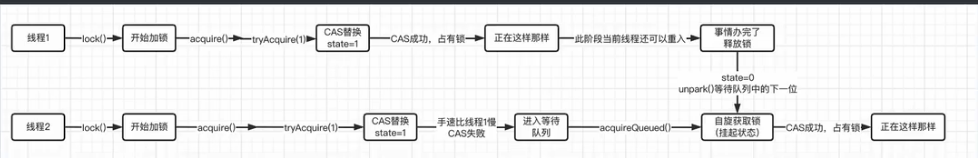

## happens-before原则

JMM的一种原则，程序员只要遵循着这个原则就能保证变量的正确性

- 程序次序规则  

  **单线程**当中，虽然可能发生重排序，但是能够保证结果一定能够与重排序之前的结果一致

- 监视器加锁机制

​      释放锁的那个线程对变量做的修改，后续获得锁的那个线程一定能够看到前一个线程做的修改

- **volatile**关键字机制

  被volatile关键字修饰的变量，只要被修改就能被看到

- 线程创建机制

  A 创建 B 线程  那么在B线程创建之前，A线程做的修改，B线程一定能够看到

- 传递性

- join原则

## Volatile重排序的规则：

​	写volatile关键字**之前**的代码都不能进行重排序,因为另外一个线程需要对这个线程操作volatile之前的操作可见

​	读volatile关键字修饰变量**之后**的代码都不能重排序，后续的操作需要可见

## 32位机器上long 与 double的原子性问题

 在32位虚拟机上由于long 与 double 是 8个字节的，并且是64位的，在其写的时候只能32位的写, 赋值的时候先赋值高32位在赋值低32位，必须要在long与double变量加上volatile关键字才能保证原子性,jdk5之后读操作是原子性操作

## AQS结点

```java
static final class Node {
    	//每个结点可以被分为 独占模式结点 与 共享模式结点  用于独占锁与共享锁
        /** Marker to indicate a node is waiting in shared mode */
        static final Node SHARED = new Node();
        /** Marker to indicate a node is waiting in exclusive mode */
        static final Node EXCLUSIVE = null;
		//表示该节点已经失效 ，被取消 唯一一个大于0
        /** waitStatus value to indicate thread has cancelled */
        static final int CANCELLED =  1;
    	// 表示表示该节点后面的节点 被挂起  需要被唤醒
        /** waitStatus value to indicate successor's thread needs unparking */
        static final int SIGNAL    = -1;
        /** waitStatus value to indicate thread is waiting on condition */
        static final int CONDITION = -2;
        /**
         * waitStatus value to indicate the next acquireShared should
         * unconditionally propagate
         */
        static final int PROPAGATE = -3;

        
        volatile int waitStatus;

       
        volatile Node prev;

         
        volatile Node next;

        
        volatile Thread thread;

       
        Node nextWaiter;


```

## park unpark

```java
// 暂停当前线程
LockSupport.park(); 
// 恢复某个线程的运行
LockSupport.unpark(暂停线程对象)
    //直到线程被unpark 或者发送 interrupt()中断信号 才能被恢复运行
```


AQS

```java
   
    private transient volatile Node head;

    private transient volatile Node tail;
 
    private volatile int state; //AQS状态 决定了当前的锁的状态 0表示没有被占用
```


```java
private static final Unsafe unsafe = Unsafe.getUnsafe(); //内部有unsafe常量
,private static final long stateOffset; //用于记录各个字段相对于类的便宜值 便于unsafe对象操作，直接操作内存进行cas
    private static final long headOffset;
    private static final long tailOffset;
    private static final long waitStatusOffset;
    private static final long nextOffset;
```

## 可被重写的方法

 ReentrantLock**锁机制是自己实现**，**底层调度**是由AQS抽象类实现的,比如ReentranLOCK当中既有公平锁又有非公平锁，他们都是AQS的子类

```java
//独占的获取与释放
protected boolean tryReleaseShared(int arg) {
        throw new UnsupportedOperationException();
    }  
protected boolean tryRelease(int arg) {
        throw new UnsupportedOperationException();
    }
//共享锁的独占与释放

 protected int tryAcquireShared(int arg) {
        throw new UnsupportedOperationException();
    }
protected boolean tryAcquire(int arg) {
        throw new UnsupportedOperationException();
    }

protected boolean isHeldExclusively() {
        throw new UnsupportedOperationException();
    }
```

## AQS 通过自旋锁入队

```java
private Node addWaiter(Node mode) {
        Node node = new Node(Thread.currentThread(), mode);
        // Try the fast path of enq; backup to full enq on failure
    //先尝试快速的插入队列的尾部
        Node pred = tail;
        if (pred != null) {
            node.prev = pred;
            if (compareAndSetTail(pred, node)) {
                pred.next = node;
                return node;
            }
        }
    //如果失败的话进入enq方法，也就是通过自旋+CAS入队
        enq(node);
        return node;
    }
private Node enq(final Node node) {
    for (;;) {
        Node t = tail;
        if (t == null) { // Must initialize
            if (compareAndSetHead(new Node()))//如果tail 为空就进行初始化
                tail = head;
        } else {
            node.prev = t;
            if (compareAndSetTail(t, node)) {
                t.next = node;
                return t;
            }
        }
    }
}
```

## ReentrantLock 中的内部类Sync的 抢占锁 unfair 实现 

```java
//  AQS 的方法
public final void acquire(int arg) {  
        if (!tryAcquire(arg) && //先枪锁  抢到就直接退出  tryAcquire部分需要被重写
            acquireQueued(addWaiter(Node.EXCLUSIVE), arg)) //将addWaiter入队,通过自旋+CAS的操作入队  入队之后自旋，直到 当前加入队列的结点为头结点  就创建中断，表示抢到锁了
            selfInterrupt();
    }
```

```java
//  AQS 的方法
final boolean acquireQueued(final Node node, int arg) {
        boolean failed = true;
        try {
            boolean interrupted = false;
            for (;;) { //如果是头结点就会一直自旋，如果不是的话，就会将前面的结点设置为SIGNAL并进入休眠
                final Node p = node.predecessor();
                if (p == head && tryAcquire(arg)) { //如果前驱节点是头结点就尝试tryACquire获取锁，如果获取成功就退出自旋,AQS中的head节点是一个虚节点，不存储线程的信息  
                    setHead(node);  //抢到锁了就将前驱结点设置为头结点
                    p.next = null; // help GC
                    failed = false;
                    return interrupted;
                }
                //shouldParkAfterFailedAcquire 检查上一个节点的状态，如果是 SIGNAL 就阻塞，否则就改成 SIGNAL
                if (shouldParkAfterFailedAcquire(p, node) && //如果不是的话就将前面的结点的状态设置为SIGNAL  将中断标识设置为true 
                    parkAndCheckInterrupt())  // 前驱结点为SIGNAL状态之后就将当前线程进行park()就是将当前线程进入等待状态  
                    interrupted = true; //被唤醒就将interrupted设置为true
            }
        } finally {
            if (failed)
                cancelAcquire(node);
        }
    }
```

```java
protected final boolean tryAcquire(int acquires) {
            final Thread current = Thread.currentThread();
            int c = getState();
            if (c == 0) { //判断c是否为0也就是aqs有无被线程占用
                if (!hasQueuedPredecessors() &&
                    compareAndSetState(0, acquires)) {//CAS抢锁
                    setExclusiveOwnerThread(current);//抢到了则设置当前的线程
                    return true; 
                }
            }
            else if (current == getExclusiveOwnerThread()) {//判断当前占有的线程是不是自己的线程  ，如果是的话就添加可重入次数
                int nextc = c + acquires;  
                if (nextc < 0)
                    throw new Error("Maximum lock count exceeded");
                setState(nextc);
                return true;
            }
            return false;//没有抢到则返回false 
        }
```

大致流程：

先tryAcquire抢锁，抢锁

## ReentrantLock 释放锁release

```java
// AQS的方法
public final boolean release(int arg) {
        if (tryRelease(arg)) { //尝试释放锁  实现部分由子类实现 模版方法
            Node h = head;   
            if (h != null && h.waitStatus != 0)
                unparkSuccessor(h);  //如果释放成功则会尝试 unpark 唤醒 后面的结点
            return true;
        }
        return false;
    }
 private void unparkSuccessor(Node node) {
        /*
         * 将当期节点的状态改为0 
         */
        int ws = node.waitStatus;
        if (ws < 0)
            compareAndSetWaitStatus(node, ws, 0);

        /*
         * 唤醒下一个结点
         */
        Node s = node.next;
        if (s == null || s.waitStatus > 0) {
            s = null;
            for (Node t = tail; t != null && t != node; t = t.prev)
                if (t.waitStatus <= 0)
                    s = t;
        }
        if (s != null)
            LockSupport.unpark(s.thread);
    }
```

## ReentrantLock释放锁的实现

```java
protected final boolean tryRelease(int releases) {
            int c = getState() - releases; //计算relase后的状态值
            if (Thread.currentThread() != getExclusiveOwnerThread())//独占锁，只能由当前线程进行释放
               throw new IllegalMonitorStateException();
            boolean free = false;
            if (c == 0) {  //c = 0表示可以释放,设置free 结果为true
                free = true;
                setExclusiveOwnerThread(null);
            }
            setState(c); //更新当前得到值
            return free; 
        }

```



## Condition实现原理

使用：机制与objcet.wait 差不多

- 必须要获取锁的线程才能使用await方法,调用await方法会直接释放当前的锁
- 等待别的线程的signal
- 被signal的时候不会立即开始运行，他还需要等使用signal的线程释放锁，并且本线程抢到锁才能够继续运行

```java
//newCondition返回了一个ConditionObject方法
final ConditionObject newCondition() {
            return new ConditionObject();
 }

//该类中维护了一个单向链表，Node是AQS中的NODE，并且是使用的NODE中的nextWaiter字段构成的链表
public class ConditionObject implements Condition, java.io.Serializable {
        private static final long serialVersionUID = 1173984872572414699L;
        /** First node of condition queue. */
        private transient Node firstWaiter;
        /** Last node of condition queue. */
        private transient Node lastWaiter;

        /**
         * Creates a new {@code ConditionObject} instance.
         */
        public ConditionObject() { }

```

## await方法

```java
public final void await() throws InterruptedException {
            if (Thread.interrupted())
                throw new InterruptedException();
            Node node = addConditionWaiter();//创建一个当前线程的新的结点,并放入condition中的队列当中
            long savedState = fullyRelease(node); //记录一下当前线程的state值,唤醒之后需要恢复,将当前的线程的锁释放
            int interruptMode = 0;
            while (!isOnSyncQueue(node)) { //不在同步队列里面
                LockSupport.park(this);//就将其挂起
                if ((interruptMode = checkInterruptWhileWaiting(node)) != 0)
                    break;
            }
    //现成被唤醒了，这个时候结点也在同步队列中了，做后序处理，恢复状态,接下来就通过acquireQueued方法抢锁
            if (acquireQueued(node, savedState) && interruptMode != THROW_IE)
                interruptMode = REINTERRUPT;
            if (node.nextWaiter != null) // clean up if cancelled
                unlinkCancelledWaiters();
            if (interruptMode != 0)
                reportInterruptAfterWait(interruptMode);
        }
//将当前线程创建一个结点并放入条件队列当中
  private Node addConditionWaiter() {
            Node t = lastWaiter;
            // If lastWaiter is cancelled, clean out.
            if (t != null && t.waitStatus != Node.CONDITION) {
                unlinkCancelledWaiters();
                t = lastWaiter;
            }
            Node node = new Node(Thread.currentThread(), Node.CONDITION);
            if (t == null)
                firstWaiter = node;
            else
                t.nextWaiter = node;
            lastWaiter = node;
            return node;
        }
//将当前活跃线程的锁释放,并返回当前的state
  final int fullyRelease(Node node) {
        boolean failed = true;
        try {
            int savedState = getState();
            if (release(savedState)) {
                failed = false;
                return savedState;
            } else {
                throw new IllegalMonitorStateException();
            }
        } finally {
            if (failed)
                node.waitStatus = Node.CANCELLED;
        }
    }
```

## signal方法

- 将condition中的等待队列中的节点挪出，并放入AQS的同步队列当中

```java
	public final void signal() {
            if (!isHeldExclusively())//判断当前结点有没有获得锁
                throw new IllegalMonitorStateException();
            Node first = firstWaiter;//获得第一个结点
            if (first != null)
                doSignal(first);
        }
//不断从第一个结点开始查找可以被signal的结点,被signal成功就退出循环,
private void doSignal(Node first) {
            do {
                if ( (firstWaiter = first.nextWaiter) == null)
                    lastWaiter = null;
                first.nextWaiter = null;
           } while (!transferForSignal(first) && 
                     (first = firstWaiter) != null);
        }

final boolean transferForSignal(Node node) {
        /*
         * 如果状态设置失败了，就返回false
         */
        if (!compareAndSetWaitStatus(node, Node.CONDITION, 0))
            return false;
	//将当前结点放入AQS中的同步队列
    	  Node p = enq(node);
        int ws = p.waitStatus;
        if (ws > 0 || !compareAndSetWaitStatus(p, ws, Node.SIGNAL))
            LockSupport.unpark(node.thread);//释放当前结点的线程，在await方法当中被阻塞的线程就可以继续运行了
        return true;
    
```


## 公平锁不一定公平

在队列初始化的时候，别的线程进来了，进行了误判，误以为head = tail 没有其他线程就直接进行抢锁

## 线程池ThreadPoolExecutor

```java
//该变量的将32位整数进行拆分，最高位的前三位用来表示状态，后29位用来表示运行线程数
private final AtomicInteger ctl = new AtomicInteger(ctlOf(RUNNING, 0));
private static final int COUNT_BITS = Integer.SIZE - 3; //29
private static final int COUNT_MASK = (1 << COUNT_BITS) - 1; //容量 2的29次方
//运行状态
   // runState is stored in the high-order bits
    private static final int RUNNING    = -1 << COUNT_BITS;
    private static final int SHUTDOWN   =  0 << COUNT_BITS;
    private static final int STOP       =  1 << COUNT_BITS;
    private static final int TIDYING    =  2 << COUNT_BITS;
    private static final int TERMINATED =  3 << COUNT_BITS;
//获取状态
private static int runStateOf(int c)     { return c & ~COUNT_MASK; }
//计算工作线程的数量   
private static int workerCountOf(int c)  { return c & COUNT_MASK; }
//计算当前的ctl的值    
private static int ctlOf(int rs, int wc) { return rs | wc; }

```

## execute方法

```java
public void execute(Runnable command) {
        if (command == null)
            throw new NullPointerException();
        int c = ctl.get();
   		//当前线程数小于核心线程数直接addWork()创建新的核心线程
        if (workerCountOf(c) < corePoolSize) {
            if (addWorker(command, true))
                return;
            c = ctl.get();
        }
    	//如果是运行状态,就放入workQueue阻塞队列中添加任务 
        if (isRunning(c) && workQueue.offer(command)) {
            int recheck = ctl.get();
            if (! isRunning(recheck) && remove(command))
                reject(command);
            else if (workerCountOf(recheck) == 0)
                addWorker(null, false);//如果没有工作线程了，就说明没有线程来唤醒阻塞队列中的线程了，就会添加一个空线程
        }
        else if (!addWorker(command, false))//添加非核心线程
            reject(command);//再不行就拒绝
    }
```

## addWork（）方法

```java
private boolean addWorker(Runnable firstTask, boolean core) {
        retry:
        for (;;) {
            int c = ctl.get();
            int rs = runStateOf(c); //解析状态

            // Check if queue empty only if necessary.
            if (rs >= SHUTDOWN &&//判断线程池有没有停止
                ! (rs == SHUTDOWN &&
                   firstTask == null &&
                   ! workQueue.isEmpty()))
                return false;
			//通过自旋来改变工作线程的数目
            for (;;) {
                int wc = workerCountOf(c);
                if (wc >= CAPACITY ||
                    wc >= (core ? corePoolSize : maximumPoolSize))
                    return false;//判断线程数是否超出范围
                if (compareAndIncrementWorkerCount(c))
                    break retry;
                c = ctl.get();  // Re-read ctl
                if (runStateOf(c) != rs)
                    continue retry;
                // else CAS failed due to workerCount change; retry inner loop
            }
        }
//修改了计数，接下来添加线程
        boolean workerStarted = false;
        boolean workerAdded = false;
        Worker w = null;
        try {
            w = new Worker(firstTask);
            final Thread t = w.thread;
            if (t != null) {
                final ReentrantLock mainLock = this.mainLock;
                mainLock.lock(); //加锁，保证将worker添加至workers的线程安全,因为workers是一个普通的集合类
                try {
                    // Recheck while holding lock.
                    // Back out on ThreadFactory failure or if
                    // shut down before lock acquired.
                    int rs = runStateOf(ctl.get());

                    if (rs < SHUTDOWN ||
                        (rs == SHUTDOWN && firstTask == null)) {
                        if (t.isAlive()) // precheck that t is startable
                            throw new IllegalThreadStateException();
                        workers.add(w); //添加至集合当中
                        int s = workers.size();
                        if (s > largestPoolSize)
                            largestPoolSize = s;
                        workerAdded = true;
                    }
                } finally {
                    mainLock.unlock();
                }
                if (workerAdded) {
                    t.start(); //开始运行，但是这个运行不是直接调度我们传进来的runnable接口，而是worker中对runnable接口的调度，间接的调用了worker类中的runWorker方法
                    workerStarted = true;
                }
            }
        } finally {
            if (! workerStarted)
                addWorkerFailed(w); //启动失败了，就撤销之前的操作，如减少计数，删除集合中的worker
        }
        return workerStarted;
    }
```

## Worker类

```java
private final class Worker
        extends AbstractQueuedSynchronizer //继承了AQS
        implements Runnable
{

        /** 干活的线程 */
        final Thread thread;
        /** 将要执行的任务 */
        Runnable firstTask;
        /** 这个线程干了多少活 */
        volatile long completedTasks;
    
     public void run() {
            runWorker(this);//线程执行的是执行runWork方法
        }

```

## runWork()方法

```java
final void runWorker(Worker w) {
        Thread wt = Thread.currentThread();
        Runnable task = w.firstTask;
        w.firstTask = null;  //将任务取出
        w.unlock(); // allow interrupts
        boolean completedAbruptly = true;
        try {
            //通过while循环执行调度，运行完当前方法，就从阻塞队列当中取任务去执行
            while (task != null || (task = getTask()) != null) {
                w.lock();
                // If pool is stopping, ensure thread is interrupted;
                // if not, ensure thread is not interrupted.  This
                // requires a recheck in second case to deal with
                // shutdownNow race while clearing interrupt
                if ((runStateAtLeast(ctl.get(), STOP) ||
                     (Thread.interrupted() &&
                      runStateAtLeast(ctl.get(), STOP))) &&
                    !wt.isInterrupted())
                    wt.interrupt();
                try {
                    beforeExecute(wt, task);
                    Throwable thrown = null;
                    try {
                        task.run(); //运行任务
                    } catch (RuntimeException x) {
                        thrown = x; throw x;
                    } catch (Error x) {
                        thrown = x; throw x;
                    } catch (Throwable x) {
                        thrown = x; throw new Error(x);
                    } finally {
                        afterExecute(task, thrown);
                    }
                } finally {
                    task = null; //task设置为空，下一次循环再从队列中取
                    w.completedTasks++;//计数+1
                    w.unlock();
                }
            }
            completedAbruptly = false;
        } finally {
            //将work从works中挪出，非核心线程，或者报错或者线程池关闭
            processWorkerExit(w, completedAbruptly);
        }
    }
```

## getTask()

```java
  private Runnable getTask() {
        boolean timedOut = false; // Did the last poll() time out?

        for (;;) {
            int c = ctl.get();
            int rs = runStateOf(c);

            // Check if queue empty only if necessary.
            if (rs >= SHUTDOWN && (rs >= STOP || workQueue.isEmpty())) {
                decrementWorkerCount();//线程池要关闭了就返回null,runWorker也结束了
                return null;
            }

            int wc = workerCountOf(c);

            //如果当前的线程数如果小于核心线程数，就表明该线程是核心线程,就允许超时
            boolean timed = allowCoreThreadTimeOut || wc > corePoolSize;
		
            //大于最大限度 或者 超时就返回 null，同时将线程池中的工作线程数-1
            if ((wc > maximumPoolSize || (timed && timedOut))
                && (wc > 1 || workQueue.isEmpty())) {
                if (compareAndDecrementWorkerCount(c))
                    return null;
                continue;
            }

            try {
                Runnable r = timed ? //(allowCoreThreadTimeOut || wc > corePoolSize;)
                    workQueue.poll(keepAliveTime, TimeUnit.NANOSECONDS) : //不允许超时就会阻塞直到keepAliveTime,workcCount > core 表明是非核心线程所以就在 KeepAlive 之后如果还没有取到task 就返回null
                    workQueue.take();//允许超时，则允许一直无限的阻塞值得有新的任务,能够被取出 如果当前活动线程数小于core 则表明当前线程是核心线程，所以就一直阻塞，保持当前线程一直存活
                if (r != null)
                    return r;
                timedOut = true;
            } catch (InterruptedException retry) {
                timedOut = false;
            }
        }
    }
```

MarkWord的结构


重量级锁的实现原理：

一个monitor有三个区域： owner  waitSet(wait)  entrySet(未抢到锁),并且一个被锁的对象对应一个monitor，如果使用synchornized给对象上锁之后会将该对象的对象头中的Mark Word替换为指向Mpnitor对象的指针

每个等待锁的线程都会被封装成ObjectWaiter对象，进入到如下机制：


ObjectWaiter首先会进入 Entry Set等着，当线程获取到对象的`monitor`后进入 The Owner 区域并把`monitor`中的`owner`变量设置为当前线程，同时`monitor`中的计数器`count`加1，若线程调用`wait()`方法，将释放当前持有的`monitor`，`owner`变量恢复为`null`，`count`自减1，同时该线程进入 WaitSet集合中等待被唤醒。若当前线程执行完毕也将释放`monitor`并复位变量的值，以便其他线程进入获取对象的`monitor`。

**自旋锁**

为了解决重量级锁上下文切换消耗资源

虽然这样的设计思路非常合理，但是在大多数应用上，每一个线程占用同步代码块的时间并不是很长，我们完全没有必要将竞争中的线程挂起然后又唤醒，并且现代CPU基本都是多核心运行的，我们可以采用一种新的思路来实现锁。

在JDK1.4.2时，引入了自旋锁（JDK6之后默认开启），它不会将处于等待状态的线程挂起，而是通过无限循环的方式，不断检测是否能够获取锁，由于单个线程占用锁的时间非常短，所以说循环次数不会太多，可能很快就能够拿到锁并运行，这就是自旋锁。当然，仅仅是在等待时间非常短的情况下，自旋锁的表现会很好，但是如果等待时间太长，由于循环是需要处理器继续运算的，所以这样只会浪费处理器资源，因此自旋锁的等待时间是有限制的，默认情况下为10次，如果失败，那么会进而采用重量级锁机制。


在JDK6之后，自旋锁得到了一次优化，自旋的次数限制不再是固定的，而是自适应变化的，比如在同一个锁对象上，自旋等待刚刚成功获得过锁，并且持有锁的线程正在运行，那么这次自旋也是有可能成功的，所以会允许自旋更多次。当然，如果某个锁经常都自旋失败，那么有可能会不再采用自旋策略，而是直接使用重量级锁。

### 轻量级锁

> 从JDK 1.6开始，为了减少获得锁和释放锁带来的性能消耗，就引入了轻量级锁。

轻量级锁的目标是，在无竞争情况下，减少重量级锁产生的性能消耗（并不是为了代替重量级锁，实际上就是赌一手同一时间只有一个线程在占用资源），包括系统调用引起的内核态与用户态切换、线程阻塞造成的线程切换等。它不像是重量级锁那样，需要向操作系统申请互斥量。它的运作机制如下：

在即将开始执行同步代码块中的内容时，会首先检查对象的Mark Word，查看锁对象是否被其他线程占用，如果没有任何线程占用，那么会在当前线程中所处的(Interpretered Frame)解释帧 栈帧中建立一个名为锁记录（Lock Record）的空间，用于复制并存储对象目前的Mark Word信息（官方称为Displaced Mark Word）。

接着，虚拟机将使用CAS操作将对象的Mark Word更新为轻量级锁状态（数据结构变为指向Lock Record的指针，指向的是当前的栈帧）

> CAS（Compare And Swap）是一种无锁算法，它并不会为对象加锁，而是在执行的时候，看看当前数据的值是不是我们预期的那样，如果是，那就正常进行替换，如果不是，那么就替换失败。比如有两个线程都需要修改变量`i`的值，默认为10，现在一个线程要将其修改为20，另一个要修改为30，如果他们都使用CAS算法，那么并不会加锁访问`i`，而是直接尝试修改`i`的值，但是在修改时，需要确认`i`是不是10，如果是，表示其他线程还没对其进行修改，如果不是，那么说明其他线程已经将其修改，此时不能完成修改任务，修改失败。
>
> 在CPU中，CAS操作使用的是`cmpxchg`指令，能够从最底层硬件层面得到效率的提升。

如果CAS操作失败了的话，那么说明可能这时有线程已经进入这个同步代码块了，这时虚拟机会再次检查对象的Mark Word，是否指向当前线程的栈帧，如果是，说明不是其他线程，而是当前线程已经有了这个对象的锁，直接放心大胆进同步代码块即可。如果不S是，那确实是被其他线程占用了。Fre

这时，轻量级锁一开始的想法就是错的（这时有对象在竞争资源，已经赌输了），所以说只能将锁膨胀为重量级锁，按照重量级锁的操作执行（注意锁的膨胀是不可逆的）


所以，轻量级锁 -> 失败 -> 自适应自旋锁 -> 失败 -> 重量级锁

解锁过程同样采用CAS算法，如果对象的MarkWord仍然指向线程的锁记录，那么就用CAS操作把对象的MarkWord和复制到栈帧中的Displaced Mark Word进行交换。如果替换失败，说明其他线程尝试过获取该锁，在释放锁的同时，需要唤醒被挂起的线程。

### 偏向锁

偏向锁相比轻量级锁更纯粹，干脆就把整个同步都消除掉，不需要再进行CAS操作了。它的出现主要是得益于人们发现某些情况下某个锁频繁地被同一个线程获取，这种情况下，我们可以对轻量级锁进一步优化。

偏向锁实际上就是专门为单个线程而生的，当某个线程第一次获得锁时，如果接下来都没有其他线程获取此锁，那么持有锁的线程将不再需要进行同步操作。

可以从之前的MarkWord结构中看到，偏向锁也会通过CAS操作记录线程的ID，如果一直都是同一个线程获取此锁，那么完全没有必要在进行额外的CAS操作。当然，如果有其他线程来抢了，那么偏向锁会根据当前状态，决定是否要恢复到未锁定或是膨胀为轻量级锁。

如果我们需要使用偏向锁，可以添加`-XX:+UseBiased`参数来开启。

所以，最终的锁等级为：未锁定 < 偏向锁 < 轻量级锁 < 重量级锁

值得注意的是，如果对象通过调用`hashCode()`方法计算过对象的一致性哈希值，那么它是不支持偏向锁的，会直接进入到轻量级锁状态，因为Hash是需要被保存的，而偏向锁的Mark Word数据结构，无法保存Hash值；如果对象已经是偏向锁状态，再去调用`hashCode()`方法，那么会直接将锁升级为重量级锁，并将哈希值存放在`monitor`（有预留位置保存）中。


### 锁消除和锁粗化

锁消除和锁粗化都是在运行时的一些优化方案，比如我们某段代码虽然加了锁，但是在运行时根本不可能出现各个线程之间资源争夺的情况，这种情况下，完全不需要任何加锁机制，所以锁会被消除。锁粗化则是我们代码中频繁地出现互斥同步操作，比如在一个循环内部加锁，这样明显是非常消耗性能的，所以虚拟机一旦检测到这种操作，会将整个同步范围进行扩展。