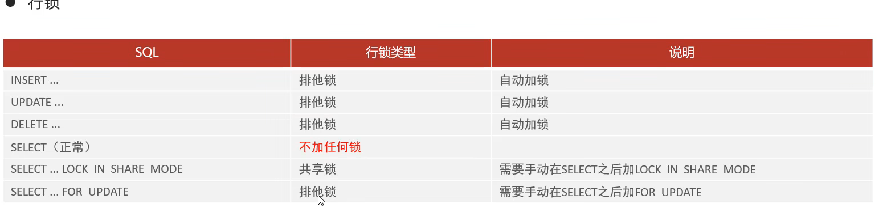

## 全局锁

数据库级别的锁

## 表级别锁

### 表锁

- 表共享锁  加了表共享锁，他自己也不能进行 改 、删、写
- 表排他锁

### 元数据锁(meta data lock)

为了防止DDL与DML的冲突

当有活动的事务未提交的时候，不能进行alter 也就是表结构的操作

### 意向锁

防止行锁与表锁的冲突，如果一个表中的行添加了行锁，则不能添加对应表锁，但是肯定不能去每一行去查看有没有添加行锁，所以要给这个表添加一个意向锁，用来判断该表有无添加行锁

- 意向共享锁(SX) 与表读锁 兼容，也就是说有SX，可以添加表读锁，但是与表写锁不兼容
- 意向排他锁 (IX)  与表读锁与表共享锁都不兼容

## 行级锁

### 行锁 / 记录锁    

如果进行操作的时候，涉及到的条件查找操作不通过索引来查找，就会升级为表锁

通过索引来实现的，MYISAM  存储引擎当中并不支持，所以单个记录，在RR （可重复读）与RC（读已提交）

- 共享锁
- 排他锁

### 间隙锁

锁定索引的间隙，保证索引记录的间隙不变

- 唯一索引为等值条件查询的时候，给不存在的记录加锁

  比如本来有 id = 3 , id =8

  操纵数据的时候条件 where id = 5,就会给 (3,8)这个区间加锁,不允许对该区间进行操作

- 普通索引 等值查询  会将 索引值为中心，向左第一个比他小的，像右第一个比他大的加锁

### 临键锁

前两者的结合，既能够保证数据不变，也能够保证间隙,RR隔离级别支持

唯一索引、范围查询

