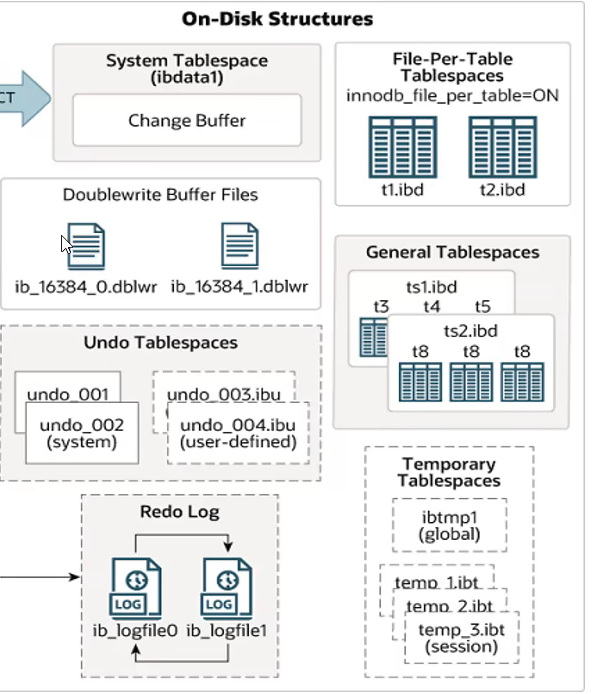
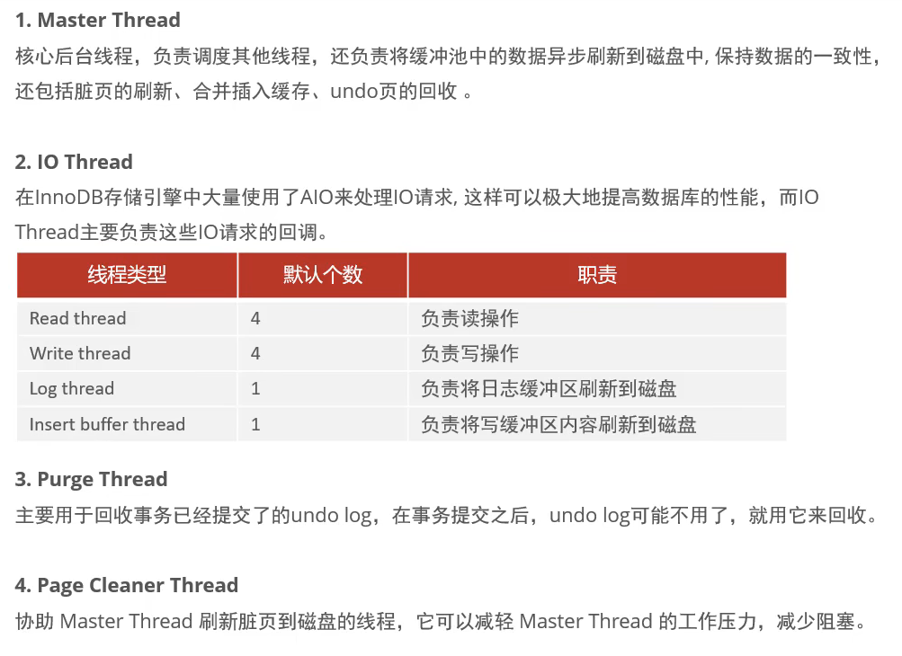
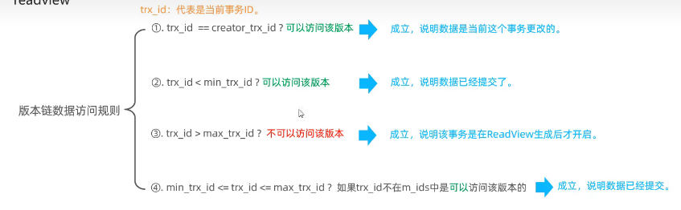
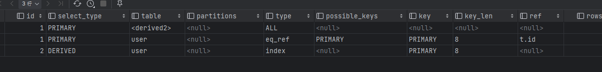
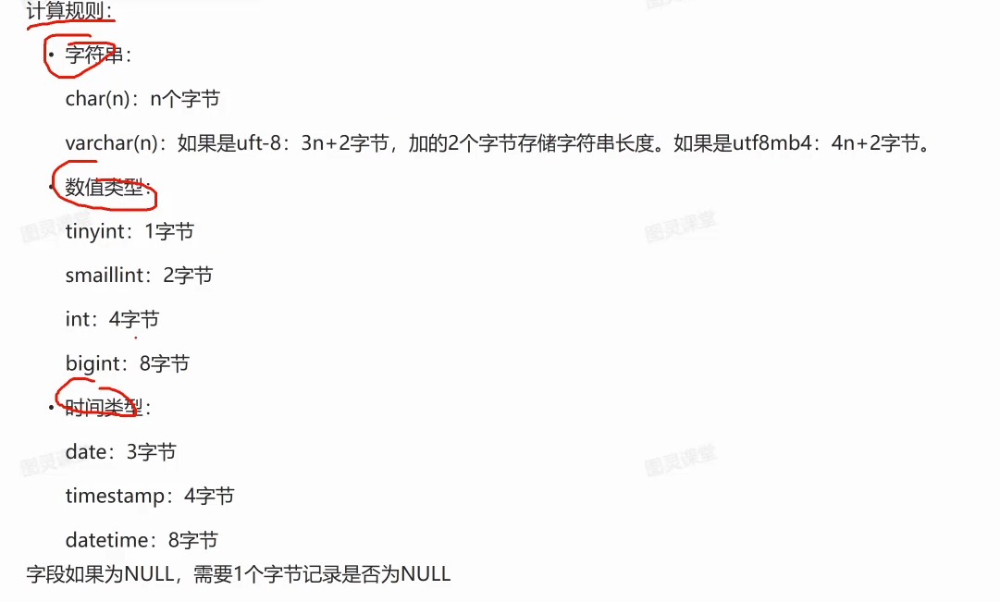

# MySql  锁

```mysql
select * from performance_schema.data_locks;//查看当前所有的锁
```

## 全局锁

数据库级别的锁


## 表级别锁

### 表锁

- 表共享锁  加了表共享锁，他自己也不能进行 改 、删、写
- 表排他锁

### 元数据锁(meta data lock)

为了防止DDL与DML的冲突

当有活动的事务未提交的时候，不能进行alter 也就是表结构的操作

### 意向锁

防止行锁与表锁的冲突，如果一个表中的行添加了行锁，则不能添加对应表锁，但是肯定不能去每一行去查看有没有添加行锁，所以要给这个表添加一个意向锁，用来判断该表有无添加行锁

- 意向共享锁(SX) 与表读锁 兼容，也就是说有SX，可以添加表读锁，但是与表写锁不兼容
- 意向排他锁 (IX)  与表读锁与表共享锁都不兼容

## 行级锁

### 行锁 / 记录锁    

如果进行操作的时候，涉及到的条件查找操作不通过索引来查找，就会升级为表锁

通过索引来实现的，MYISAM  存储引擎当中并不支持，所以单个记录，在RR （可重复读）与RC（读已提交）

- 共享锁
- 排他锁


### 间隙锁(开区间)

锁定索引的间隙，保证索引记录的间隙不变

**间隙锁可能会产生死锁的问题**，当两个事务都在同一个区间添加了间隙锁，并且都想要对这个区间进行insert操作的时候就会触发死锁问题，因为两个事务都会等待对方事务的资源释放，触发超时，自动回滚某一个事务

- 唯一索引为等值条件查询的时候，给不存在的记录加锁

  比如本来有 id = 3 , id =8

  操纵数据的时候条件 where id = 5,就会给 (3,8)这个区间加锁,不允许对该区间进行操作

- 普通索引 等值查询  会将 索引值为中心，向左第一个比他小的，像右第一个比他大的加锁

### 临键锁 （闭区间）

比如加锁的时候使用范围条件查询就可以添加临键锁

前两者的结合，既能够保证数据不变，也能够保证间隙,RR隔离级别支持

唯一索引、范围查询

# 结构

## 内存：

### Buffer Pool  缓存池

缓存磁盘当中的真实数据，先操作缓冲池中的数据，缓冲池再写入

- 空闲页  free Page 没有被使用过的
-  clean Page  被使用的page 但是没有被修改过
- dirty page 被使用了并且被修改了  buffer pool 中的与磁盘中的不一致

### change Buffer

针对非唯一 二级索引

8.0之后  如果进行DML语句的时候，buffer pool中没有响应的的页，就先将修改操作存入change buffer当中，等到buffer pool中有了再合并

### 自适应Hash索引

Adaptive Hash Index:自适应hash索引，用于优化对Buffer Pool数据的查询。InnoDB存储引擎会监控对表_上各索引页的查询，如果观察到hash索引可以提升速度,则建立hash索引,称之为自适应hash索引

自适应哈希索引，无需人工干预，是系统根据情况自动完成。
参数: adaptive_ hash_ index

### 日志缓冲区

默认16MB, 用于存储要写入到磁盘的日志(undolog、redolog)

## 磁盘：

表 段 区 页 行

**File-Per-Table Tablespaces:**每个表的文件表空间包含单个InnoDB表的数据和索引，并存储在
文件系统上的单个数据文件中。

表空间，ibd文件，存放表的结构、数据、索引

**General Tablespaces:通用表空间**，需要通过CREATE TABLESPACE 语法创建通用表空间，在创建表时，可
以指定该表空间。

**undolog 表空间**创建两个默认相同的表空间存放 undlog日志

删除时机：

**当insert的时候**，产生的undo log日志只在回滚时需要,在事务提交后,可被立即删除。
**而update、delete的时候**， 产生的undo log日志不仅在回滚时需要，在快照读时也需要,**不会**立即被删除。

**Temporary Tablespaces:** InnoDB 使用会话临时表空间和全局临时表空间。存储用户创建的临时表等数据。

**Doublewrite Buffer Files: 双写缓冲区**，innoDB引擎将数据页从Buffer Pool刷新到磁盘前，先将数据页写入双写缓冲区文件中，便于系统异常时恢复数据。

**Redo Log:重做日志**，是用来实现事务的持久性。该日志文件由两部分组成:重做日志缓冲(redo log buffer)以及重做日志文件(redo log) ,前者是在内存中，后者在磁盘中。当事务提交之后会把所有修改信息都会存到该日志中,用于在刷新脏页到磁盘时,发生错误时,进行数据恢复使用。**(会定时清理)**



### 后台线程



# MVCC多版本并发控制

全称Multi-Version Concurrency Control,多版本并发控制。指维护一-个数据的多个版本,使得读写操作没有冲突,快照读为MySQL实现
MVCC提供了-个非阻塞读功能。MVCC的具体实现，还需要依赖于**数据库记录中的三个隐式字段、undo log日志、readView**。

- 当前读，读取的是当前mysql当中的最新的数据
- 快照读  读取的是历史记录可见版本,
  Read Committed:每次select, 都生成一一个快照读。
  Repeatable Read:开启事务后第一个select语句才 是快照读的地方。
  Serializable:快照读会退化为当前读。

## 隐藏字段

**DB_TRX_ID** 最近一次修改、插入操作的事务的ID

**DB_ROLL_PTR** 回滚指针，指向该记录的上一个版本,用于配合undolog指向上一个版本,指向undo log

**DB_ROW_ID** 隐式主键，没有主键或者唯一键的时候生成

## undolog 版本链

当多个日志对应同一条数据进行修改操作的时候，会产生多条undolog 日志,而这多条undolog日志会形成一个链表，链表头部是最新的记录，尾部是最旧的日志，这就是版本链

## ReadView

是快照读SQL执行MVCC提取数据的依据，它用来记录并维护当前活跃事务的id，他有四个核心的字段

- 当前活跃的事务ID的集合
- 事务id集合中最小的id
- 事务id集合中的最大的id
- 事务id集合中的创建者事务 id

## MVCC实现原理

如果是RC 读已提交隔离级别，那么就会在每一次进行快照读的时候都创建一个readView

如果是RR  可重复读，就会在一个事务中第一次对该条记录进行快照读的时候创建ReadView,之后的快照读，都会使用这一个ReadView

快照读的时候会从undolog版本链的头结点的版本开始比对，直到找到第一个符合条件的记录：

**通过undlog 链 找到 一个 在readView 生成之前就提交的记录，或者是读视图创建者记录修改的记录**

比对规则如下：



## 索引下推：

在索引失效的情况下，如果没有索引下推技术的话，会进行多次回表，但是有了索引下推，就可以先通过现有的字段，在索引当中先进行过滤，然后再使用过滤之后的索引进行回表

上面的例子中，提到了like,包括MySQL官网中也只提到了like,但是其实不止有like。因为我认为索引下推其实
是解决索引失效带来的效率低的问题的一种手段。
所以当联合索引中，某个非前导列因为索弓|失效而要进行扫表并回表时，就可以进行索引下推优化了。
如，有a,b联合索引，类型都是varchar,以下SQL也可以用到索引下推:

``` sql
select d fromt 2 where a="ni" and b=1;
```


因为b字段因为类型不匹配导致索引失效了，但是通过下推优化其实是可以减少回表的次数的。

## redo log 和 binlog 有什么区别？

这两个日志有四个区别。

*1、适用对象不同：*

- binlog 是 MySQL 的 Server 层实现的日志，所有存储引擎都可以使用；
- redo log 是 Innodb 存储引擎实现的日志；

*2、文件格式不同：*

- binlog 有 3 种格式类型，分别是 STATEMENT（默认格式）、ROW、 MIXED，区别如下：
  - STATEMENT：每一条修改数据的 SQL 都会被记录到 binlog 中（相当于记录了逻辑操作，所以针对这种格式， binlog 可以称为逻辑日志），主从复制中 slave 端再根据 SQL 语句重现。但 STATEMENT 有动态函数的问题，比如你用了 uuid 或者 now 这些函数，你在主库上执行的结果并不是你在从库执行的结果，这种随时在变的函数会导致复制的数据不一致；
  - ROW：记录行数据最终被修改成什么样了（这种格式的日志，就不能称为逻辑日志了），不会出现 STATEMENT 下动态函数的问题。但 ROW 的缺点是每行数据的变化结果都会被记录，比如执行批量 update 语句，更新多少行数据就会产生多少条记录，使 binlog 文件过大，而在 STATEMENT 格式下只会记录一个 update 语句而已；
  - MIXED：包含了 STATEMENT 和 ROW 模式，它会根据不同的情况自动使用 ROW 模式和 STATEMENT 模式；
- redo log 是物理日志，记录的是在某个数据页做了什么修改，比如对 XXX 表空间中的 YYY 数据页 ZZZ 偏移量的地方做了AAA 更新；

*3、写入方式不同：*

- binlog 是追加写，写满一个文件，就创建一个新的文件继续写，不会覆盖以前的日志，保存的是全量的日志。
- redo log 是循环写，日志空间大小是固定，全部写满就从头开始，保存未被刷入磁盘的脏页日志。

*4、用途不同：*

- binlog 用于备份恢复、主从复制；
- redo log 用于掉电等故障恢复。

## mysql 产生死锁

1)表的死锁
产生原因:
用户A访问表A (锁住了表A)，然后又访问表B;另一个用户B访问表B (锁住了表B)，然后企图访问表A;这时
用户A由于用户B已经锁住表B，它必须等待用户B释放表B才能继续，同样用户B要等用户A释放表A才能继续，这
就死锁就产生了。

解决方案：只能调整程序的逻辑

2）行级别的死锁

1. 执行没有索引的操作，升级为表级锁，如果执行多个这种事务，就会阻塞
2. 占有多个行，两个行之间想互相占有
3. 同一条sql产生死锁，就是同一条sql如果它需要对多个行加锁，同时进行操作的时候就可能导致死锁，两个线程分别先拿到了其中一个资源，并持有等待

需要调整访问顺序，让线程以固定顺序执行

## mysql 可重复读级别的幻读

- 在一个事务当中虽然看不到别的事务的提交，比如另外一个事务插入了一个id = 25的行，你看不到因为你读的是 事务开始之前的数据，但是你却可以对这条数据进行增删改操作，并可以成功执行,MVCC只保证了读的时候的没有幻读，但是不能保证写的时候

- 并且你在同一个事务中的时候，使用selct * from + 表名是使用的快照读，但是使用select * from+ 表名 for update 的时候就是当前读了

## redolog为什么要先写

redolog是追加写在之前日志idea基础上面追加，而更改数据是随机写要先找到数据的位置，所以redolog的写入操作更快所以

## 索引跳跃扫描

比如联合索引(a,b) 如果sql语句当中只有 b =  那么正常来说不符合最左前缀原则，但是在a的字段类型较少的情况下可以被优化成

```mysql
where  a = 1 and b =1
union
where a =  2 and b =1 
```

这样也可以用到索引，要求前面的字段区分度高，不如效率也会比较低

## order by 排序的实现

有索引的时候一般会走索引，索引保证了顺序，没有索引的时候会走file_sort 也就是将数据放入内存当中使用排序算法进行排序

分为, **全字段排序、row_id排序**,字段过长会使用row_id 也就是排序的时候不带上数据，带上主键，但是这样的话需要进行回表

如果file_sort的**缓冲区满了**就会去磁盘当中排序

## 索引语句

```mysql
alter table user add index age_index(age); 添加索引
 show index from user; 查看表中的索引
  alter table user drop index user_age_index; 删除索引
```


# 优化

## insert优化

- 进行批量插入，也不要太多，太多的话可以多次分批插入
- 手动控制事务，防止频繁的事务提交 
- 主键进行顺序插入 ，和索引有关
- 大量数据用load指令

```mysql
create index idx user age pho ad on tb user(age asc  phone desc); 建立索引的时候可以指定索引的升序或者降序
```

## 深度分页优化

使用主键索引+子查询

```mysql
select * from tb sku t . (select id from tb sku order by id limit 2000000.10) a where t.id = a.id
先通过主键索引查找分页的主键id(因为主键是顺序的)，然后再去通过主键查出数据
```

## update

记得加索引，因为没有索引的时候是加的表锁

## explain

分析查询执行计划

### id列表示同一张表中的执行顺序、id越大越先执行



### select_type 查询的类型

| 序号 | select_type 类型 | 含义 |
| ---- | ---------------- | :--- |
|1	|SIMPLE	|简单的 select 查询,查询中不包含子查询或者UNION|
|2	|PRIMARY	|查询中若包含任何复杂的子部分，最外层查询则被标记为Primary|
|3	|SUBQUERY	|在SELECT或WHERE列表中包含了子查询|
|4	|DERIVED	|在FROM列表中包含的子查询被标记为DERIVED(衍生);MySQL会递归执行这些子查询, 把结果放在临时表里。|
|5	|UNION	|若第二个SELECT出现在UNION之后，则被标记为UNION；若UNION包含在FROM子句的子查询中,外层SELECT将被标记为：DERIVED|
|6	|UNION RESULT	|从UNION表获取结果的SELECT|
|7	|DEPENDENT SUBQUERY	|在SELECT或WHERE列表中包含了子查询,子查询基于外层|
|8	|UNCACHEABLE SUBQUREY	|无法被缓存的子查询|

### type列表示查询所使用的类型

system 最高级别

- **const** 基于**主键或者唯一索引**查看一行的时候，mysql对查询某部分进行优化转换为一个常量
- eq_ref  基于主键或者唯一索引 连接两个表查询 查询到条件每个索引都对应的只有一行的数据
- **ref** 使用**非唯一索引**作为条件
- 进行查询，每个索引对应的 有多个查询记录
- **range** 使用索引对表进行**范围查找**
- **index** 一般是进行全表扫描,能通过**全表扫描就能拿到结果**，不需要回表,一般是二级索引能够覆盖索引的情况
- **all** **遍历聚簇索引树** 进行了查找
- **null** 优化过程当中分解语句就可以获取到结果，执行的时候不用访问表或者索引  如：explain select *min*(user.age) from user;

### possible_key 与 key 列 ，分表表示可能用到与实际用到的索引


### key_len表示索引的最大长度，通常在联合索引的时候可以看出区别来，查看是否联合索引是否全部用到

计算规则：



### ref列表示的是等值匹配的类型

const 是常量

字段名

func表示是与函数的结果

### rows 表示 全表扫描的时候预估要扫描的行数， 索引扫描时表示扫描索引的夯实

### filter表示扫描的结果命中率

### Extra 列 表示sql查询的时候的一些额外的信息

- using index 表示二级索引就可以直接得到结果不需要回表
- using where 不通过索引来查询信息 
- using index conditiong 使用二级索引 范围查找，并且需要回表查找数据
- using temporary 需要引入临时表来进行操作
- using filesort  排序的时候无法借助索引的时候  排序过多的时候要通过建立索引来优化