# NIO

 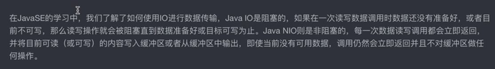

## 缓冲区，抽象类Buffer


他有很多实现的子类，每个基本数据类型都有一个对应的Buffer实现(除了bollean)

```java
 // Invariants: mark <= position <= limit <= capacity
    private int mark = -1;
    private int position = 0;//指针
    private int limit;//限制指针的位置
    private int capacity;//最大容量
```


默认创建的是堆缓冲区

```java
 public static void main(String[] args) {
        //    IntBuffer buffer = IntBuffer.allocate(10);//创建一个能够容纳10个int的缓冲区
        int[] intArr = new int[]{1,2,3,4,5,6};
        IntBuffer buffer2 = IntBuffer.wrap(intArr);
        System.out.println(buffer2.get(0));
        buffer2.put(0,9);
        System.out.println(buffer2.get(0));
    }
}
```

使用wrap方法得到的缓冲区，实际上是在维护被wrap的那个数组


那么它的内部是本质上如何进行操作的呢？我们来看看它的源码：

```java
public static IntBuffer allocate(int capacity) {
    if (capacity < 0)   //如果申请的容量小于0，那还有啥意思
        throw new IllegalArgumentException();
    return new HeapIntBuffer(capacity, capacity);   //可以看到这里会直接创建一个新的IntBuffer实现类
      //HeapIntBuffer是在堆内存中存放数据，本质上就数组，一会我们可以在深入看一下
}
复制代码
public static IntBuffer wrap(int[] array, int offset, int length) {
    try {
          //可以看到这个也是创建了一个新的HeapIntBuffer对象，并且给了初始数组以及截取的起始位置和长度
        return new HeapIntBuffer(array, offset, length);
    } catch (IllegalArgumentException x) {
        throw new IndexOutOfBoundsException();
    }
}

public static IntBuffer wrap(int[] array) {
    return wrap(array, 0, array.length);   //调用的是上面的wrap方法
}
复制代码
```

那么这个HeapIntBuffer又是如何实现的呢，我们接着来看：

```java
HeapIntBuffer(int[] buf, int off, int len) { // 注意这个构造方法不是public，是默认的访问权限
    super(-1, off, off + len, buf.length, buf, 0);   //你会发现这怎么又去调父类的构造方法了，绕来绕去
      //mark是标记，off是当前起始下标位置，off+len是最大下标位置，buf.length是底层维护的数组真正长度，buf就是数组，最后一个0是起始偏移位置
}
复制代码
```

我们又来看看IntBuffer中的构造方法是如何定义的：

```java
final int[] hb;                  // 只有在堆缓冲区实现时才会使用
final int offset;
boolean isReadOnly;                 // 只有在堆缓冲区实现时才会使用

IntBuffer(int mark, int pos, int lim, int cap,   // 注意这个构造方法不是public，是默认的访问权限
             int[] hb, int offset)
{
    super(mark, pos, lim, cap);  //调用Buffer类的构造方法
    this.hb = hb;    //hb就是真正我们要存放数据的数组，堆缓冲区底层其实就是这么一个数组
    this.offset = offset;   //起始偏移位置
}
复制代码
```

最后我们来看看Buffer中的构造方法：

```java
Buffer(int mark, int pos, int lim, int cap) {       // 注意这个构造方法不是public，是默认的访问权限
    if (cap < 0)  //容量不能小于0，小于0还玩个锤子
        throw new IllegalArgumentException("Negative capacity: " + cap);
    this.capacity = cap;   //设定缓冲区容量
    limit(lim);    //设定最大position位置
    position(pos);   //设定起始位置
    if (mark >= 0) {  //如果起始标记大于等于0
        if (mark > pos)  //并且标记位置大于起始位置，那么就抛异常（至于为啥不能大于我们后面再说）
            throw new IllegalArgumentException("mark > position: ("
                                               + mark + " > " + pos + ")");
        this.mark = mark;   //否则设定mark位置（mark默认为-1）
    }
}
复制代码
```

通过对源码的观察，我们大致可以得到以下结构了：


现在我们来总结一下上面这些结构的各自职责划分：

- Buffer：缓冲区的一些基本变量定义，比如当前的位置（position）、容量 (capacity)、最大限制 (limit)、标记 (mark)等，你肯定会疑惑这些变量有啥用，别着急，这些变量会在后面的操作中用到，我们逐步讲解。
- IntBuffer等子类：定义了存放数据的数组（只有堆缓冲区实现子类才会用到）、是否只读等，也就是说数据的存放位置、以及对于底层数组的相关操作都在这里已经定义好了，并且已经实现了Comparable接口。
- HeapIntBuffer堆缓冲区实现子类：数据存放在堆中，实际上就是用的父类的数组在保存数据，并且将父类定义的所有底层操作全部实现了。

## 缓冲区的写操作

```java
   IntBuffer buffer = IntBuffer.allocate(10);//创建一个能够容纳10个int的缓冲区
            buffer.put(1);
            buffer.put(2);//不指定索引，根据指针来确定索引
            buffer.put(6,999);//指定索引
        System.out.println(Arrays.toString(buffer.array()));
            buffer.put(new int[]{666,555,333});//将数组内容添加至buffer当中，从当前指针开始添加
        System.out.println(Arrays.toString(buffer.array ()));
            buffer.put(IntBuffer.wrap(new int[]{777,666,333,555}));
        System.out.println(Arrays.toString(buffer.array()));//也可以将buffer写入
```

## 缓冲区读操作

```java
  IntBuffer intBuffer = IntBuffer.wrap(new int[]{1,2,3,4,5,6,7,3,354,3,});
            //获取元素就是直接获取数组中对应的值
        System.out.println(intBuffer.get());
        //获取指定的元素
        System.out.println(intBuffer.get(5));
        //将Buffer当中的元素放入指定的数组当中,从当前的指针开始
        int [] arr = new int[5];
        intBuffer.get(arr);
        System.out.println(Arrays.toString(arr));
        System.out.println(intBuffer.remaining());//remaining获取剩余的容量 remain = limit - position
```

flip方法:

```java
     // 将Buffer从写模式切换到读模式（必须调用这个方法）
        buffer.flip();

   //源代码
    public Buffer flip() {
        limit = position;
        position = 0;
        mark = -1;
        return this;
    }
```

mark来标记（艾克大招）

```java
   IntBuffer intBuffer = IntBuffer.wrap(new int[]{1,2,3,4,5,6,7,3,354,3,});
       //使用mark来实现控制position
            intBuffer.get();
            intBuffer.mark();//标记当前的position指针，将值赋值给mark
            intBuffer.get();
            intBuffer.reset();//将mark的值赋值给position指针
```

其他的操作:

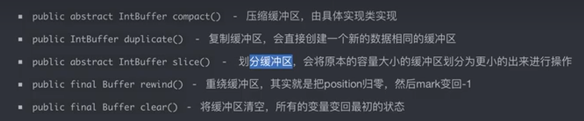

compact()将positoni到limit的所有的元素都提到前面

duplicate是浅拷贝，他们都是维护的同一个数组

slice()(将当前position之后的元素划分出来):

现在我们接着来看下一个方法，`slice()`方法会将缓冲区进行划分：

```java
public IntBuffer slice() {
    int pos = this.position();   //获取当前position
    int lim = this.limit();     //获取position最大位置
    int rem = (pos <= lim ? lim - pos : 0);   //求得剩余空间
    return new HeapIntBuffer(hb,    //返回一个新的划分出的缓冲区，但是底层的数组用的还是同一个
                                    -1,
                                    0,
                                    rem,    //新的容量变成了剩余空间的大小
                                    rem,
                                    pos + offset);   //可以看到offset的地址不再是0了，而是当前的position加上原有的offset值
}
复制代码
```

虽然现在底层依然使用的是之前的数组，但是由于设定了offset值，我们之前的操作似乎变得不太一样了：

回顾前面我们所讲解的内容，在读取和存放时，会被`ix`方法进行调整：

```java
protected int ix(int i) {
    return i + offset;   //现在offset为4，那么也就是说逻辑上的i是0但是得到真实位置却是4
}

public int get() {
    return hb[ix(nextGetIndex())];   //最后会经过ix方法转换为真正在数组中的位置
}
复制代码
```

当然，在逻辑上我们可以认为是这样的：

 


clear方法，恢复到原来的状态

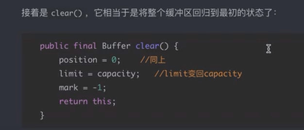

equals方法比较的是缓冲区剩余的内容(比较remain)，所以写完可以flip一下在比较

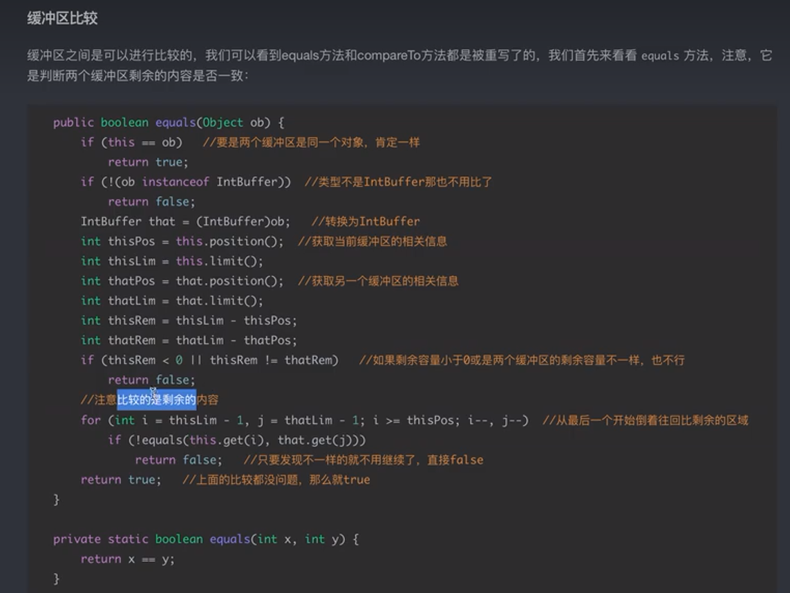

## 只读缓冲区

```java
IntBuffer readOnly = buffer.asReadOnlyBuffer//返回一个HeapIntBufferR类,只读缓冲区
```

## ByteBuffer与CharBuffer

底层也是维护一个对应的类型的数组

```java
ByteBuffer byteBuffer = ByteBuffer.allocate(20);
        byteBuffer.putInt(123);
        byteBuffer.putChar('n');
        System.out.println(byteBuffer.remaining());
        byteBuffer.flip();
        System.out.println(byteBuffer.getInt());
        System.out.println(byteBuffer.getChar());
```

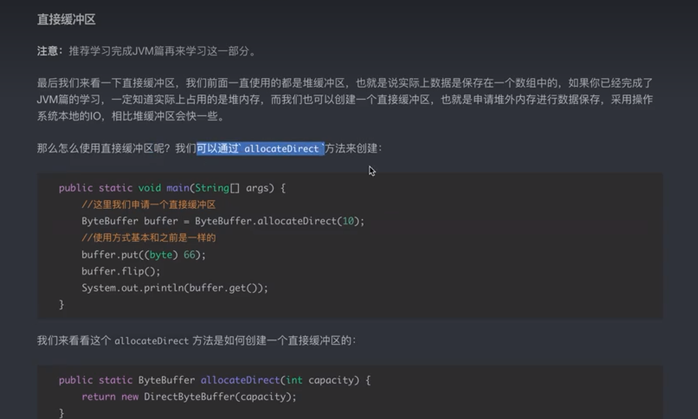

## 通道

在传统IO中，我们都是通过流进行传输，数据会源源不断从流中传出;而在NIO中，数据是放在缓冲区中进行管理，再使用通道将缓冲区中的数据传输到目的地,`Channel`的`position`属性表示在通道中进行读取或写入操作的当前位置或偏移量，你可以通过设置它来控制操作的起始位置。

```java
public interface Channel extends Closeable {
    //通道是否处于开启状态
    public boolean isOpen();

    //因为通道开启也需要关闭，所以实现了Closeable接口，所以这个方法懂的都懂
    public void close() throws IOException;
}
```

```java
public interface ReadableByteChannel extends Channel {
    //将通道中的数据读取到给定的缓冲区中
    public int read(ByteBuffer dst) throws IOException;
}
```

```java
public interface WritableByteChannel extends Channel {
      //将给定缓冲区中的数据写入到通道中
    public int write(ByteBuffer src) throws IOException;
}
```

```java
//有了读写功能后，最后整合为了一个ByteChannel接口：
public interface ByteChannel extends ReadableByteChannel, WritableByteChannel{

}
```

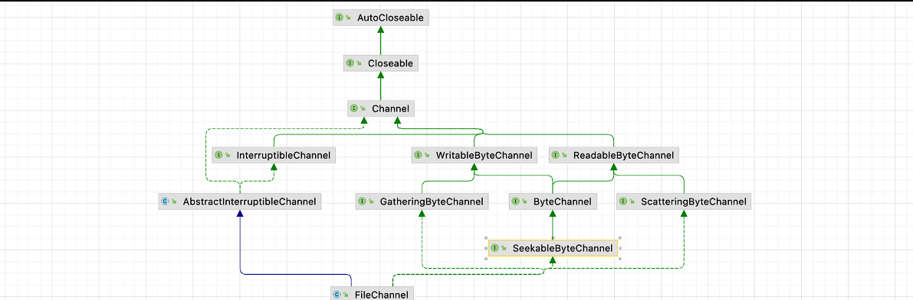

```java
//channel读取数据至Buffer当中
ByteBuffer byteBuffer = ByteBuffer.allocate(200);//创建一个缓冲区
        ReadableByteChannel readableByteChannel = Channels.newChannel(System.in);//使用Channels这个工具类将流其变成一个可读的channel
        while (true){
            readableByteChannel.read(byteBuffer);//写入
            //写入之后进行翻转
            byteBuffer.flip();
            //打印出数据
            String str = new String(byteBuffer.array());
            System.out.println(str);
            //回到最初的状态
            byteBuffer.clear();
        }
```

使用chaneel进行读入

```java
		FileInputStream input = new FileInputStream(file);
        //直接通过流来获取channel
        FileChannel channel = input.getChannel();
        //创建一个容量为128的缓冲区
        ByteBuffer buffer = ByteBuffer.allocate(128);
        channel.read(buffer);
        buffer.flip();
        System.out.println(new String(buffer.array()));
```

可以使用RandomAccessFile来获取既可以读也可以写的channel

```java
 RandomAccessFile randomAccessFile = new RandomAccessFile("test.txt","rw");
        FileChannel channel = randomAccessFile.getChannel();//这样得到的channel既可以读又可以写

        channel.write(ByteBuffer.wrap(new String("你好").getBytes("utf-8")));
        System.out.println(channel.position());
        channel.position(0);//将position归位
        ByteBuffer allocate = ByteBuffer.allocate(200);
        channel.read(allocate);
        System.out.println(new String(allocate.array()));
```

截断truncate

```java
channel.truncate(10);
```

transorm实现channel的数据的转移

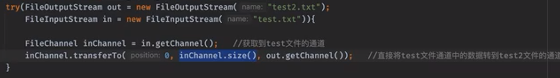

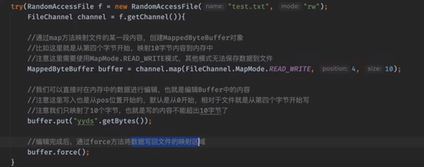

文件锁，对一个文件进行进程级别的加锁，也就是不允许其他的进程去操纵文件：

### 文件锁FileLock

我们可以创建一个跨进程文件锁来防止多个进程之间的文件争抢操作（注意这里是进程，不是线程）FileLock是文件锁，它能保证同一时间只有一个进程（程序）能够修改它，或者都只可以读，这样就解决了多进程间的同步文件，保证了安全性。但是需要注意的是，它进程级别的，不是线程级别的，他可以解决多个进程并发访问同一个文件的问题，但是它不适用于控制同一个进程中多个线程对一个文件的访问。

那么我们来看看如何使用文件锁：

```java
public static void main(String[] args) throws IOException, InterruptedException {
      //创建RandomAccessFile对象，并拿到Channel
    RandomAccessFile f = new RandomAccessFile("test.txt", "rw");
    FileChannel channel = f.getChannel();
    System.out.println(new Date() + " 正在尝试获取文件锁...");
      //接着我们直接使用lock方法进行加锁操作（如果其他进程已经加锁，那么会一直阻塞在这里）
      //加锁操作支持对文件的某一段进行加锁，比如这里就是从0开始后的6个字节加锁，false代表这是一把独占锁
      //范围锁甚至可以提前加到一个还未写入的位置上
    FileLock lock = channel.lock(0, 6, false);
    System.out.println(new Date() + " 已获取到文件锁！");
    Thread.sleep(5000);   //假设要处理5秒钟
    System.out.println(new Date() + " 操作完毕，释放文件锁！");
      
      //操作完成之后使用release方法进行锁释放
    lock.release();
}
```

共享锁与独占锁

有关共享锁和独占锁：

- 进程对文件加独占锁后，当前进程对文件可读可写，独占此文件，其它进程是不能读该文件进行读写操作的。
- 进程对文件加共享锁后，进程可以对文件进行读操作，但是无法进行写操作，共享锁可以被多个进程添加，但是只要存在共享锁，就不能添加独占锁。

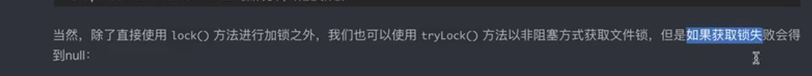

## 多路复用

使用socketChannel来实现socket连接

Client

```java
SocketChannel socketChannel = SocketChannel.open(new InetSocketAddress("127.0.0.1",8080));
        Scanner scanner = new Scanner(System.in);
        String msg = scanner.nextLine();

        socketChannel.write(ByteBuffer.wrap(msg.getBytes()));

        ByteBuffer byteBuffer = ByteBuffer.allocate(1024);
        socketChannel.read(byteBuffer);
        byteBuffer.flip();
        msg = new String(byteBuffer.array(),0,byteBuffer.remaining());
        System.out.println(msg);
```

Server

```java
ServerSocketChannel serverSocketChannel = ServerSocketChannel.open();
        serverSocketChannel.bind(new InetSocketAddress(8080));
        SocketChannel socketChannel = serverSocketChannel.accept();
        System.out.println("ip地址为:"+socketChannel.getRemoteAddress());//获取远端的地址

        //使用缓冲区接受数据
        ByteBuffer byteBuffer = ByteBuffer.allocate(1024);
        socketChannel.read(byteBuffer);
        byteBuffer.flip();
        System.out.println("接收到数据:"+new String(byteBuffer.array(),0,byteBuffer.remaining()));

        //写回数据
        socketChannel.write(ByteBuffer.wrap("已经收到消息了..".getBytes()));
        //关闭资源
        socketChannel.close();
```

传统Socket的弊端:

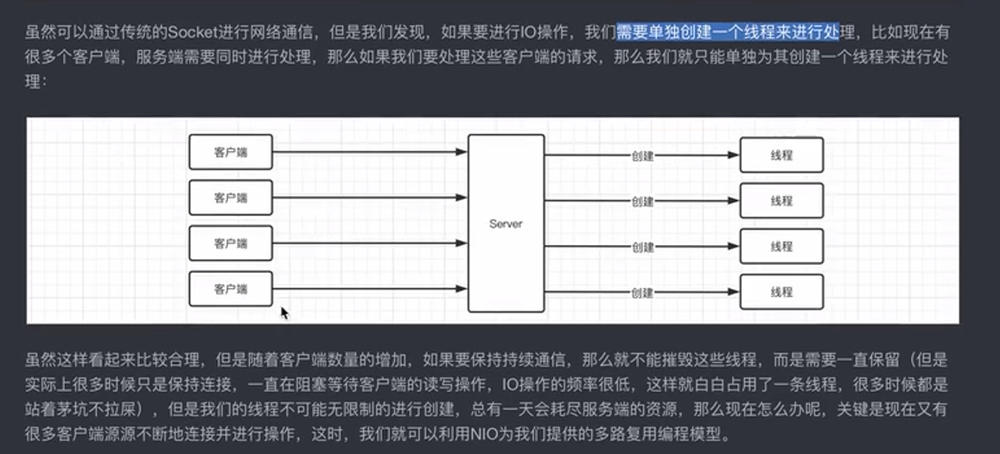

在较早的 Tomcat 版本中，Tomcat 使用传统的 Socket 方式处理连接。这种方式每个请求都会创建一个新的线程，由该线程负责处理请求和响应。

然而，从 Tomcat 6 版本开始，引入了 NIO 技术，即 Java 的非阻塞 I/O。NIO 提供了更高效的事件驱动 I/O 模型，可以通过较少的线程处理更多的并发连接。Tomcat 中的 NIO 实现使用了 Java NIO 包中的相关类，如 Selector、Channel 等。

NIO的模型:

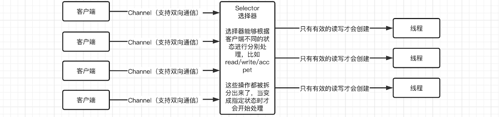

服务端不再是一个单纯通过`accept()`方法来创建连接的机制了，而是根据客户端不同的状态，Selector会不断轮询，只有客户端在对应的状态时，比如真正开始读写操作时，才会创建线程或进行处理（这样就不会一直阻塞等待某个客户端的IO操作了），而不是创建之后需要一直保持连接，即使没有任何的读写操作。这样就不会因为占着茅坑不拉屎导致线程无限制地创建下去了。

通过这种方式，甚至单线程都能做到高效的复用，最典型的例子就是Redis了，因为内存的速度非常快，多线程上下文的开销就会显得有些拖后腿，还不如直接单线程简单高效，这也是为什么Redis单线程也能这么快的原因。

NIO选择器:

selector实现的几种方案:

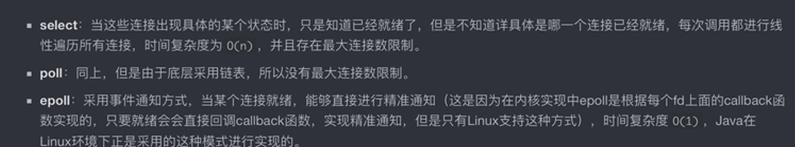

使用NIO的模型非阻塞的实现Socket通信

```java
public static void main(String[] args) {
    try (ServerSocketChannel serverChannel = ServerSocketChannel.open();
         Selector selector = Selector.open()){   //开启一个新的Selector，这玩意也是要关闭释放资源的
        serverChannel.bind(new InetSocketAddress(8080));
        //要使用选择器进行操作，必须使用非阻塞的方式，这样才不会像阻塞IO那样卡在accept()，而是直接通过，让选择器去进行下一步操作
        serverChannel.configureBlocking(false);
        //将选择器注册到ServerSocketChannel中，后面是选择需要监听的时间，只有发生对应事件时才会进行选择，多个事件用 | 连接，注意，并不是所有的Channel都支持以下全部四个事件，可能只支持部分
        //因为是ServerSocketChannel这里我们就监听accept就可以了，等待客户端连接
        //SelectionKey.OP_CONNECT --- 连接就绪事件，表示客户端与服务器的连接已经建立成功
        //SelectionKey.OP_ACCEPT --- 接收连接事件，表示服务器监听到了客户连接，服务器可以接收这个连接了
        //SelectionKey.OP_READ --- 读 就绪事件，表示通道中已经有了可读的数据，可以执行读操作了
        //SelectionKey.OP_WRITE --- 写 就绪事件，表示已经可以向通道写数据了（这玩意比较特殊，一般情况下因为都是可以写入的，所以可能会无限循环）
        serverChannel.register(selector, SelectionKey.OP_ACCEPT);
        while (true) {   //无限循环等待新的用户网络操作
            //每次选择都可能会选出多个已经就绪的网络操作，没有操作时会暂时阻塞
            int count = selector.select();
            System.out.println("监听到 "+count+" 个事件");
            Set<SelectionKey> selectionKeys = selector.selectedKeys();
            Iterator<SelectionKey> iterator = selectionKeys.iterator();
            while (iterator.hasNext()) {
                SelectionKey key = iterator.next();
                //根据不同的事件类型，执行不同的操作即可
                if(key.isAcceptable()) {  //如果当前ServerSocketChannel已经做好准备处理Accept
                    SocketChannel channel = serverChannel.accept();
                    System.out.println("客户端已连接，IP地址为："+channel.getRemoteAddress());
                    //现在连接就建立好了，接着我们需要将连接也注册选择器，比如我们需要当这个连接有内容可读时就进行处理
                    channel.configureBlocking(false);
                    channel.register(selector, SelectionKey.OP_READ);
                    //这样就在连接建立时完成了注册
                } else if(key.isReadable()) {    //如果当前连接有可读的数据并且可以写，那么就开始处理
                    SocketChannel channel = (SocketChannel) key.channel();
                    ByteBuffer buffer = ByteBuffer.allocate(128);
                    channel.read(buffer);
                    buffer.flip();
                    System.out.println("接收到客户端数据："+new String(buffer.array(), 0, buffer.remaining()));

                    //直接向通道中写入数据就行
                    channel.write(ByteBuffer.wrap("已收到！".getBytes()));
                    //别关，说不定用户还要继续通信呢
                }
                //处理完成后，一定记得移出迭代器，不然下次还有
                iterator.remove();
            }
        }
    } catch (IOException e) {
        throw new RuntimeException(e);
    }
}
```

reactor模式:

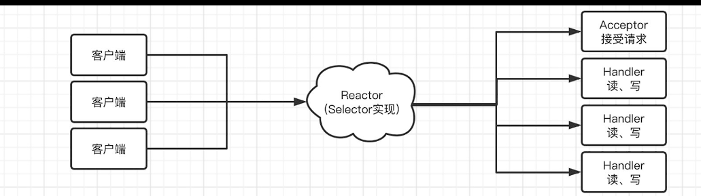

客户端还是按照我们上面的方式连接到Reactor，并通过选择器走到Acceptor或是Handler，Acceptor主要负责客户端连接的建立，Handler负责读写操作，代码如下，首先是Handler：

```java
public class Handler implements Runnable{

    private final SocketChannel channel;

    public Handler(SocketChannel channel) {
        this.channel = channel;
    }

    @Override
    public void run() {
        try {
            ByteBuffer buffer = ByteBuffer.allocate(128);
            channel.read(buffer);
            buffer.flip();
            System.out.println("接收到客户端数据："+new String(buffer.array(), 0, buffer.remaining()));
            channel.write(ByteBuffer.wrap("已收到！".getBytes()));
        }catch (IOException e){
            e.printStackTrace();
        }
    }
}
复制代码
```

接着是Acceptor，实际上就是把上面的业务代码搬个位置罢了：

```java
/**
 * Acceptor主要用于处理连接操作
 */
public class Acceptor implements Runnable{

    private final ServerSocketChannel serverChannel;
    private final Selector selector;

    public Acceptor(ServerSocketChannel serverChannel, Selector selector) {
        this.serverChannel = serverChannel;
        this.selector = selector;
    }

    @Override
    public void run() {
        try{
            SocketChannel channel = serverChannel.accept();
            System.out.println("客户端已连接，IP地址为："+channel.getRemoteAddress());
            channel.configureBlocking(false);
            //这里在注册时，创建好对应的Handler，这样在Reactor中分发的时候就可以直接调用Handler了
            channel.register(selector, SelectionKey.OP_READ, new Handler(channel));
        }catch (IOException e){
            e.printStackTrace();
        }
    }
}
```

这里我们在注册时丢了一个附加对象进去，这个附加对象会在选择器选择到此通道上时，可以通过`attachment()`方法进行获取，对于我们简化代码有大作用，一会展示，我们接着来看看Reactor：

```java
public class Reactor implements Closeable, Runnable{

    private final ServerSocketChannel serverChannel;
    private final Selector selector;
    public Reactor() throws IOException{
        serverChannel = ServerSocketChannel.open();
        selector = Selector.open();
    }

    @Override
    public void run() {
        try {
            serverChannel.bind(new InetSocketAddress(8080));
            serverChannel.configureBlocking(false);
            //注册时，将Acceptor作为附加对象存放，当选择器选择后也可以获取到
            serverChannel.register(selector, SelectionKey.OP_ACCEPT, new Acceptor(serverChannel, selector));
            while (true) {
                int count = selector.select();
                System.out.println("监听到 "+count+" 个事件");
                Set<SelectionKey> selectionKeys = selector.selectedKeys();
                Iterator<SelectionKey> iterator = selectionKeys.iterator();
                while (iterator.hasNext()) {
                    this.dispatch(iterator.next());   //通过dispatch方法进行分发
                    iterator.remove();
                }
            }
        }catch (IOException e) {
            e.printStackTrace();
        }
    }

    //通过此方法进行分发
    private void dispatch(SelectionKey key){
        Object att = key.attachment();   //获取attachment，ServerSocketChannel和对应的客户端Channel都添加了的
        if(att instanceof Runnable) {
            ((Runnable) att).run();   //由于Handler和Acceptor都实现自Runnable接口，这里就统一调用一下
        }   //这样就实现了对应的时候调用对应的Handler或是Acceptor了
    }

    //用了记得关，保持好习惯，就像看完视频要三连一样
    @Override
    public void close() throws IOException {
        serverChannel.close();
        selector.close();
    }
}
```

最后我们编写一下主类：

```java
public static void main(String[] args) {
    //创建Reactor对象，启动，完事
    try (Reactor reactor = new Reactor()){
        reactor.run();
    }catch (IOException e) {
        e.printStackTrace();
    }
}
```

这样，我们就实现了单线程Reactor模式，注意全程使用到的都只是一个线程，没有创建新的线程来处理任何事情。

但是单线程始终没办法应对大量的请求，如果请求量上去了，单线程还是很不够用，接着我们来看看多线程Reactor模式，它创建了多个线程处理，我们可以将数据读取完成之后的操作交给线程池来执行：

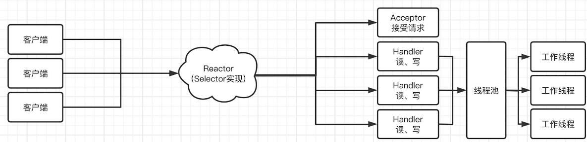

主从reactor:

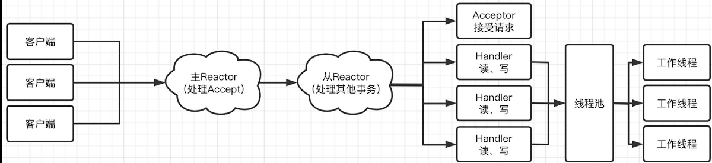