# Netty

导包

```xml
<dependencies>
    <dependency>
        <groupId>io.netty</groupId>
        <artifactId>netty-all</artifactId>
        <version>4.1.76.Final</version>
    </dependency>
</dependencies>
```

缓冲区

### ByteBuf介绍

Netty并没有使用NIO中提供的ByteBuffer来进行数据装载，而是自行定义了一个ByteBuf类。

那么这个类相比NIO中的ByteBuffer有什么不同之处呢？

- 写操作完成后无需进行`flip()`翻转。
- 具有比ByteBuffer更快的响应速度。
- 动态扩容。

首先我们来看看它的内部结构：

```java
public abstract class AbstractByteBuf extends ByteBuf {
    ...
    int readerIndex;   //index被分为了读和写，是两个指针在同时工作
    int writerIndex;
    private int markedReaderIndex;    //mark操作也分两种
    private int markedWriterIndex;
    private int maxCapacity;    //最大容量，没错，这玩意能动态扩容
```

可以看到，读操作和写操作分别由两个指针在进行维护，每写入一次，`writerIndex`向后移动一位，每读取一次，也是`readerIndex`向后移动一位，当然`readerIndex`不能大于`writerIndex`，这样就不会像NIO中的ByteBuffer那样还需要进行翻转了。


```java
		ByteBuf buffer = Unpooled.buffer(10);//创建一个缓冲区
        System.out.println("初始状态:"+ Arrays.toString(buffer.array()));
        buffer.writeInt(1234665321);
        System.out.println("中间状态:"+ Arrays.toString(buffer.array()));
        buffer.readChar();
        System.out.println("中间状态:"+ Arrays.toString(buffer.array()));
        buffer.discardReadBytes();//丢弃操作.将可读的部分内容丢在最前面，读写指针往前移

        buffer.clear();//读写指针都归零
        System.out.println("结束状态:"+ Arrays.toString(buffer.array()));
```

```java
ByteBuf byteBuf = Unpooled.wrappedBuffer("1231sadasad".getBytes());
        Unpooled.copiedBuffer("1231sadasad".getBytes());//copiedBuffer是会将原来的数组中的数据拷贝创建一个新的
        byteBuf.readChar();
        ByteBuf slice = byteBuf.slice();//切片
        byteBuf.arrayOffset();
        byteBuf.array();
```

动态扩容

```java
//动态扩容,也可以在创建时候指定最大容量，使得不能动态扩容
        ByteBuf byteBuf = Unpooled.buffer(10);
        System.out.println(byteBuf.capacity());
        byteBuf.writeCharSequence("萨加不加萨等不及萨等不及萨等不及萨比就2", StandardCharsets.UTF_8);
        System.out.println(byteBuf.capacity());
```

复合缓冲区:

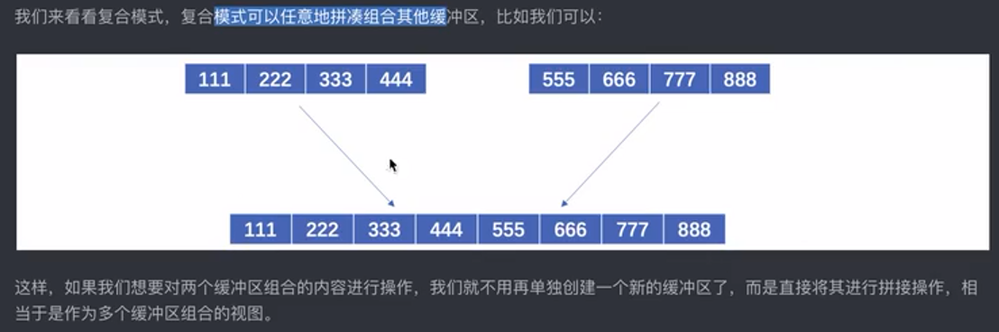

创建复合缓冲区

```java
CompositeByteBuf byteBufs = Unpooled.compositeBuffer();
byteBufs.addComponent(Unpooled.copiedBuffer("你好吗".getBytes()));
byteBufs.addComponent(Unpooled.copiedBuffer("我很好".getBytes()));
```

在 Netty 中，`CompositeByteBuf.array()` 方法报错的原因可能是因为 `CompositeByteBuf` 对象是一个组合缓冲区，它由多个子缓冲区组成，并不具备一个连续的字节数组来支持 `array()` 方法。

`CompositeByteBuf` 是一种特殊的 `ByteBuf` 实现，它将多个子缓冲区组合在一起，形成一个逻辑上连续但物理上分散的缓冲区。由于 `CompositeByteBuf` 不是由单个连续的字节数组支持的，因此调用 `array()` 方法时会抛出 `UnsupportedOperationException` 异常。

如果你想获取 `CompositeByteBuf` 的数据，可以考虑使用其他方法，如 `getByte(int index)`、`readByte()`、`readBytes(byte[] dst)` 等方法来逐个获取字节数据或将数据读取到字节数组中。


池化缓冲区

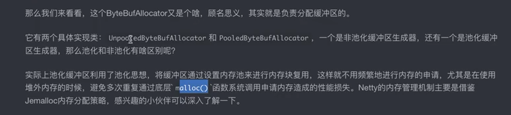

零拷贝:

零拷贝是一种I/O操作优化技术，可以快速高效地将数据从文件系统移动到网络接口，而不需要将其从内核空间复制到用户空间

实现零拷贝我们这里演示三种方案：

1. 使用虚拟内存

   现在的操作系统基本都是支持虚拟内存的，我们可以让内核空间和用户空间的虚拟地址指向同一个物理地址，这样就相当于是直接共用了这一块区域，也就谈不上拷贝操作了：

   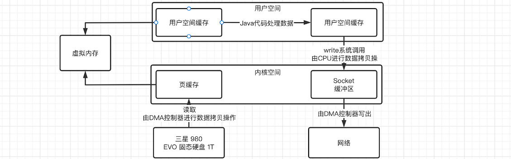

2. 使用mmap/write内存映射

   实际上这种方式就是将内核空间中的缓存直接映射到用户空间缓存，比如我们之前在学习NIO中使用的MappedByteBuffer，就是直接作为映射存在，当我们需要将数据发送到Socket缓冲区时，直接在内核空间中进行操作就行了：

   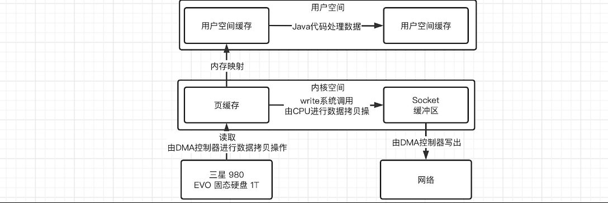

   不过这样还是会出现用户态和内核态的切换，我们得再优化优化。

3. 使用sendfile方式

   在Linux2.1开始，引入了sendfile方式来简化操作，我们可以直接告诉内核要把哪个文件数据拷贝拷贝到Socket上，直接在内核空间中一步到位：

   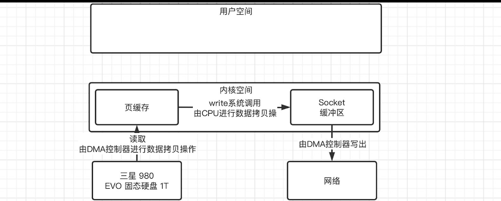

   比如我们之前在NIO中使用的`transferTo()`方法，就是利用了这种机制来实现零拷贝的。


## Netty的工作模型

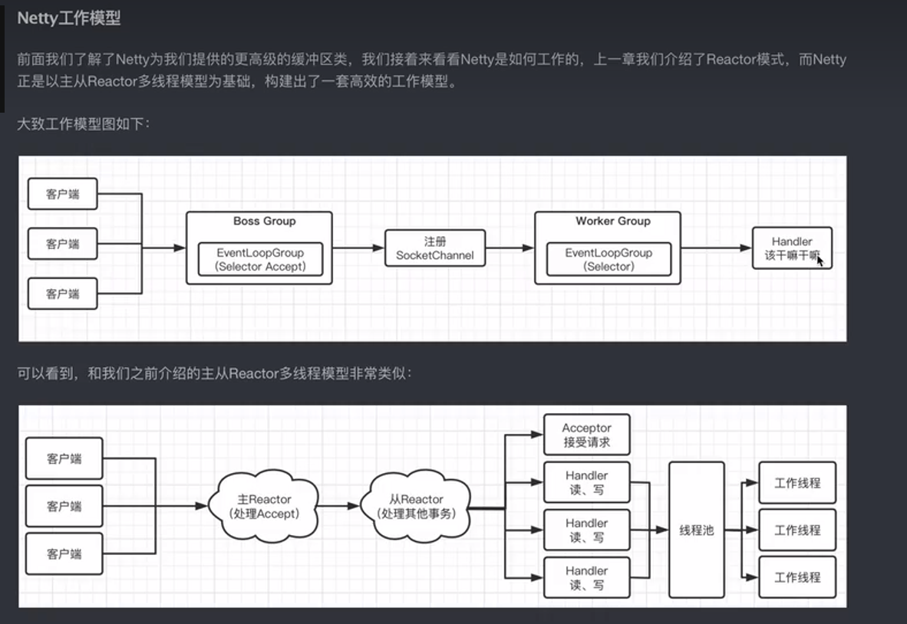

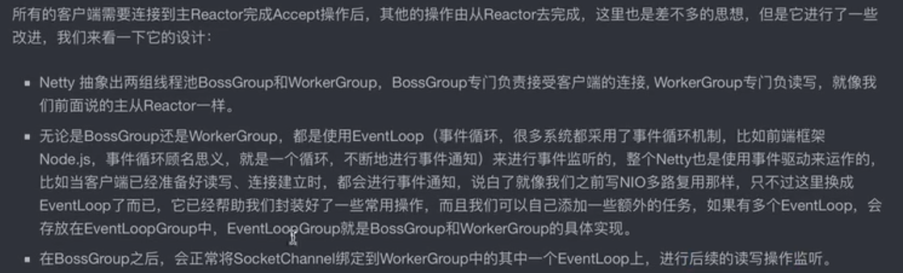

Netty实现一个服务器

```java
 public static void main(String[] args) {
        //创建BossGroup与WorkGroup
        EventLoopGroup bossGroup = new NioEventLoopGroup();
        EventLoopGroup workGroup = new NioEventLoopGroup();

        //创建一个服务器的启动引导类，就是启动之前对服务器进行一些设置以后才能启动
        ServerBootstrap serverBootstrap = new ServerBootstrap();

        serverBootstrap
                .group(bossGroup,workGroup)//指定事件循环组
                .channel(NioServerSocketChannel.class)//指定类型
                .childHandler(new ChannelInitializer<SocketChannel>() {
                    @Override
                    protected void initChannel(SocketChannel socketChannel) throws Exception {
                        //获取流水线,一个流水线上面有很多的Handler
                        socketChannel.pipeline().addLast(new ChannelInboundHandlerAdapter(){//添加一个handler,入栈
                            @Override
                            public void channelRead(ChannelHandlerContext ctx, Object msg) throws Exception {//ctx是上下文,msg默认是ByteBuf类
                                ByteBuf byteBuf = (ByteBuf) msg;
                                System.out.println(Thread.currentThread().getName()+">>收到客户端传来的信息:"+byteBuf.toString(StandardCharsets.UTF_8));
                                //通过上下文返回一个响应,返回一个数据
                                ctx.writeAndFlush(Unpooled.wrappedBuffer("已经收到消息了".getBytes()));
                            }
                        });
                    }
                });
        serverBootstrap.bind(8080);

    }
```

在Netty中，一个`Channel`会被注册到一个`EventLoopGroup`中的一个`EventLoop`上。`EventLoopGroup`是用于管理`Channel`的线程池，而`EventLoop`是负责处理`Channel`上的事件的执行器。

一个`Channel`可以有多个`ChannelHandler`，这些`ChannelHandler`被添加到`ChannelPipeline`中，构成了处理器链。`ChannelPipeline`是一个处理器链，它负责处理`Channel`上的事件和数据流。当有事件在`Channel`上触发时，`ChannelPipeline`会按顺序调用每个`ChannelHandler`的相应方法来处理事件或数据。

每个`ChannelHandler`可以根据需要进行读取、写入、转换、解码、编码、验证等操作，并将处理结果传递给下一个`ChannelHandler`。通过将多个`ChannelHandler`组合在一起，可以实现复杂的数据处理逻辑。

因此，您的理解是一个`Channel`会被注册到一个事件循环组（`EventLoopGroup`）中，然后该`Channel`会有多个`ChannelHandler`组成的处理器链（`ChannelPipeline`）来监听和处理事件和数据。每个`ChannelHandler`负责特定的任务，并可以通过`ChannelHandlerContext`与`Channel`进行交互和操作。


channel:

在学习NIO时，我们就已经接触到Channel了，我们可以通过通道来进行数据的传输，并且通道支持双向传输。

而在Netty中，也有对应的Channel类型：

```java
public interface Channel extends AttributeMap, ChannelOutboundInvoker, Comparable<Channel> {
    ChannelId id();   //通道ID
    EventLoop eventLoop();   //获取此通道所属的EventLoop，因为一个Channel在它的生命周期内只能注册到一个EventLoop中
    Channel parent();   //Channel是具有层级关系的，这里是返回父Channel
    ChannelConfig config();
    boolean isOpen();   //通道当前的相关状态
    boolean isRegistered();
    boolean isActive();
    ChannelMetadata metadata();   //通道相关信息
    SocketAddress localAddress(); 
    SocketAddress remoteAddress();
    ChannelFuture closeFuture();  //关闭通道，但是会用到ChannelFuture，后面说
    boolean isWritable();
    long bytesBeforeUnwritable();
    long bytesBeforeWritable();
    Unsafe unsafe();
    ChannelPipeline pipeline();   //流水线，之后也会说
    ByteBufAllocator alloc();   //可以直接从Channel拿到ByteBufAllocator的实例，来分配ByteBuf
    Channel read();
    Channel flush();   //刷新，基操
}
```


channelHandler的生命周期:

```java
public class TestChannelHandler extends ChannelInboundHandlerAdapter {

    public void channelRegistered(ChannelHandlerContext ctx) throws Exception {
        System.out.println("channelRegistered");
    }

    public void channelUnregistered(ChannelHandlerContext ctx) throws Exception {
        System.out.println("channelUnregistered");
    }

    public void channelActive(ChannelHandlerContext ctx) throws Exception {
        System.out.println("channelActive");
    }

    public void channelInactive(ChannelHandlerContext ctx) throws Exception {
        System.out.println("channelInactive");
    }

    public void channelRead(ChannelHandlerContext ctx, Object msg) throws Exception {
        ByteBuf buf = (ByteBuf) msg;
        System.out.println(Thread.currentThread().getName()+" >> 接收到客户端发送的数据："+buf.toString(StandardCharsets.UTF_8));
        //这次我们就直接使用ctx.alloc()来生成缓冲区
        ByteBuf back = ctx.alloc().buffer();
        back.writeCharSequence("已收到！", StandardCharsets.UTF_8);
        ctx.writeAndFlush(back);
        System.out.println("channelRead");
    }

    public void channelReadComplete(ChannelHandlerContext ctx) throws Exception {
        System.out.println("channelReadComplete");
    }

    public void userEventTriggered(ChannelHandlerContext ctx, Object evt) throws Exception {
        System.out.println("userEventTriggered");
    }

    public void channelWritabilityChanged(ChannelHandlerContext ctx) throws Exception {
        System.out.println("channelWritabilityChanged");
    }

    public void exceptionCaught(ChannelHandlerContext ctx, Throwable cause) throws Exception {
        System.out.println("exceptionCaught"+cause);
    }
}s
```

如果handler运行出现异常那么就会在他的exceptionCaught方法当中处理这个异常

Channel	

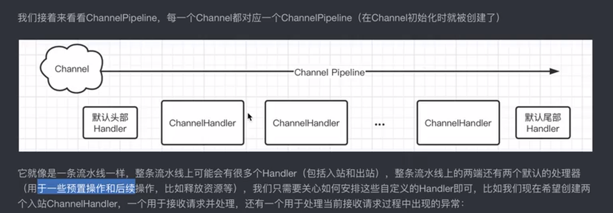

```javva
ctx.fireChannelRead(msg)//将消息传递给下一个	Handler
```

处理器链，出站与入站的设置

```
.childHandler(new ChannelInitializer<SocketChannel>() {
    @Override
    protected void initChannel(SocketChannel socketChannel) throws Exception {
        //获取流水线,一个流水线上面有很多的Handler
        socketChannel.pipeline()//需要将出站的处理器放在前面
                .addLast(new ChannelOutboundHandlerAdapter() {
                    @Override
                    public void write(ChannelHandlerContext ctx, Object msg, ChannelPromise promise) throws Exception {
                        ByteBuf byteBuf = (ByteBuf) msg;
                        System.out.println(Thread.currentThread().getName() + ">>写出的信息:" + byteBuf.toString(StandardCharsets.UTF_8));
                        ctx.writeAndFlush(Unpooled.wrappedBuffer("已经收到消息了".getBytes()));
                    }
                })
                .addLast(new ChannelInboundHandlerAdapter() {//添加一个handler,入栈
                    @Override
                    public void channelRead(ChannelHandlerContext ctx, Object msg) throws Exception {//ctx是上下文,msg默认是ByteBuf类
                        ByteBuf byteBuf = (ByteBuf) msg;
                        System.out.println(Thread.currentThread().getName() + ">>收到客户端传来的信息:" + byteBuf.toString(StandardCharsets.UTF_8));
                        //通过上下文返回一个响应,返回一个数据
                        ctx.writeAndFlush(Unpooled.wrappedBuffer("已经收到消息了".getBytes()));//使用该方法会从当前·的Handler往前找出站处理器，
                    }
                });
    }
});
```

EventLoop 

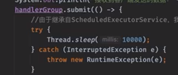

添加流水线的时候可以指定eventloopGroup

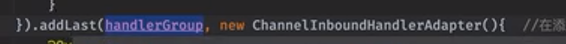

Netty编写客户端

```java
Bootstrap bootstrap = new Bootstrap();   //客户端也是使用Bootstrap来启动
    bootstrap
            .group(new NioEventLoopGroup())   //客户端就没那么麻烦了，直接一个EventLoop就行，用于处理发回来的数据
            .channel(NioSocketChannel.class)   //客户端肯定就是使用SocketChannel了
            .handler(new ChannelInitializer<SocketChannel>() {   //这里的数据处理方式和服务端是一样的
                @Override
                protected void initChannel(SocketChannel channel) throws Exception {
                    channel.pipeline().addLast(new ChannelInboundHandlerAdapter(){   
                        @Override
                        public void channelRead(ChannelHandlerContext ctx, Object msg) throws Exception {
                            ByteBuf buf = (ByteBuf) msg;
                            System.out.println(">> 接收到客户端发送的数据："+buf.toString(StandardCharsets.UTF_8));
                        }
                    });
                }
            });
    Channel channel = bootstrap.connect("localhost", 8080).channel();  //连接后拿到对应的Channel对象
      //注意上面连接操作是异步的，调用之后会继续往下走，下面我们就正式编写客户端的数据发送代码了
    try(Scanner scanner = new Scanner(System.in)){    //还是和之前一样，扫了就发
        while (true) {
            System.out.println("<< 请输入要发送给服务端的内容：");
            String text = scanner.nextLine();
            if(text.isEmpty()) continue;
            channel.writeAndFlush(Unpooled.wrappedBuffer(text.getBytes()));  //通过Channel对象发送数据
        }
    }
```

## ChannelFuture

我们接着来看ChannelFuture，前面我们提到，Netty中Channel的相关操作都是异步进行的，并不是在当前线程同步执行，我们不能立即得到执行结果，如果需要得到结果，那么我们就必须要利用到Future。

我们先来看看ChannelFutuer接口怎么定义的：

```java
public interface ChannelFuture extends Future<Void> {
    Channel channel();    //我们可以直接获取此任务的Channel
    ChannelFuture addListener(GenericFutureListener<? extends Future<? super Void>> var1);  //当任务完成时，会直接执行GenericFutureListener的任务，注意执行的位置也是在EventLoop中
    ChannelFuture addListeners(GenericFutureListener<? extends Future<? super Void>>... var1);
    ChannelFuture removeListener(GenericFutureListener<? extends Future<? super Void>> var1);
    ChannelFuture removeListeners(GenericFutureListener<? extends Future<? super Void>>... var1);
    ChannelFuture sync() throws InterruptedException;   //在当前线程同步等待异步任务完成，任务失败会抛出异常
    ChannelFuture syncUninterruptibly();   //同上，但是无法响应中断
    ChannelFuture await() throws InterruptedException;  //同上，但是任务中断不会抛出异常，需要手动判断
    ChannelFuture awaitUninterruptibly();    //不用我说了吧？
    boolean isVoid();   //返回类型是否为void
}
```

此接口是继承自Netty中的Future接口的（不是JDK的那个）：

```java
public interface Future<V> extends java.util.concurrent.Future<V> {   //再往上才是JDK的Future
    boolean isSuccess();    //用于判断任务是否执行成功的
    boolean isCancellable();
    Throwable cause();    //获取导致任务失败的异常
    
      ...
    
    V getNow();  //立即获取结果，如果还未产生结果，得到null，不过ChannelFuture定义V为Void，就算完成了获取也是null
    boolean cancel(boolean var1);    //取消任务
}
复制代码
```

Channel的很多操作都是异步完成的，直接返回一个ChannelFuture，比如Channel的write操作，返回的就是一个ChannelFuture对象：

```java
//通过上下文返回一个响应,返回一个数据
                                        ChannelFuture channelFuture = ctx.writeAndFlush(Unpooled.wrappedBuffer("已经收到消息了".getBytes()));
//使用该方法会从当前·的Handler往前找出栈处理器，
                                        System.out.println("任务完成状态"+channelFuture.isDone());
```

绑定事件

```
ChannelFuture channelFuture = serverBootstrap.bind(8080);
channelFuture.addListener(new ChannelFutureListener() {
    @Override
    public void operationComplete(ChannelFuture channelFuture) throws Exception {
        System.out.println("finishing!!1");
    }
});
```

我们接着来看看Promise接口，它支持手动设定成功和失败的结果：

```java
//此接口也是继承自Netty中的Future接口
public interface Promise<V> extends Future<V> {
    Promise<V> setSuccess(V var1);    //手动设定成功
    boolean trySuccess(V var1);
    Promise<V> setFailure(Throwable var1);  //手动设定失败
    boolean tryFailure(Throwable var1);
    boolean setUncancellable();
        //这些就和之前的Future是一样的了
    Promise<V> addListener(GenericFutureListener<? extends Future<? super V>> var1);
    Promise<V> addListeners(GenericFutureListener<? extends Future<? super V>>... var1);
    Promise<V> removeListener(GenericFutureListener<? extends Future<? super V>> var1);
    Promise<V> removeListeners(GenericFutureListener<? extends Future<? super V>>... var1);
    Promise<V> await() throws InterruptedException;
    Promise<V> awaitUninterruptibly();
    Promise<V> sync() throws InterruptedException;
    Promise<V> syncUninterruptibly();
}
复制代码
```

比如我们来测试一下：

```java
public static void main(String[] args) throws ExecutionException, InterruptedException {
    Promise<String> promise = new DefaultPromise<>(new DefaultEventLoop());
    System.out.println(promise.isSuccess());    //在一开始肯定不是成功的
    promise.setSuccess("lbwnb");    //设定成功
    System.out.println(promise.isSuccess());   //再次获取，可以发现确实成功了
    System.out.println(promise.get());    //获取结果，就是我们刚刚给进去的
}
```

可以看到我们可以手动指定成功状态，包括ChannelOutboundInvoker中的一些基本操作，都是支持ChannelPromise的：

```java
.addLast(new ChannelInboundHandlerAdapter(){
    @Override
    public void channelRead(ChannelHandlerContext ctx, Object msg) throws Exception {
        ByteBuf buf = (ByteBuf) msg;
        String text = buf.toString(StandardCharsets.UTF_8);
        System.out.println("接收到客户端发送的数据："+text);
        ChannelPromise promise = new DefaultChannelPromise(channel);
        System.out.println(promise.isSuccess());
        ctx.writeAndFlush(Unpooled.wrappedBuffer("已收到！".getBytes()), promise);
        promise.sync();  //同步等待一下
        System.out.println(promise.isSuccess());
    }
});
```

最后结果就是我们想要的了，当然我们也可以像Future那样添加监听器，当成功时自动通知：

```java
public static void main(String[] args) throws ExecutionException, InterruptedException {
    Promise<String> promise = new DefaultPromise<>(new DefaultEventLoop()); 
    promise.addListener(f -> System.out.println(promise.get()));   //注意是在上面的DefaultEventLoop执行的
    System.out.println(promise.isSuccess());
    promise.setSuccess("lbwnb");
    System.out.println(promise.isSuccess());
}
```

### 编码器和解码器

前面我们已经了解了Netty的大部分基础内容，我们接着来看看Netty内置的一些编码器和解码器。

在前面的学习中，我们的数据发送和接收都是需要以ByteBuf形式传输，但是这样是不是有点太不方便了，咱们能不能参考一下JavaWeb那种搞个Filter，在我们开始处理数据之前，过过滤一次，并在过滤的途中将数据转换成我们想要的类型，也可以将发出的数据进行转换，这就要用到编码解码器了。

我们先来看看最简的，字符串，如果我们要直接在客户端或是服务端处理字符串，可以直接添加一个字符串解码器到我们的流水线中：

```java
@Override
protected void initChannel(SocketChannel channel) {
    channel.pipeline()
            //解码器本质上也算是一种ChannelInboundHandlerAdapter，用于处理入站请求
            .addLast(new StringDecoder())   //当客户端发送来的数据只是简单的字符串转换的ByteBuf时，我们直接使用内置的StringDecoder即可转换
            .addLast(new ChannelInboundHandlerAdapter(){
                @Override
                public void channelRead(ChannelHandlerContext ctx, Object msg) throws Exception {
                    //经过StringDecoder转换后，msg直接就是一个字符串，所以打印就行了
                    System.out.println(msg);
                }
            });
}
```

### 自定义编码器

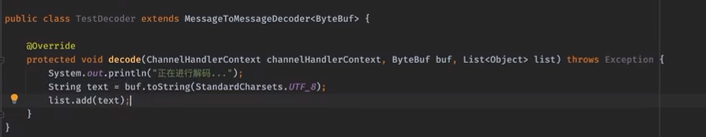


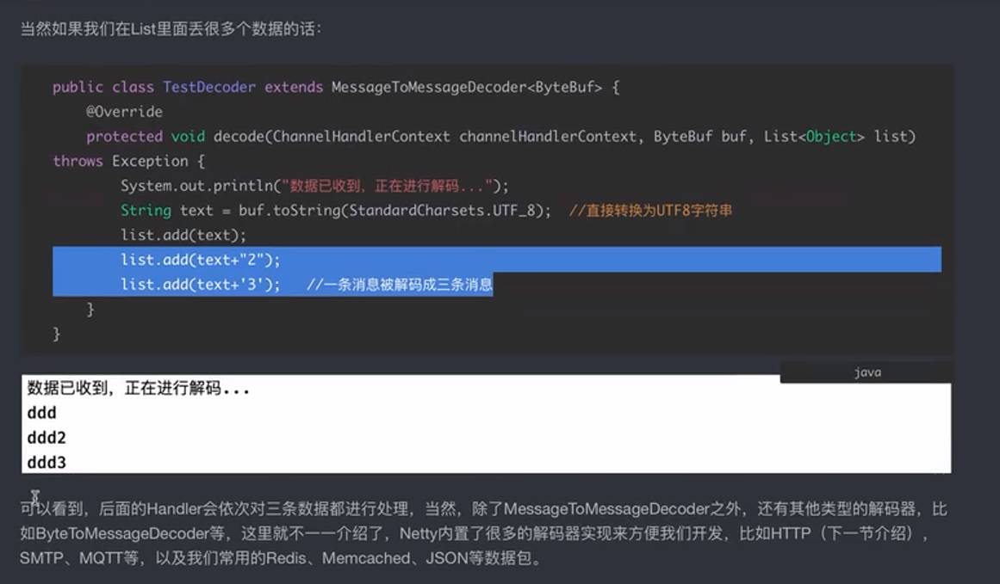

编码器、解码器

```java
 socketChannel.pipeline()//需要将出栈的处理器放在前面
                                .addLast(new StringDecoder())
                                .addLast(new ChannelInboundHandlerAdapter() {//添加一个handler,入栈
                                    @Override
                                    public void channelRead(ChannelHandlerContext ctx, Object msg) throws Exception {//ctx是上下文,msg默认是ByteBuf类
                                        System.out.println(Thread.currentThread().getName() + ">>收到客户端传来的信息:" + msg);
                                        //通过上下文返回一个响应,返回一个数据
                                       ctx.channel().writeAndFlush("sadsadsa咋的萨达");//使用该方法会从当前·的Handler往前找出栈处理器，
                                    }
                                })
                                .addLast(new StringEncoder());
```

编解码器，既可以处理出站，也可以处理入站

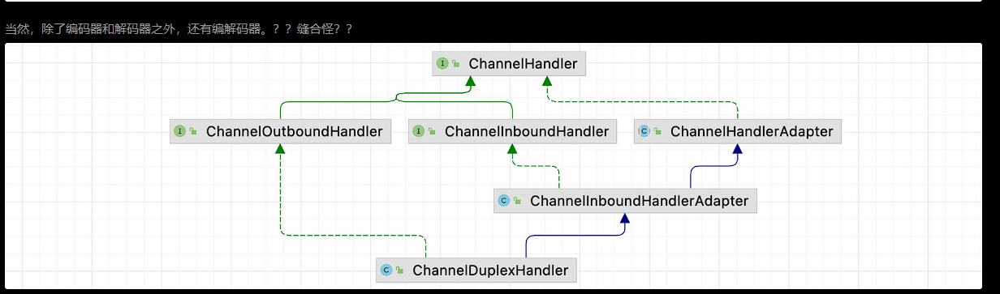

使用解码器与编码器处理粘包问题:

我们在一开始提到的粘包/拆包问题，也可以使用一个解码器解决：

```java
channel.pipeline()
        .addLast(new FixedLengthFrameDecoder(10))  
        //第一种解决方案，使用定长数据包，每个数据包都要是指定长度
              ...
复制代码
channel.pipeline()
        .addLast(new DelimiterBasedFrameDecoder(1024, Unpooled.wrappedBuffer("!".getBytes())))
        //第二种，就是指定一个特定的分隔符，比如我们这里以感叹号为分隔符
              //在收到分隔符之前的所有数据，都作为同一个数据包的内容
复制代码
channel.pipeline()
        .addLast(new LengthFieldBasedFrameDecoder(1024, 0, 4))
        //第三种方案，就是在头部添加长度信息，来确定当前发送的数据包具体长度是多少
        //offset是从哪里开始，length是长度信息占多少字节，这里是从0开始读4个字节表示数据包长度
        .addLast(new StringDecoder())
复制代码
channel.pipeline()
        .addLast(new StringDecoder())
        .addLast(new ChannelInboundHandlerAdapter(){
            @Override
            public void channelRead(ChannelHandlerContext ctx, Object msg) throws Exception {
                System.out.println(">> 接收到客户端发送的数据：" + msg);
            }
        })
        .addLast(new LengthFieldPrepender(4))   //客户端在发送时也需要将长度拼到前面去
        .addLast(new StringEncoder());
```

### 使用Netty解析Http请求

##### HttpObjectAggregator的作用：

在 Netty 中，`HttpObjectAggregator` 是一个用于处理 HTTP 消息的处理器（handler）。它的主要作用是将 HTTP 消息的多个部分聚合成完整的 `FullHttpRequest` 或 `FullHttpResponse`，以便后续的处理器能够更方便地处理完整的请求或响应。

HTTP 消息通常由多个部分组成，特别是在处理 POST 请求时，请求的内容可能被分成多个片段（chunks）发送。

```java
serverBootstrap
                .group(bossGroup, workGroup)//指定事件循环组
                .channel(NioServerSocketChannel.class)//指定类型
                .childHandler(new ChannelInitializer<SocketChannel>() {
                    @Override
                    protected void initChannel(SocketChannel socketChannel) throws Exception {
                        //获取流水线,一个流水线上面有很多的Handler
                        socketChannel.pipeline()//需要将出栈的处理器放在前面
                                .addLast(new HttpRequestDecoder())
                                .addLast(new HttpObjectAggregator(Integer.MAX_VALUE))  //搞一个聚合器，将内容聚合为一个FullHttpRequest，参数是最大内容长度
                                .addLast(new ChannelInboundHandlerAdapter() {//添加一个handler,入栈
                                    @Override
                                    public void channelRead(ChannelHandlerContext ctx, Object msg) throws Exception {//ctx是上下文,msg默认是ByteBuf类
                                        System.out.println("收到客户端的数据："+msg.getClass());  //看看是个啥类型
                                        FullHttpRequest request = (FullHttpRequest) msg;
                                        System.out.println("浏览器的请求路径为："+request.uri());
                                        //收到浏览器请求后，我们需要给一个响应回去
                                        FullHttpResponse response = new DefaultFullHttpResponse(HttpVersion.HTTP_1_1, HttpResponseStatus.OK);  //HTTP版本为1.1，状态码就OK（200）即可
                                        //直接向响应内容中写入数据
                                        response.content().writeCharSequence("Hello World!", StandardCharsets.UTF_8);
                                        ctx.channel().writeAndFlush(response);   //发送响应
                                        ctx.channel().close();   //HTTP请求是一次性的，所以记得关闭
                                    }
                                })
                                .addLast(new HttpResponseEncoder());
                    }
                });
```

## 日至打印Handler

```
.addLast(new LoggingHandler(LogLevel.INFO))
```

## 过滤ip的Handler

```java
.addLast(new RuleBasedIpFilter(new IpFilterRule() {//过滤掉IP
    @Override
    public boolean matches(InetSocketAddress inetSocketAddress) {
        return inetSocketAddress.getHostName().equals("127.0.0.1");
    }
    @Override
    public IpFilterRuleType ruleType() {
        return IpFilterRuleType.REJECT;//拒绝127.0.0.1的访问
    }
}))
```

我们也可以对那些长期处于空闲的进行处理：

```java
channel.pipeline()
        .addLast(new StringDecoder())
        .addLast(new IdleStateHandler(10, 10, 0))  //IdleStateHandler能够侦测连接空闲状态
        //第一个参数表示连接多少秒没有读操作时触发事件，第二个是写操作，第三个是读写操作都算，0表示禁用
        //事件需要在ChannelInboundHandlerAdapter中进行监听处理
        .addLast(new ChannelInboundHandlerAdapter(){
            @Override
            public void channelRead(ChannelHandlerContext ctx, Object msg) throws Exception {
                System.out.println("收到客户端数据："+msg);
                ctx.channel().writeAndFlush("已收到！");
            }

            @Override
            public void userEventTriggered(ChannelHandlerContext ctx, Object evt) throws Exception {
                //没想到吧，这个方法原来是在这个时候用的
                if(evt instanceof IdleStateEvent) {
                    IdleStateEvent event = (IdleStateEvent) evt;
                    if(event.state() == IdleState.WRITER_IDLE) {
                        System.out.println("好久都没写了，看视频的你真的有认真在跟着敲吗");
                    } else if(event.state() == IdleState.READER_IDLE) {
                        System.out.println("已经很久很久没有读事件发生了，好寂寞");
                    }
                }
            }
        })
        .addLast(new StringEncoder());
```

## Netty的启动的流程

bootStrap类开启bind方法之后就开始启动了


## **Netty中的核心组件**

1.网络通信层

BootStrap  客户端的启动并且负责去连接远程的Netty Server

ServerBootStrap 负责服务端的监听，用于监听指定的一个端口

Channel 是网络信的通道

2.事件调度层

EventLoopGroup  本质上是一个线程池,去接受IO请求，并分配线程去处理

EventLoop  是线程池当中的一个具体的线程

3.服务编排层

ChannelPipline 负责处理channelHandler将多个channelHandler形成一个pipline

ChannelHandler 是一个数据处理器，接受数据之后由数据去处理相应的事件

ChannelHandlerContext 用于处理处理器之间的一个上下文信息的

## FileRegion实现零拷贝

```java
import io.netty.bootstrap.Bootstrap;
import io.netty.buffer.Unpooled;
import io.netty.channel.*;
import io.netty.channel.nio.NioEventLoopGroup;
import io.netty.channel.socket.SocketChannel;
import io.netty.channel.socket.nio.NioSocketChannel;
import io.netty.handler.codec.http.*;
import io.netty.handler.stream.ChunkedFile;
import io.netty.util.CharsetUtil;

import java.io.File;
import java.io.RandomAccessFile;

public class FileClient {

    public static void main(String[] args) throws Exception {
        EventLoopGroup group = new NioEventLoopGroup();

        try {
            Bootstrap b = new Bootstrap();
            b.group(group)
                    .channel(NioSocketChannel.class)
                    .handler(new ChannelInitializer<SocketChannel>() {
                        @Override
                        protected void initChannel(SocketChannel ch) {
                            ChannelPipeline p = ch.pipeline();
                            p.addLast(new HttpClientCodec());
                            p.addLast(new HttpObjectAggregator(65536));
                            p.addLast(new ChunkedWriteHandler());
                            p.addLast(new SimpleChannelInboundHandler<FullHttpResponse>() {
                                @Override
                                protected void channelRead0(ChannelHandlerContext ctx, FullHttpResponse msg) throws Exception {
                                    // 处理服务器响应
                                    if (msg.status().code() == HttpResponseStatus.OK.code()) {
                                        System.out.println("File transferred successfully!");
                                    } else {
                                        System.err.println("File transfer failed: " + msg.status());
                                    }
                                }
                            });
                        }
                    });

            Channel ch = b.connect("127.0.0.1", 8080).sync().channel();

            // 构建 HTTP 请求
            HttpRequest request = new DefaultHttpRequest(HttpVersion.HTTP_1_1, HttpMethod.POST, "/");
            HttpUtil.setContentLength(request, 0);

            // 打开文件并创建 FileRegion
            RandomAccessFile raf = new RandomAccessFile("path/to/your/local/file.txt", "r");
            FileRegion region = new DefaultFileRegion(raf.getChannel(), 0, raf.length());

            // 发送 HTTP 请求和 FileRegion
            ch.writeAndFlush(request);
            ch.writeAndFlush(region).addListener(ChannelFutureListener.CLOSE);

            ch.closeFuture().sync();
        } finally {
            group.shutdownGracefully();
        }
    }
}

```


```java
import io.netty.bootstrap.ServerBootstrap;
import io.netty.channel.Channel;
import io.netty.channel.ChannelInitializer;
import io.netty.channel.ChannelPipeline;
import io.netty.channel.FileRegion;
import io.netty.channel.SimpleChannelInboundHandler;
import io.netty.channel.nio.NioEventLoopGroup;
import io.netty.channel.socket.SocketChannel;
import io.netty.channel.socket.nio.NioServerSocketChannel;
import io.netty.handler.codec.http.HttpObjectAggregator;
import io.netty.handler.codec.http.HttpServerCodec;
import io.netty.handler.stream.ChunkedWriteHandler;

import java.io.RandomAccessFile;

public class FileServer {

    public static void main(String[] args) throws Exception {
        NioEventLoopGroup bossGroup = new NioEventLoopGroup();
        NioEventLoopGroup workerGroup = new NioEventLoopGroup();

        try {
            ServerBootstrap b = new ServerBootstrap();
            b.group(bossGroup, workerGroup)
                    .channel(NioServerSocketChannel.class)
                    .childHandler(new ChannelInitializer<SocketChannel>() {
                        @Override
                        protected void initChannel(SocketChannel ch) {
                            ChannelPipeline p = ch.pipeline();
                            p.addLast(new HttpServerCodec());
                            p.addLast(new HttpObjectAggregator(65536));
                            p.addLast(new ChunkedWriteHandler());
                            p.addLast(new SimpleChannelInboundHandler<Object>() {
                                @Override
                                protected void channelRead0(io.netty.channel.ChannelHandlerContext ctx, Object msg) throws Exception {
                                    // 处理文件传输请求
                                    if (msg instanceof FileRegion) {
                                        FileRegion region = (FileRegion) msg;
                                        RandomAccessFile raf = new RandomAccessFile("path/to/your/file.txt", "r");
                                        region.transferTo(raf.getChannel(), 0, raf.length());
                                        raf.close();
                                    }
                                }
                            });
                        }
                    });

            Channel ch = b.bind(8080).sync().channel();
            ch.closeFuture().sync();
        } finally {
            bossGroup.shutdownGracefully();
            workerGroup.shutdownGracefully();
        }
    }
}

```

`Unpooled` 是 Netty 提供的一个工具类，用于创建各种类型的 `ByteBuf`。以下是使用 `Unpooled` 创建 `ByteBuf` 的几种常见方式：

1. **创建一个堆内存的 `ByteBuf`：**

   ```
   javaCopy code
   ByteBuf heapBuffer = Unpooled.buffer(1024);
   ```

   这种方式创建的 `ByteBuf` 使用 Java 堆内存，适用于大多数应用场景。

2. **创建一个直接内存的 `ByteBuf`：**

   ```
   javaCopy code
   ByteBuf directBuffer = Unpooled.directBuffer(1024);
   ```

   这种方式创建的 `ByteBuf` 使用直接内存，适用于需要避免将数据从用户空间复制到内核空间的高性能场景，例如进行网络 I/O 操作。

3. **使用给定的字节数组创建 `ByteBuf`：**

   ```
   javaCopy codebyte[] byteArray = "Hello, ByteBuf!".getBytes();
   ByteBuf wrappedBuffer = Unpooled.wrappedBuffer(byteArray);
   ```

   这种方式创建的 `ByteBuf` 是一个包装（wrapped）的 `ByteBuf`，它不会在内存中进行复制，而是直接引用给定的字节数组。请注意，对这种类型的 `ByteBuf` 的修改会影响原始字节数组。

4. **使用给定的字符串创建 `ByteBuf`：**

   ```
   javaCopy codeString str = "Hello, ByteBuf!";
   ByteBuf copiedBuffer = Unpooled.copiedBuffer(str, Charset.forName("UTF-8"));
   ```

   这种方式创建的 `ByteBuf` 是一个拷贝（copied）的 `ByteBuf`，它会在内存中创建一个新的字节数组，并将给定的字符串内容复制到该数组中。

5. **创建一个组合 `ByteBuf`：**

   ```
   javaCopy codeByteBuf buffer1 = Unpooled.buffer(5).writeBytes("Hello".getBytes());
   ByteBuf buffer2 = Unpooled.buffer(5).writeBytes(", ByteBuf!".getBytes());
   
   CompositeByteBuf compositeBuffer = Unpooled.wrappedBuffer(buffer1, buffer2);
   ```

   这种方式创建的 `ByteBuf` 是一个组合（composite）的 `ByteBuf`，它将多个 `ByteBuf` 合并为一个逻辑上的单一缓冲区。

## Netty中的零拷贝技术：

1.  DirectedBuf 直接使用堆外内存
2. CompositedBuf 组合多个ByteBuf  实际上是逻辑上使用的多个ByteBuf,并没有进行复制
3. Unpooled.wrapped是直接包裹，没有复制
4. byteBuf slice 切分多个对象，实际上是公用的的一个ByteBuf
5. FileRegion与RandomAccessFile相互组合共同实现了零拷贝，不需要进行内核态用户态的转换，使用transforTo的方法直接将接受到的文件传输，底层使用到的是Linux的sendfile

## Netty线程模型:

**单线程单Reactor模式**

只有一个Reactor负责读写处理连接

**单Reactor多线程模式**

一个reactor中有多个线程，这个多个线程要同时进行连接、数据、handler的处理

**主从reactor模型**

两个reactor，parent负责连接的建立与，并负责将数据读取与处理交给childReactor

## 解决TCP粘包

1.按照换行符切割报文: LineBasedFrameDecoder
2.按照自定义分隔符符号切割报文: DelimiterBasedFrameDecoderO
3.按照固定长度切割报文: FixedLenghtFrameDecoder
4.基于数据包长度切割报文: LengthFieldBasedFrameDecoder