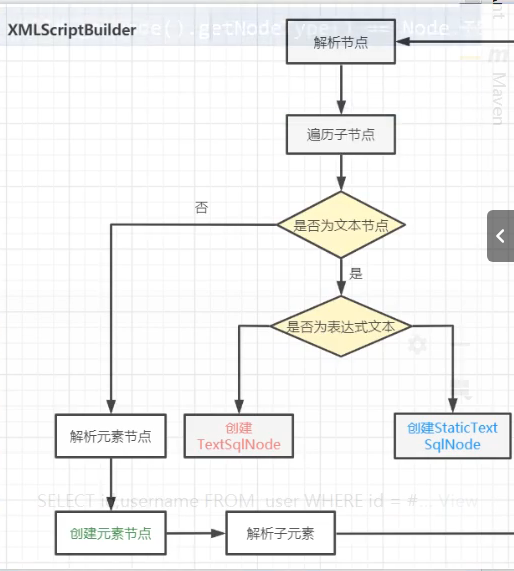

 


```java
InputStream resourceAsStream = Resources.getResourceAsStream("mybatis-config.xml");  //里面是，在多个备选的类加载器当中选出合适的类加载器进行解析
    SqlSessionFactoryBuilder sqlSessionFactoryBuilder = new SqlSessionFactoryBuilder();
	//解析文件封装SqlSessionFactory对象  并且创建了DefaultSqlSessionFactory对象并返回
    SqlSessionFactory sqlSessionFactory = sqlSessionFactoryBuilder.build(resourceAsStream);
    SqlSession sqlSession = sqlSessionFactory.openSession();
    List<Object> objects = sqlSession.selectList("user.selectList", "hhh");
```

```java
/**
* SqlSessionFactoryBuilder中的Builder方法 envirment参数指的是配置文件中的enviroment标签的id
*/
public SqlSessionFactory build(InputStream inputStream, String environment, Properties properties) {
    try {
        //创建了XpathParser解析器对象，将字节流解析为document对象。并且创建了全局配置类Configuration类
      XMLConfigBuilder parser = new XMLConfigBuilder(inputStream, environment, properties);
        //parse()方法使用Xpath将document对象中的内容封装至Configuration类当中,解析所有可能存在的标签，在解析mapper标签的时候，就会使用XMLmapperBuilder对象进行解析
      return build(parser.parse());
    } catch (Exception e) {
      throw ExceptionFactory.wrapException("Error building SqlSession.", e);
    } finally {
      ErrorContext.instance().reset();
      try {
        inputStream.close();
      } catch (IOException e) {
        // Intentionally ignore. Prefer previous error.
      }
    }
  }


```

```java

```

## 通过 XMLMapperBuilder解析Mapper.xml文件,XMLStatementBuilder构建语句

```java
public void parseStatementNode() {

    String keyStatementId = id + SelectKeyGenerator.SELECT_KEY_SUFFIX;//获取StatementId
    keyStatementId = builderAssistant.applyCurrentNamespace(keyStatementId, true);
  
	//原来的sql被解析,替换占位符并且 解析动态sql ，sqlSource分为动态与静态sqlSource ,SqlSource,getBoundSql获取BoundSql,静态BooundSql当中有
     //private final String sql;
  	 // private final List<ParameterMapping> parameterMappings; 
    SqlSource sqlSource = langDriver.createSqlSource(configuration, context, parameterTypeClass);
   //解析各种参数……
	//创建MappedStatement对象,并放入Configuration中的  protected final Map<String, MappedStatement> mappedStatements当中
    builderAssistant.addMappedStatement(id, sqlSource, statementType, sqlCommandType,
        fetchSize, timeout, parameterMap, parameterTypeClass, resultMap, resultTypeClass,
        resultSetTypeEnum, flushCache, useCache, resultOrdered,
        keyGenerator, keyProperty, keyColumn, databaseId, langDriver, resultSets);
  }
```


## 通过XmlScriptBuilder解析获得SqlSource

```java
 public SqlSource createSqlSource(Configuration configuration, XNode script, Class<?> parameterType) {
     //在构造方法中会初始化动态sql标签处理器:   initNodeHandlerMap()，也就是创建处理器的缓存,处理器对应不同的动态sql标签
    XMLScriptBuilder builder = new XMLScriptBuilder(configuration, script, parameterType);
     //解析sql
    return builder.parseScriptNode();
  }
public SqlSource parseScriptNode() {
    // 将sql进行解析 解析成SqlNode
    MixedSqlNode rootSqlNode = parseDynamicTags(context);
    SqlSource sqlSource;
    if (isDynamic) {
      sqlSource = new DynamicSqlSource(configuration, rootSqlNode);
    } else {
      sqlSource = new RawSqlSource(configuration, rootSqlNode, parameterType);
    }
    return sqlSource;
  }

protected MixedSqlNode parseDynamicTags(XNode node) {
    List<SqlNode> contents = new ArrayList<>();
    NodeList children = node.getNode().getChildNodes();
    for (int i = 0; i < children.getLength(); i++) {
      XNode child = node.newXNode(children.item(i));
      //如果是文本节点
      if (child.getNode().getNodeType() == Node.CDATA_SECTION_NODE || child.getNode().getNodeType() == Node.TEXT_NODE) {
        String data = child.getStringBody("");
        TextSqlNode textSqlNode = new TextSqlNode(data);
        if (textSqlNode.isDynamic()) {
          //带有${}这个符号
          contents.add(textSqlNode);
          isDynamic = true;
        } else {
          //没有${}  的话就是静态
          contents.add(new StaticTextSqlNode(data));
        }
      } else if (child.getNode().getNodeType() == Node.ELEMENT_NODE) { // issue #628
        String nodeName = child.getNode().getNodeName();
        //获取动态标签处理器
        NodeHandler handler = nodeHandlerMap.get(nodeName);
        if (handler == null) {
          throw new BuilderException("Unknown element <" + nodeName + "> in SQL statement.");
        }
        //使用处理器进行处理,并放入SqlNodes集合当中
        handler.handleNode(child, contents);
        isDynamic = true;
      }
    }
    return new MixedSqlNode(contents);
  }

//每个标签都会对应着一个处理器
private void initNodeHandlerMap() {
    nodeHandlerMap.put("trim", new TrimHandler());
    nodeHandlerMap.put("where", new WhereHandler());
    nodeHandlerMap.put("set", new SetHandler());
    nodeHandlerMap.put("foreach", new ForEachHandler());
    nodeHandlerMap.put("if", new IfHandler());
    nodeHandlerMap.put("choose", new ChooseHandler());
    nodeHandlerMap.put("when", new IfHandler());
    nodeHandlerMap.put("otherwise", new OtherwiseHandler());
    nodeHandlerMap.put("bind", new BindHandler());
  }
```




如果当前的sql语句不是动态sql，也就是说sql语句中不包含`${}`占位符的话，RawSqlSource会将当前sql中的`#{}`占位符替换为`?`，并维护其参数映射关系，最终返回一个StaticSqlSource对象。

## openSession()方法创建

```java
@Override
  public SqlSession openSession() {
      // 1.执行器类型,2.事务隔离级别 3.是否自动提交事务  ,默认的执行器类型是Simple
    return openSessionFromDataSource(configuration.getDefaultExecutorType(), null, false);
  }

```

## Executor:


```java
private SqlSession openSessionFromDataSource(ExecutorType execType, TransactionIsolationLevel level, boolean autoCommit) {
    Transaction tx = null;
    try {
        //获取Enviroment对象
      final Environment environment = configuration.getEnvironment();
      final TransactionFactory transactionFactory = getTransactionFactoryFromEnvironment(environment);
        //获取事务对象其中,JdbcTransaction实现是通过connection来实现事务，而ManagedTransaction实现是将事务操作交给容器来处理，自己不做处理
      tx = transactionFactory.newTransaction(environment.getDataSource(), level, autoCommit);
        //创建执行器对象,通过执行器类型创建执行器，对象，并且如果允许缓存，则会使用CachingExecutor(维护二级缓存)对BaseExecutor包装一层,进行装饰
      final Executor executor = configuration.newExecutor(tx, execType);
        //创建SqlSession对象并返回
      return new DefaultSqlSession(configuration, executor, autoCommit);
    } catch (Exception e) {
      closeTransaction(tx); // may have fetched a connection so lets call close()
      throw ExceptionFactory.wrapException("Error opening session.  Cause: " + e, e);
    } finally {
      ErrorContext.instance().reset();
    }
```

## SelectOne方法流程

```java
//selectOne方法实际上执行的是selectList方法并且，取出List中的第一个元素 
public <T> T selectOne(String statement, Object parameter) {
    // Popular vote was to return null on 0 results and throw exception on too many.
    List<T> list = this.selectList(statement, parameter);
    if (list.size() == 1) {
      return list.get(0);
    } else if (list.size() > 1) {
      throw new TooManyResultsException("Expected one result (or null) to be returned by selectOne(), but found: " + list.size());
    } else {
      return null;
    }
  }
```

## SelectList方法

```java
 private <E> List<E> selectList(String statement, Object parameter, RowBounds rowBounds, ResultHandler handler) {
    try {
        //获取MappedStatement对象，并交给执行器Executor对象去执行 
      MappedStatement ms = configuration.getMappedStatement(statement);
      return executor.query(ms, wrapCollection(parameter), rowBounds, handler);
    } catch (Exception e) {
      throw ExceptionFactory.wrapException("Error querying database.  Cause: " + e, e);
    } finally {
      ErrorContext.instance().reset();
    }
  }

```

## CacheExecutor中的query方法

```java
@Override
public <E> List<E> query(MappedStatement ms, Object parameterObject, RowBounds rowBounds, ResultHandler resultHandler) throws SQLException {
    //获取Boundsql，而BoundSql是从SqlSource对象中获得的
  BoundSql boundSql = ms.getBoundSql(parameterObject);
    //创建缓存Key，缓存CachKey对象中维护了一个hashCode，我们由sql 参数 分页参数 enviroment多因素的hashcode进行运算得到
  CacheKey key = createCacheKey(ms, parameterObject, rowBounds, boundSql);
  return query(ms, parameterObject, rowBounds, resultHandler, key, boundSql);
}
 @Override
  public <E> List<E> query(MappedStatement ms, Object parameterObject, RowBounds rowBounds, ResultHandler resultHandler, CacheKey key, BoundSql boundSql)
      throws SQLException {
    //获取二级缓存,二级缓存是在mappedStatement当中的
    Cache cache = ms.getCache();
    if (cache != null) {
      flushCacheIfRequired(ms);
      if (ms.isUseCache() && resultHandler == null) {
        ensureNoOutParams(ms, boundSql);
        @SuppressWarnings("unchecked")
          //从二级缓存中查询数据
        List<E> list = (List<E>) tcm.getObject(cache, key);
        if (list == null) {
          //如果缓存当中没有数据的话，就从数据库或者一级缓存当中去查询数据
          list = delegate.query(ms, parameterObject, rowBounds, resultHandler, key, boundSql);
            //将结果放入二级缓存当中
          tcm.putObject(cache, key, list); // issue #578 and #116
        }
        return list;
      }
    }
    //委托给BaseExecutor
    return delegate.query(ms, parameterObject, rowBounds, resultHandler, key, boundSql);
  }
```

## BaseExecutor中的query方法

```java
//BaseExcutor维护了一级缓存，具体的查询还是交给实现类去做
public <E> List<E> query(MappedStatement ms, Object parameter, RowBounds rowBounds, ResultHandler resultHandler, CacheKey key, BoundSql boundSql) throws SQLException {
    ErrorContext.instance().resource(ms.getResource()).activity("executing a query").object(ms.getId());
    if (closed) {
      throw new ExecutorException("Executor was closed.");
    }
    if (queryStack == 0 && ms.isFlushCacheRequired()) {
      clearLocalCache();
    }
    List<E> list;
    try {
      queryStack++;
      //从一级缓存当中获取数据
      list = resultHandler == null ? (List<E>) localCache.getObject(key) : null;
      if (list != null) {
        //已经有缓存结果则处理结果输出参数
        handleLocallyCachedOutputParameters(ms, key, parameter, boundSql);
      } else {
        //没有缓存的话则从数据库当中去查询结果
        list = queryFromDatabase(ms, parameter, rowBounds, resultHandler, key, boundSql);
      }
    } finally {
      queryStack--;
    }
    if (queryStack == 0) {
      for (DeferredLoad deferredLoad : deferredLoads) {
        deferredLoad.load();
      }
      // issue #601
      deferredLoads.clear();
      if (configuration.getLocalCacheScope() == LocalCacheScope.STATEMENT) {
        // issue #482
        clearLocalCache();
      }
    }
    return list;
  }
```

## SimpleExecutor中的doQuery方法

```java
 @Override
  public <E> List<E> doQuery(MappedStatement ms, Object parameter, RowBounds rowBounds, ResultHandler resultHandler, BoundSql boundSql) throws SQLException {
    Statement stmt = null;
    try {
      //获取configuration实例
      Configuration configuration = ms.getConfiguration();
      //创建一个语句处理器 封装了JDBC 的 statement
      StatementHandler handler = configuration.newStatementHandler(wrapper, ms, parameter, rowBounds, resultHandler, boundSql);
      //创建statement对象，并且，进行statement参数的设置
      stmt = prepareStatement(handler, ms.getStatementLog());
        //调用sql
      return handler.query(stmt, resultHandler);
    } finally {
      closeStatement(stmt);
    }
  }
```

## StatementHandler,可以实现jdbc Statement对象的创建以及参数设置，以及query方法的调用:


## PreParedStatementHandler中的parameterized方法

```java
@Override
public void parameterize(Statement statement) throws SQLException {
    //调用StatementHandler当中的parameterHandler来实现真正的参数设置
  parameterHandler.setParameters((PreparedStatement) statement);
}
```

```java
//通过boundSql获取所有的parameterMapping,并且遍历找到合适的TypeHandler实现类型处理器的转换，给preparedStatement进行赋值
public void setParameters(PreparedStatement ps) {
    ErrorContext.instance().activity("setting parameters").object(mappedStatement.getParameterMap().getId());
    List<ParameterMapping> parameterMappings = boundSql.getParameterMappings();
    if (parameterMappings != null) {
      for (int i = 0; i < parameterMappings.size(); i++) {
        ParameterMapping parameterMapping = parameterMappings.get(i);
        if (parameterMapping.getMode() != ParameterMode.OUT) {
          Object value;
          String propertyName = parameterMapping.getProperty();
          if (boundSql.hasAdditionalParameter(propertyName)) { // issue #448 ask first for additional params
            value = boundSql.getAdditionalParameter(propertyName);
          } else if (parameterObject == null) {
            value = null;
          } else if (typeHandlerRegistry.hasTypeHandler(parameterObject.getClass())) {
              //如果有对应的入参的类型处理器比如,int string,就将value赋值为parameterObject
            value = parameterObject;
          } else {
              //如果没有类型处理器，比如Map集合或者其他的javaBean类,就会将这个parameterObjcet转换为MetaObjcet，该对象可以支持对JavaBean、Collection、Map的访问
            MetaObject metaObject = configuration.newMetaObject(parameterObject);
            value = metaObject.getValue(propertyName);
          }
          TypeHandler typeHandler = parameterMapping.getTypeHandler();
          JdbcType jdbcType = parameterMapping.getJdbcType();
          if (value == null && jdbcType == null) {
            jdbcType = configuration.getJdbcTypeForNull();
          }
          try {
              //调用typeHandler设置参数
            typeHandler.setParameter(ps, i + 1, value, jdbcType);
          } catch (TypeException | SQLException e) {
            throw new TypeException("Could not set parameters for mapping: " + parameterMapping + ". Cause: " + e, e);
          }
        }
      }
    }
  }
```

## 结果集的处理

### preparedStatementHandler中的query方法

```java
 @Override
  public <E> List<E> query(Statement statement, ResultHandler resultHandler) throws SQLException {
    PreparedStatement ps = (PreparedStatement) statement;
    ps.execute();
    //获取statement对象之后调用resultHandler对象进行结果集处理
    return resultSetHandler.handleResultSets(ps);
  }
```

```java
public List<Object> handleResultSets(Statement stmt) throws SQLException {
    ErrorContext.instance().activity("handling results").object(mappedStatement.getId());

    //创建结果容器
    final List<Object> multipleResults = new ArrayList<>();

    int resultSetCount = 0;
    //获取结果集，是对jdbc中的ResultSet对象的封装,包装类
    ResultSetWrapper rsw = getFirstResultSet(stmt);

    //获取mapper文件的ResultMap,这个resultMap包括自己标签的resultMap,也包括returnType中javaBean被自动解析的resultMap
    List<ResultMap> resultMaps = mappedStatement.getResultMaps();
    int resultMapCount = resultMaps.size();
    validateResultMapsCount(rsw, resultMapCount);

    while (rsw != null && resultMapCount > resultSetCount) {
      ResultMap resultMap = resultMaps.get(resultSetCount);
      //获取映射关系后对结果集进行pojo的转换
      handleResultSet(rsw, resultMap, multipleResults, null);
      rsw = getNextResultSet(stmt);
      cleanUpAfterHandlingResultSet();
      resultSetCount++;
    }

    String[] resultSets = mappedStatement.getResultSets();
    if (resultSets != null) {
      while (rsw != null && resultSetCount < resultSets.length) {
        ResultMapping parentMapping = nextResultMaps.get(resultSets[resultSetCount]);
        if (parentMapping != null) {
          String nestedResultMapId = parentMapping.getNestedResultMapId();
          ResultMap resultMap = configuration.getResultMap(nestedResultMapId);
          handleResultSet(rsw, resultMap, null, parentMapping);
        }
        rsw = getNextResultSet(stmt);
        cleanUpAfterHandlingResultSet();
        resultSetCount++;
      }
    }

    return collapseSingleResultList(multipleResults);
  }
```

# 插件

## 在Configuration创建时，会通过XMLConfigBuilder解析注册的插件，放入拦截器链对象（包含List< Interceptor >）当中：


## 需要实现interceptor接口:

```java
public class MyPlugin implements Interceptor {
  //拦截执行的方法,在执行代理对象的时候会调用interceptor方法
  @Override
  public Object intercept(Invocation invocation) throws Throwable {
    return null;
  }
  //插件注册,创建代理对象，
  @Override
  public Object plugin(Object target) {
      //    Plugin.wrap(target, this);
    return Interceptor.super.plugin(target);
  }
  //从配置文件中获取属性,在xml被解析的时候就会被调用
  @Override
  public void setProperties(Properties properties) {
    Interceptor.super.setProperties(properties);
  }
}

```

## 在配置文件当中注册：

```xml
 <plugins>
        <plugin interceptor="com.lxl.plugin.MyPlugin">
            <property name="name" value="刘孝龙"/>
        </plugin>
    </plugins>
```

## pluginAll方法

将List< interceptor >集合中的插件遍历并调用plugin方法


## 签名：

```java
// 签名 type 是指的是要拦截的对象  method 是正在执行的方法  并且 参数是 arg中指定的
@Intercepts(@Signature(type = Executor.class, method = "update", args = {MappedStatement.class, Object.class}))
```

## 能被拦截的四大接口：


## openSession()方法创建执行器的时候会调用pluginAll()来创建一个被增强的执行器


```JAVA

public ResultSetHandler newResultSetHandler(Executor executor, MappedStatement mappedStatement, RowBounds rowBounds, ParameterHandler parameterHandler,
      ResultHandler resultHandler, BoundSql boundSql) {
    ResultSetHandler resultSetHandler = new DefaultResultSetHandler(executor, mappedStatement, parameterHandler, resultHandler, boundSql, rowBounds);
    resultSetHandler = (ResultSetHandler) interceptorChain.pluginAll(resultSetHandler);
    return resultSetHandler;
  }

//在sqlSession执行 doupdate或者doQury方法的时候创建StatementHandler的时候会调用pluginAll
  public StatementHandler newStatementHandler(Executor executor, MappedStatement mappedStatement, Object parameterObject, RowBounds rowBounds, ResultHandler resultHandler, BoundSql boundSql) {
    StatementHandler statementHandler = new RoutingStatementHandler(executor, mappedStatement, parameterObject, rowBounds, resultHandler, boundSql);
    statementHandler = (StatementHandler) interceptorChain.pluginAll(statementHandler);
    return statementHandler;
  }
```


## 初始化阶段，会将 @Signature当中的签名当中信息解析一下放入SignatrueMap当中，并且在invoke方法中会判断签名的

```java
  //@Signature(type = Executor.class, method = "update", args = {MappedStatement.class, Object.class}),
  //@Signature(type = Executor.class, method = "query", args = {MappedStatement.class, Object.class, RowBounds.class, ResultHandler.class})})
/**
* Plugin方法中的invoke方法
*/
@Override
  public Object invoke(Object proxy, Method method, Object[] args) throws Throwable {
    try {
      Set<Method> methods = signatureMap.get(method.getDeclaringClass());//判断是否符合签名
      if (methods != null && methods.contains(method)) {//如果符合签名的话就会执行interceptor代理对象方法
        return interceptor.intercept(new Invocation(target, method, args));
      }
        //不符合签名就执行原有的方法不做代理
      return method.invoke(target, args);
    } catch (Exception e) {
      throw ExceptionUtil.unwrapThrowable(e);
    }
  }
```

## Mybatis代理类原理

**解析：**在配置文件当中，mappers,标签会标记mapper文件的地址,解析地址之后，会使用XMLMapperBuilder解析这个Mapper文件

```java
public void parse() {//XMLMapperBuilder
    if (!configuration.isResourceLoaded(resource)) {
      configurationElement(parser.evalNode("/mapper"));
      configuration.addLoadedResource(resource);
      bindMapperForNamespace();//该方法会试图将namespace当作Mapper接口类的全限定名去解析
    }
    parsePendingResultMaps();
    parsePendingCacheRefs();
    parsePendingStatements();
  }
private void bindMapperForNamespace() {
    String namespace = builderAssistant.getCurrentNamespace();
    if (namespace != null) {
      Class<?> boundType = null;
      try {
        boundType = Resources.classForName(namespace);//将namespace当作接口Mapper的全限定名，加载对应的Class对象
      } catch (ClassNotFoundException e) {
        // ignore, bound type is not required
      }
      if (boundType != null && !configuration.hasMapper(boundType)) {
        // Spring may not know the real resource name so we set a flag
        // to prevent loading again this resource from the mapper interface
        // look at MapperAnnotationBuilder#loadXmlResource
        configuration.addLoadedResource("namespace:" + namespace);
        configuration.addMapper(boundType);//调用addMapper，方法添加Mapper
      }
    }
  }
//Configuration当中的addMapper方法调用mapperRegistry
public <T> void addMapper(Class<T> type) {
    mapperRegistry.addMapper(type);
  }
//mapperRegistry ，为该Mapper接口创建一个MapperProxyFactory,放入缓存当中
public <T> void addMapper(Class<T> type) {
    if (type.isInterface()) {
      if (hasMapper(type)) {
        throw new BindingException("Type " + type + " is already known to the MapperRegistry.");
      }
      boolean loadCompleted = false;
      try {
        knownMappers.put(type, new MapperProxyFactory<>(type));
        // It's important that the type is added before the parser is run
        // otherwise the binding may automatically be attempted by the
        // mapper parser. If the type is already known, it won't try.
        MapperAnnotationBuilder parser = new MapperAnnotationBuilder(config, type);
        parser.parse();
        loadCompleted = true;
      } finally {
        if (!loadCompleted) {
          knownMappers.remove(type);
        }
      }
    }
  }
```

**获取代理对象方法**

```java
//sqlSession.getMapper方法会调用MapperRegistry的getMapper方法 
public <T> T getMapper(Class<T> type, SqlSession sqlSession) {
    //获取到解析阶段的MapperProxyFactory
    final MapperProxyFactory<T> mapperProxyFactory = (MapperProxyFactory<T>) knownMappers.get(type);
    if (mapperProxyFactory == null) {
      throw new BindingException("Type " + type + " is not known to the MapperRegistry.");
    }
    try {
    	//通过工厂创建代理对象实例
      return mapperProxyFactory.newInstance(sqlSession);
    } catch (Exception e) {
      throw new BindingException("Error getting mapper instance. Cause: " + e, e);
    }
  }

protected T newInstance(MapperProxy<T> mapperProxy) {
    return (T) Proxy.newProxyInstance(mapperInterface.getClassLoader(), new Class[] { mapperInterface }, mapperProxy);
  }

  public T newInstance(SqlSession sqlSession) {
    final MapperProxy<T> mapperProxy = new MapperProxy<>(sqlSession, mapperInterface, methodCache);//是一个JDK  InvocationHandler的实现类
    return newInstance(mapperProxy);
  }
//最终调用MapperProxy中的invoke方法，最终获取MapperMethod对象.调用MapperMethod中的execute方法，底层还是通过statementId调用sqlSession.selectList方法
```

## Spring是如何管理的

MapperScan定义包扫描，被扫描的接口被定义成BeanDefination,并且会被包装成一个MapperFactoryBean类,而当需要注入，也就是获取Mapper的实现类的，时候会调用FactoryBean的getObject方法，这样，getObjcet方法中会调用sqlSession.getMapper方法返回代理对象


## 为什么Mybatis二级缓存是namespace的而一级缓存是会话级别的

```java
因为一级缓存中的localCache是在BaseExecutor当中的，并且这个Executor是在SqlSession中的，所以一级缓存会随着SqlSession会话的关闭而关闭
而二级缓存CachingExecutor从mappedStatement中获取的，是一直存在的
       //获取二级缓存,二级缓存是在mappedStatement当中的
    Cache cache = ms.getCache();
    if (cache != null) {
      flushCacheIfRequired(ms);
```

