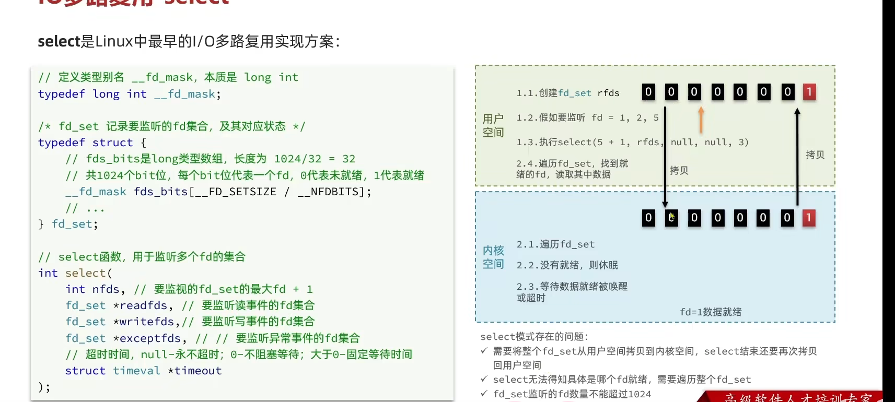

## redis 是 Ap

主从模式下对于 redis 主节点 与redis 从节点来说都是  非阻塞的，意思是在进行主从同步的时候，可以对主节点与从节点操作

## redis执行一串原子性命令：

通过EVAL 命令执行一串lua脚本可以保证原子性

```lua
 EVAL "local key = ARGV[1] local value = ARGV[2] redis.call('SET', key, value)" 1 mykey myvalue hhh
```


# 数据结构


## 动态字符串SDS

使用结构体维护一个字符串


- 获取字符串长度时间复杂度 为O 1
- 动态扩容
- 支持预分配 减少内存申请次数
- 二进制安全

## intset

维护了一个唯一、有序的int 数组 其中enoding 表示的是 编码方式，也就是表示的每个数字占了几个字节


intset还支持动态的改变编码


## DICT

与java中的哈希表实现类似，并且，一个Dict包含两个hash表,一个存储数据，另外一个

实现键值的映射


## ZipList

维护一块连续的内存区域,实现了链表的功能，但是内存占用更小，但是是连续的内存空间，数据过多连续空间申请效率低

存在连锁更新，使用listpack替代


**encoding字段中包含了数据的长度信息**


## QuickList

结点为ZipList的双端链表,还可以对zipList进行压缩，并控制ZipList的大小，结合了链表与连续空间的两者的优势


## SkipList

跳表，多级指针，元素按顺序排列，跳着查找，用空间换时间

一个结点的next指针 由多级

索引的层级最多 32 级

按照score来排序


## ListPack

**encoding字段中包含了数据的长度信息**

用于替代ZipList

他去掉了zipList中的tailOffset

并且entry中记录的是自己的长度,在 listpack 中，因为每个列表项**只记录自己的长度**，而不会像 ziplist 中的列表项那样，会记录前一项的长度。所以，当在 listpack 中新增或修改元素时，实际上只会涉及每个列表项自己的操作，而不会影响后续列表项的长度变化，这就避免了**连锁更新**。

**element-tot-len**的特殊编码方式：element-tot-len 每个字节的最高位，是用来表示当前字节是否为 element-tot-len 的最后一个字节，这里存在两种情况，分别是：

- 最高位为 1，表示 element-tot-len 还没有结束，当前字节的左边字节仍然表示 element-tot-len 的内容；
- 最高位为 0，表示当前字节已经是 element-tot-len 最后一个字节了。而 element-tot-len 每个字节的低 7 位，则记录了实际的长度信息。

这里需要注意的是，element-tot-len 每个字节的低 7 位采用了**大端模式存储**，也就是说，entry-len 的低位字节保存在内存高地址上。


## RedisObject

底层数据结构会被封装为RedisObjcet


## 五种基本数据类型

### String

 

三种编码方式：


### LIST

```
object encoding a
lpush city a
lpush city b
lpush city c
lindex  city 1
lrange city 0 -1
lset city 1 ins
linsert city before ins insssbefo
llen city
```

在之前使用的是zipList+LinkedList的方式,元素少的时候是使用的zipList，元素多的时候是使用的LinkedList

在redis 3.2 版本之后 就使用的quickList来保存数据

### SET

单列集合

```
sadd freind liu wang  yuan
srem  freind liu
srandmember freind 2
-- 求并集
SUNION key1 key2
-- 集合数量
scard  freind
-- 是否contain
sismember freind yuan
-- 求交集
sinter freind
smembers numset
```

使用的是Dict,其中只存key,Value统一为null

无序且保障数据的唯一性

- 当数据都是**整数类型并且数据数量不超过set-max-intset-extries**的时候就会使用**intSet** 来实现， 有序且 唯一的整数数组，使用二分查找，并且使用intset的时候，他是有序的
- 当存在不是整数的数据的时候就会使用**Dict**,使用hash表

### ZSET  (Sorted Set)

```
zadd zs 1 a  2 b
zscore zs b
zrem zs b
zrange zs 0 -1 withscores
zrevrange zs 0 -1 withscores
zrangebyscore zs 0  9999 withscores
zcard zs
```


**键值存储、数据唯一、可排序**


元素少的时候会使用ZipList


ZipList的Zset实现：


### MAP

```
hset map a stra
hsetnx map a stra
hexists map b
hget map a
hdel map a
hlen map
hkeys map
hvals map
```

底层使用的是Dict,与zipList


## Stream

## 脑裂问题：

就是当主节点与主从集群失去连接，但是没有意识到，还是接收客户端的请求，比如添加数据，但是当连回来的时候，哨兵会将该之前的主节点当作从节点让他服从**新的主节点**，并全量复制新的主节点的数据，并将之前的所有数据都删除，也就是说之前新增的数据都失效了 所以需要让结点监听与从节点的连接，让它在与从节点连接数低于多少的时候就**拒绝对客户端提供服务**

## 红锁：

是为了解决redis单节点故障的问题,增强分布式锁的健壮性

在进行加锁操作时，RedL ock会向每个Redis节点发送相同的命令请求，每个节点都会去竞争锁，如果至少在**大多数节点上成功获取了锁，那么就认为加锁成功**。反之,如果大多数节点上没有成功获取锁，则加锁失败。这样就可以避免因为某个Redis节点故障导致加锁失败的情况发生。

缺点：

- 网络分区  由于网络分区，导致不同结点获取到相同的锁，导致分布式系统的不一致问题
- 时钟漂移，不同结点的时间不一致 锁失效的时间不一致


## Linux五种不同的IO模型

### 阻塞io

recvfrom

本[函数](https://baike.baidu.com/item/函数/301912?fromModule=lemma_inlink)用于从（已连接）[套接口](https://baike.baidu.com/item/套接口/10058888?fromModule=lemma_inlink)上接收数据


### 非阻塞IO

recvfrom

性能上没有什么提升，会轮询结果


### IO多路复用 


Linux中是先io多路复用的三个函数

- select 

  无法知道是哪个fd,并且数量最多1024

  

- poll  前两个不会告诉用户空间是哪个资源准备好了，还要去查找


- epoll  但是epoll却会告诉系统是哪一个资源准备好了，直接调用即可


### 信号驱动io


### 异步io


## 单线程与多线程

**Redis的“单线程”**

**Redis 单线程指的是「接收客户端请求->解析请求 ->进行数据读写等操作->发送数据给客户端」这个过程是由一个线程（主线程）来完成的**，

Redis的“单线程”主要是指Redis的**网络IO** （redis 6.0之后变成了多线程）和**键值对读写**（一直是单线程）是由**一个线程**来完成的，Redis在处理客户端的请求时包括获取（socket读）、解析、执行、内容返回（socket写）等都由一个**顺序串行的主线程处理**（第一篇介绍过的那些原子的命令），这也是Redis对外提供键值存储服务的主要流程。

因此， Redis 6.0 版本之后，Redis 在启动的时候，默认情况下会**额外创建 6 个线程**（*这里的线程数不包括主线程*）：

- Redis-server ： Redis的主线程，主要负责执行命令；
- bio_close_file、bio_aof_fsync、bio_lazy_free：三个后台线程，分别异步处理关闭文件任务、AOF刷盘任务、释放内存任务；
- io_thd_1、io_thd_2、io_thd_3：三个 I/O 线程，io-threads 默认是 4 ，所以会启动 3（4-1）个 I/O 多线程，用来分担 Redis 网络 I/O 的压力。

**Redis的 多线程**

比如持久化**RDB、AOF、异步删除、集群同步数据、释放内存**等都是由额外的线程(**后台线程**)执行的，因此整个Redis可以看作是多线程的

## Reis为什么要使用单线程的：

> ​	官方文档中解释Redis中性能瓶颈不在CPU 而是在内存与网络IO当中
>
> ​	如果引入多线程可能会带来 锁竞争  设计负责  死锁 等一系列的问题

## 数据持久化：

### 	aof ：追加写

> ​	是通过先执行命令再去执行aof 
>
> - **避免额外的检查开销**
> - **不会阻塞当前写操作命令的执行**
>
> 但是：
>
> - **阻塞其他的操作**
> - **数据可能丢失**：因为当如果命令执行完成但是还没有进行aof写操作就宕机了


具体说说：

1. Redis 执行完写操作命令后，会将命令追加到 server.aof_buf 缓冲区；
2. 然后通过 write() 系统调用，将 aof_buf 缓冲区的数据写入到 AOF 文件，此时数据并没有写入到硬盘，而是拷贝到了内核缓冲区 page cache，等待内核将数据写入硬盘；
3. 具体内核缓冲区的数据什么时候**写入到硬盘**，由内核决定。

### 三种写回策略( 控制fsnyc()函数调用的时机) ：

- always
- everyseconds
- No 


当AOF文件过于庞大的时候就会触发**重写机制** 

AOF 重写机制是在重写时，读取当前数据库中的所有键值对，然后将每一个键值对用一条命令记录到「新的 AOF 文件」，等到全部记录完后，就将新的 AOF 文件替换掉现有的 AOF 文件。

Redis 的**重写 AOF 过程是由后台子进程 bgrewriteaof  来完成的**

子进程与主进程共享一个内存，如果 **主进程修改了已经存在 key-value，就会发生写时复制，注意这里只会复制主进程修改的物理内存数据，没修改物理内存还是与子进程共享的**。

子进程执行AOF重写，为了保持数据一致性，在重写的时候，为了保证数据的最终一致性，会有一个叫 **aof重写缓冲区**，主进程也会将aof日志加入该该缓冲区

也就是说，在 bgrewriteaof 子进程执行 AOF 重写期间，主进程需要执行以下三个工作:

- 执行客户端发来的命令；
- 将执行后的写命令追加到 「AOF 缓冲区」；
- 将执行后的写命令追加到 **「AOF 重写缓冲区」**；

在子进程完成重写并通知主进程之后，主进程会将重写缓冲区的数据也追加到新的被重写的aof缓冲区当中的。

### RDB

使用快照的方式，就是将一瞬间内存中的数据存储下来,**全量快照**

有两种方式： save , bgsave

- 执行了 save 命令，就会在主线程生成 RDB 文件，由于和执行操作命令在同一个线程，所以如果写入 RDB 文件的时间太长，**会阻塞主线程**；
- 执行了 bgsave 命令，会创建一个子进程来生成 RDB 文件，这样可以**避免主线程的阻塞**； 

满足配置文件当中的条件会定时进行快照的存储

如：


在bgsave当中也是通过**写时复制**的技术，来保证在进行rdb快照的时候，redis同样可以修改数据

但是，如果主线程（父进程）要**修改共享数据里的某一块数据**（比如键值对 `A`）时，就会发生**写时复制**，于是这块数据的**物理内存就会被复制一份（键值对 `A'`）**，然后**主线程在这个数据副本（键值对 `A'`）进行修改操作**。与此同时，**bgsave 子进程可以继续把原来的数据（键值对 `A`）写入到 RDB 文件**。

就是这样，Redis 使用 bgsave 对当前内存中的所有数据做快照，这个操作是由 bgsave 子进程在后台完成的，执行时不会阻塞主线程，这就使得主线程同时可以修改数据。

 bgsave 快照过程中，如果主线程修改了共享数据，**发生了写时复制后，RDB 快照保存的是原本的内存数据**，而主线程刚修改的数据，是没办法在这一时间写入 RDB 文件的，只能交由下一次的 bgsave 快照。

### 混合使用aof与rdb(  redis4.0之后的)

混合持久化工作在 **AOF 日志重写过程**。

当开启了混合持久化时，在 **AOF 重写日志**时，`fork` 出来的重写子进程会先将与主线程共享的内存数据**以 RDB 方式**写入到 AOF 文件，然后**主线程**处理的操作命令会被记录在**重写缓冲区**里，**重写缓冲区里的增量命令会以 AOF 方式写入到 AOF 文件**，写入完成后通知主进程将新的**含有 RDB 格式和 AOF 格式的 AOF 文件**替换旧的的 AOF 文件。

也就是说，使用了混合持久化，AOF 文件的**前半部分是 RDB 格式的全量数据，后半部分是 AOF 格式的增量数据**。

## 缓存设计：

**穿透**：传过来许多没有值的key，建立缓存，所以就频繁的访问数据库

​	为null值设置缓存

​	使用布隆过滤器，快速判断是否存在对应的数据

​	限制非法请求的进入

**击穿：**当key失效的时候，许多请求打在数据库当中

​	设置分布式锁，使得同时只能有一个请求来设置缓存

​	不设置过期时间，让后台异步的更新缓存的更新

**雪崩：** 许多key同时失效

​	将缓存失效的时间随机打散

​	不设置过期的时间，让后台线程设置缓存的更新

如果进行更新操作很容易出问题：


先删除再更新的话，可能会导致，删除后有一个线程进来又维护了缓存导致缓存失效


先更新后删除的话

如果上一个缓存刚好过期、删除，这边又将其更新了并删除，上一个缓存又将其写回，导致旧数据的发生


可以**延迟双删**，最大程度的保持一致性

为了保证删除缓存的成功执行，可以使用：

- 消息队列，让消费者，删除缓存
- 使用canal，监听mysql，来删除缓存

## 使用场景：

### Redis 如何实现延迟队列？

延迟队列是指把当前要做的事情，往后推迟一段时间再做。延迟队列的常见使用场景有以下几种：

- 在淘宝、京东等购物平台上下单，超过一定时间未付款，订单会自动取消；
- 打车的时候，在规定时间没有车主接单，平台会取消你的单并提醒你暂时没有车主接单；
- 点外卖的时候，如果商家在10分钟还没接单，就会自动取消订单；

在 Redis 可以使用有序集合（ZSet）的方式来实现延迟消息队列的，ZSet 有一个 Score 属性可以用来存储延迟执行的时间。

使用 zadd score1 value1 命令就可以一直往内存中生产消息。再利用 zrangebysocre 查询符合条件的所有待处理的任务， 通过循环执行队列任务即可。

### Redis 管道有什么用？

管道技术（Pipeline）是客户端提供的一种批处理技术，用于一次处理多个 Redis 命令，从而提高整个交互的性能。

使用**管道技术可以解决多个命令执行时的网络等待**，它是把多个命令整合到一起发送给服务器端处理之后统一返回给客户端，这样就免去了每条命令执行后都要等待的情况，从而有效地提高了程序的执行效率。

但使用管道技术也要注意避免发送的命令过大，或管道内的数据太多而导致的网络阻塞。

要注意的是，管道技术本质上是客户端提供的功能，而非 Redis 服务器端的功能

## redis执行事务(通过SessionCallBack接口)

关系型数据库事务的作用是保证并发访问下数据的一致性，Redis事务有些不同，由于Redis是单线程的处理来自client的指令，所以Redis所有命令的执行都是原子性的，举一个简单的例子，单个Redis服务器下，并发地执行INCR命令，也不会返回相同的结果。

  所以Redis事务的意义在于保证命令的批量顺序执行，并且事务执行期间，Redis不会执行来自client的其他请求。有一点需要注意的是，。如果有命令执行失败，还是会继续执行剩下的命令，因为Redis没有异常回滚。

  对“Redis事务命令要么全部执行，要么全部不执行”这句事实的理解：如果有命令执行失败，并不是中断事务，而是继续执行剩下的指令，因为Redis不支持异常回滚。全部不执行的情况有 1.没有执行EXEC命令 2.WATCH的key发生改变 3.DISCARD命令放弃事务。本质上开启事务后，所有输入的命令都被缓存在一个队列中，一旦EXEC，队列里的指令被一条一条的执行。

关于事务的API

- MULTI  开启事务

- EXEC  执行任务队列里所有命令，并结束事务

- DISCARD   放弃事务，清空任务队列，全部不执行，并UNWATCH

- WATCH key [key1]  MULTI执行之前，指定监控某key，如果key发生修改，放弃整个事务执行

- UNWATCH  手动取消监控

  Spring Data Redis 事务问题

  RedisTemplate来操作Redis，关于事务操作的时候会有问题：

  ```
  redisTemplate.multi();
  redisTemplate.opsForValue().increment("xxx",1);
  redisTemplate.opsForValue().increment("ttt",1);
  redisTemplate.exec();
  ```

   

  
  调用会报一个错误“No ongoing transaction. Did you forget to call multi? ”查了下，RedisTemplate操作事务不能理所当然地像原生API那么写，其实RedisTemplate的事务需要自己实现一个SessionCallBack来做事务，所以要这么写

  [](javascript:void(0);)

  ```
  SessionCallback sessionCallback = new SessionCallback() {
      @Override
      public Object execute(RedisOperations redisOperations) throws DataAccessException {
          redisOperations.multi();
          // TODO: 2017/11/20 命令1
          // TODO: 2017/11/20 命令2
          // TODO: 2017/11/20 命令3
          return redisOperations.exec();
      }
  };
  
  redisTemplate.execute(sessionCallback);
  ```