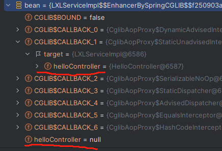
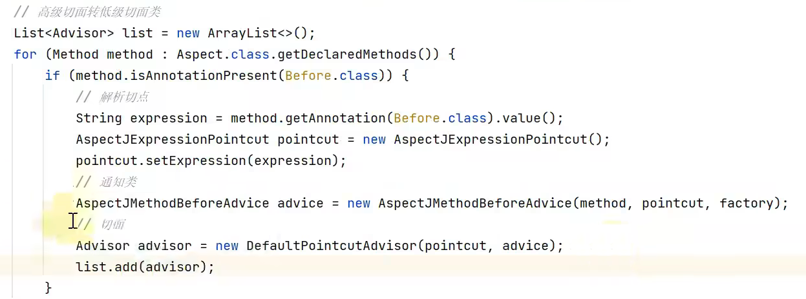
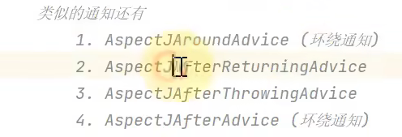
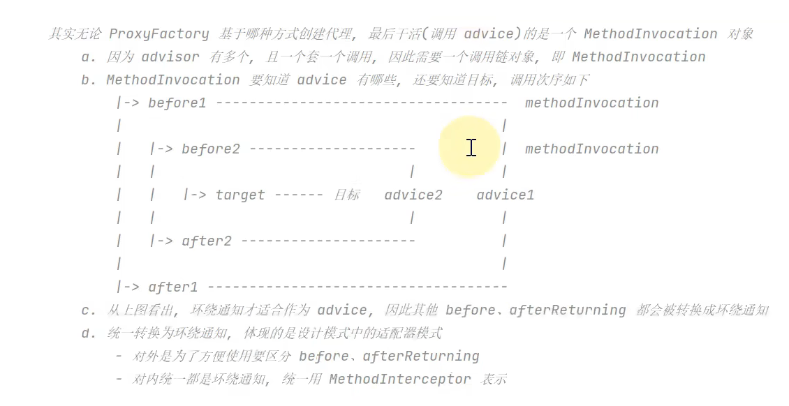
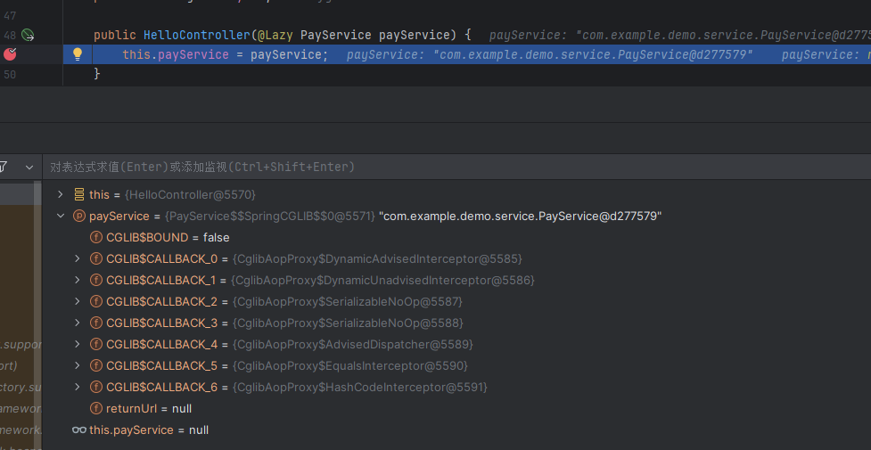

## 构造方法

默认使用无参的构造方法

如果只有一个构造方法的话就会使用这一个构造方法

如果有多个构造方法则需要使用@Autowired注解指定构造函数（没有无参的情况下）

如果构造方法中的参数，在spring对象池当中没有对应的bean,就会报错

构造方法注入有循环依赖，则使用@Lazy让一方懒加载

## 单例bean

单例bean指的一个spring容器内，同一个名字内部，只能有同一个类型的bean

```java
@Autowired(required = false) //设置为不强制依赖	
```

## AOP类的实现

一个aop代理类会继承原有类或者接口，但是aop代理类中的父类中的属性字段是为null,的而是这些代理类，都持有了原有**父类的对象实例target**,调用aop的时候会调用target的对应方法来实现原有逻辑



```java'
joinPoint.getTarget()获取普通对象
joinPoint.getThis()获取代理对象
```

想要开启jdk动态代理需要在配置文件里面设置

```properties
spring.aop.proxy-target-class=false
```

并且还要满足被动态代理的类有实现的接口

jdk动态代理与cglib

```java
@Override
public AopProxy createAopProxy(AdvisedSupport config) throws AopConfigException {
    // 判断是否需要使用CGLIB代理
    if (config.isOptimize() || config.isProxyTargetClass() || hasNoUserSuppliedProxyInterfaces(config)) {
        // 获取目标类
        Class<?> targetClass = config.getTargetClass();
        if (targetClass == null) {
            throw new AopConfigException("TargetSource cannot determine target class: " +
                                         "Either an interface or a target is required for proxy creation.");
        }
        // 判断是否需要使用JDK动态代理
        if (targetClass.isInterface() || Proxy.isProxyClass(targetClass)) {
            return new JdkDynamicAopProxy(config);
        }
        // 使用CGLIB代理
        return new ObjenesisCglibAopProxy(config);
    } else {
        // 使用JDK动态代理
        return new JdkDynamicAopProxy(config);
    }
}

```

## Spring当中的设计模式:

**工厂设计模式**， 通过BeanFactory创建Bean对象

`BeanFactory`：延迟注入(使用到某个 bean 的时候才会注入),相比于`ApplicationContext` 来说会占用更少的内存，程序启动速度更快。

`ApplicationContext`：容器启动的时候，不管你用没用到，一次性创建所有 bean 。`BeanFactory` 仅提供了最基本的依赖注入支持，`ApplicationContext` 扩展了 `BeanFactory` ,除了有`BeanFactory`的功能还有额外更多功能，所以一般开发人员使用`ApplicationContext`会更多。

**单例设计模式**  大多数的bean 都是单例的bean,范围是beanFactory作用域的Bean,并且要注意的是Spring当中的有状态的单例Bean是线程安全的

**代理模式：**  AOP 面相切面编程，将那些与业务无关，但是需要被多个公共模块共同调用的逻辑与责任封装起来，减少系统的重复代码降低耦合度

**适配器模式：**

 AOP当中，前置、后置环绕通知首先被@Before @Around注解标注的方法与表达式会有高级切面转换为低级切面advisor:





别的通知都需要转换成**MethodInterceptor**环绕通知，就体现了适配器模式，将别的实现了转换成MethodInterceptor接口

适配器模式是将原有的不兼容的类进行包装，使得其能够被使用，如不同接口的适配

**MethodBeforeAdviceAdapter**将@Before AspectJMethodBeforeAdvice 适配为MethodBeforeAdviceInterceptor
**AfterReturningAdviceAdapter**将AspectJAfterReturningAdvice 适配为AfterRe turningAdviceInterceptor



**SpringMVC**中的

**为什么要在 Spring MVC 中使用适配器模式？**

Spring MVC 中的 `Controller` 种类众多，不同类型的 `Controller` 通过不同的方法来对请求进行处理。如果不利用适配器模式的话，`DispatcherServlet` 直接获取对应类型的 `Controller`，需要的自行来判断，像下面这段代码一样：

```java
if(mappedHandler.getHandler() instanceof MultiActionController){
   ((MultiActionController)mappedHandler.getHandler()).xxx
}else if(mappedHandler.getHandler() instanceof XXX){
    ...
}else if(...){
   ...
}
```


**责任链设计模式：**

**MethodInvocation**调用链持有多个advisor

MVC中的拦截器

**观察者设计模式**：Spring当中的事件发布，publishEvent

```java
// 定义一个事件,继承自ApplicationEvent并且写相应的构造函数
public class DemoEvent extends ApplicationEvent{
    private static final long serialVersionUID = 1L;

    private String message;

    public DemoEvent(Object source,String message){
        super(source);
        this.message = message;
    }

    public String getMessage() {
         return message;
          }


// 定义一个事件监听者,实现ApplicationListener接口，重写 onApplicationEvent() 方法；
@Component
public class DemoListener implements ApplicationListener<DemoEvent>{

    //使用onApplicationEvent接收消息
    @Override
    public void onApplicationEvent(DemoEvent event) {
        String msg = event.getMessage();
        System.out.println("接收到的信息是："+msg);
    }

}
// 发布事件，可以通过ApplicationEventPublisher  的 publishEvent() 方法发布消息。
@Component
public class DemoPublisher {

    @Autowired
    ApplicationContext applicationContext;

    public void publish(String message){
        //发布事件
        applicationContext.publishEvent(new DemoEvent(this, message));
    }
}


```

## Spring事务:

实现方式，

编程实现：

transactionalTemplate：

```java
@Autowired
private TransactionTemplate transactionTemplate;
public void testTransaction() {

        transactionTemplate.execute(new TransactionCallbackWithoutResult() {
            @Override
            protected void doInTransactionWithoutResult(TransactionStatus transactionStatus) {

                try {

                    // ....  业务代码
                } catch (Exception e){
                    //回滚
                    transactionStatus.setRollbackOnly();
                }

            }
        });
}
```

TranSactionalManger获取Transaction：

```java
@Autowired
private PlatformTransactionManager transactionManager;

public void testTransaction() {

  TransactionStatus status = transactionManager.getTransaction(new DefaultTransactionDefinition());
          try {
               // ....  业务代码
              transactionManager.commit(status);
          } catch (Exception e) {
              transactionManager.rollback(status);
          }
}
```

**声明式事务**：

```java
@Transactional(propagation = Propagation.REQUIRED)
public void aMethod {
  //do something
  B b = new B();
  C c = new C();
  b.bMethod();
  c.cMethod();
}
```

### 事务属性

**事务传播行为**

```java
//事务传播行为是为了解决业务层方法之间互相调用的事务问题
public interface TransactionDefinition {
    int PROPAGATION_REQUIRED = 0;//没有则开启事务，有则加入当前事务，默认的传播行为
    int PROPAGATION_SUPPORTS = 1;//如果没有则不开启事务，有则加入之前的事务
    int PROPAGATION_MANDATORY = 2; // 存在则加入事务，如果没有事务则报错
    int PROPAGATION_REQUIRES_NEW = 3;//如果有则新开启一个事务，如果没有事务则开启一个互不干扰的新的事务
    int PROPAGATION_NOT_SUPPORTED = 4;//如果有则将当前事务挂起，没有也不开启事务
    int PROPAGATION_NEVER = 5;//如果当前存在事务则报错，没有则正常执行
    int PROPAGATION_NESTED = 6; //嵌套事务，就是调用方回滚则回滚，自己回滚但是调用方不回滚
    ......
}

```

**事务隔离级别：**

读未提交

读已提交

可重复读

可串行化

**事务超时时间：**

超过一定时间没有完成则会将事务进行回滚

**是否为只读事务**

**@Transactional实现的原理:**

使用aop在方法开始之前开启事务，如果遇到异常在回滚，没有异常则正常提交

## 事务失效：

- 默认遇到运行时异常和Error回滚、遇到检查型异常不会滚
- @TranSactional类必须要是被Spring管理的类
- 数据库必须要支持事务
- 同一个类中调用
- 只有public方法上的事务才会生效
- 并且AOP的时候 private final static的方法都不会生效的

## @Lazy注解

可以使得被注释的Bean等到在**被需要的时候才会被实例化**,可以解决循环依赖的问题

@Lazy,会将该对象进行动态代理，当需要的时候才会进行初始化

找到了 @Lazy 注解就会通过 buildLazyResolutionProxy() 方法去创建这个入参的代理对象，如下所示：

代理对象就是对原始目标类的一种增强，注意当使用代理对象**调用它的方法时会回调到 getTarget() 方法**，这个 getTarget() 方法中调用了 doResolveDependency() 方法，这个方法会触发调用 getBean() 流程实例化 bean，要格外注意，后面会演示如何调用到这个方法的。

