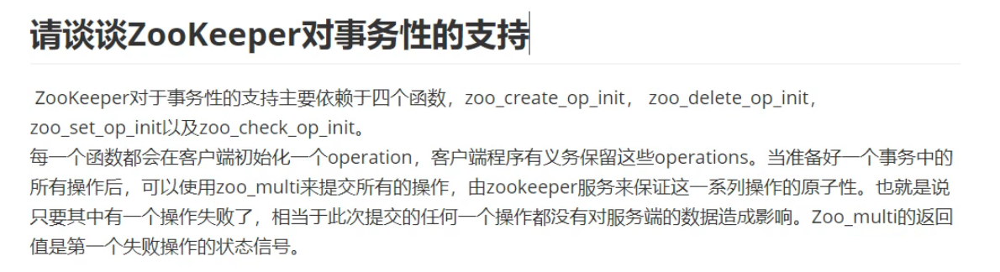

## Zookeeper的一致性

他是强一致性的中间件，但是其实他是尽量的保证一致性，其实不是非常严格的强一致性 

## 观察者节点

观察着节点与follwer节点的区别就是不参与投票，他只负责接收投票的结果，并且其他功能与follwer一致

## 为什么集群最好有奇数个结点

zookeeper集群中遵守的是过半原则，投票时，数据同步接收ACK的时候都需要过半数目才能继续，当有六个节点的时候最多挂两台，五个结点的时候也是最多挂两台，从可用性的角度来讲没必要多部署一个结点

## zookeeper中的脑裂问题

zookeeper集群当中是不会出现脑裂问题的，因为zookeeper使用过半机制

1. 当两台机房部署结点相同发生分区的时候:

   当产生分区的时候，由于在配置文件当中配置了集群的结点，由于过半机制，选举的时候，与数据同步的时候都需要  集群数目一半的结点支持，但是网络分区导致无法通信导致两边的机房都会无法对法提供服务

2. 当一台机房超过一半，一台机房小于一半时产生网络分区的情况的时候

   会导致一个机房会有leader,但是另外一个机房由于节点数小于集群数的一半，所以不能对外提供服务

