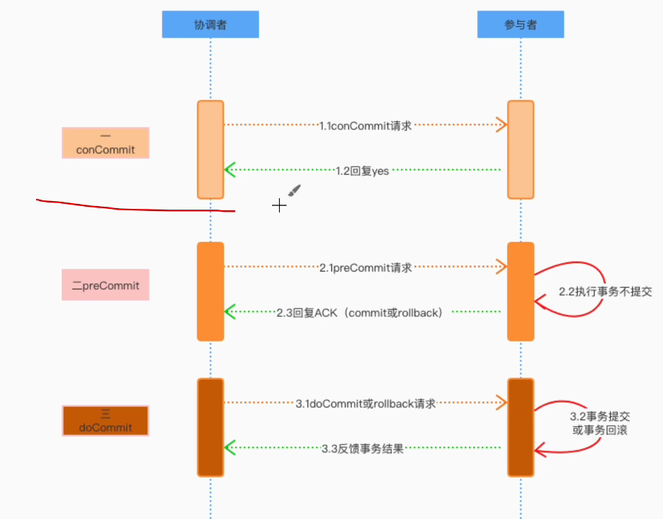
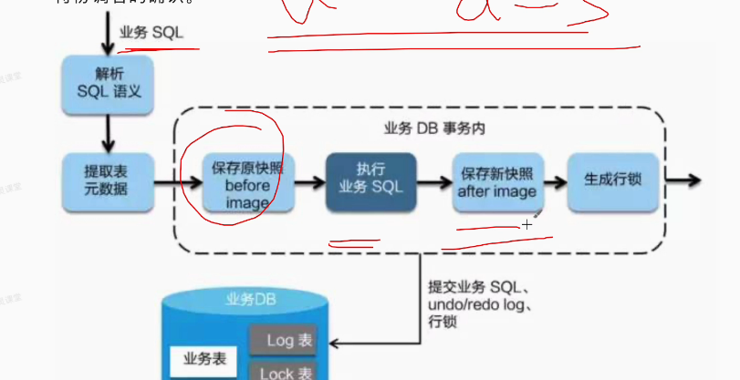
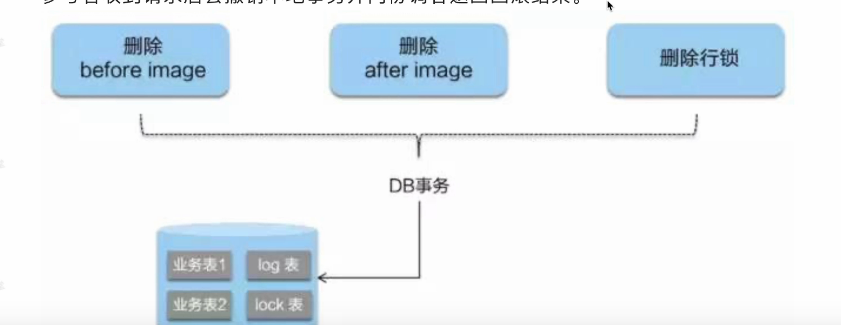
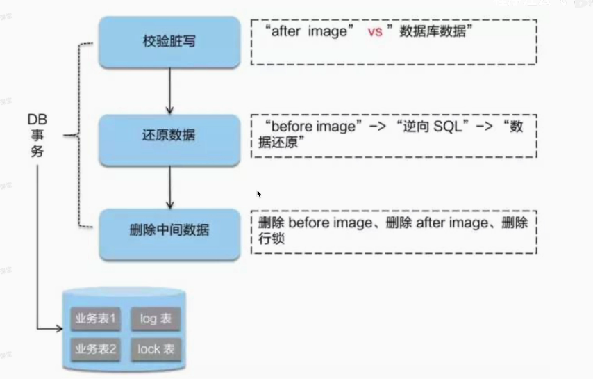
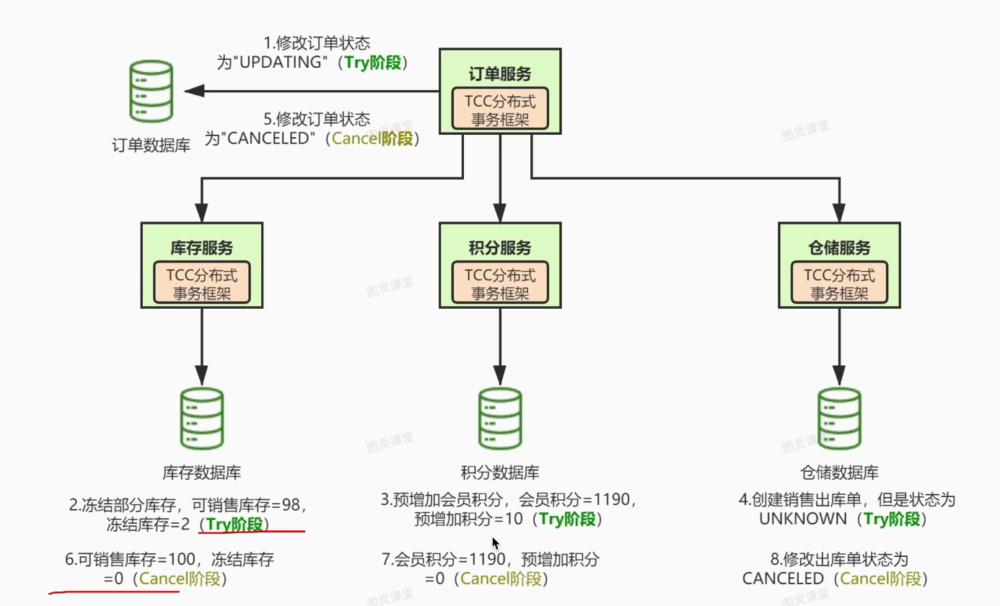
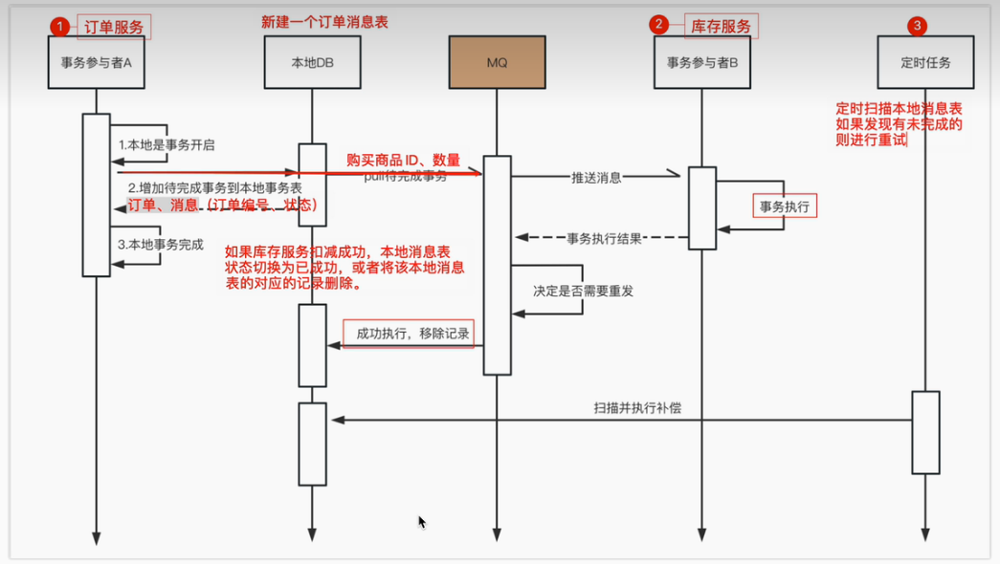

## SOA与微服务：

什么是SOA架构
SOA（全称：Service Oriented Architecture），中文意思为 “面向服务的架构”，你可以将它理解为一个架构模型或者一种设计方法，而并不是服务解决方案。

其中包含多个服务， 服务之间通过相互依赖或者通过通信机制，来完成相互通信的，最终提供一系列的功能。一个服务通常以独立的形式存在与操作系统进程中。各个服务之间通过网络调用 。

跟 SOA 相提并论的还有一个 ESB（企业服务总线），**简单来说ESB就是一根管道，用来连接各个服务节点。为了集成不同系统，不同协议的服务，ESB 可以简单理解为：它做了消息的转化解释和路由工作，让不同的服务互联互通；**

我们将各个应用之间彼此的通信全部去掉，在中间引入一个ESB企业总线，各个服务之间，只需要和ESB进行通信，这个时候，各个应用之间的交互就会变得更加的清晰，业务架构/逻辑等，也会变得很清楚。

原本杂乱没有规划的系统，梳理成了一个有规划可治理的系统，在这个过程中，最大的变化，**就是引入了ESB企业总线。**

微服务与SOA相比去掉了ESB企业服务总线，服务与服务之间是通过轻量级的通信协议来进行通信，微服务架构更加的组件化，微服务架构模式是将一个大的应用拆分成小的应用

## **CI/CD**

CI/CD代表持续集成 、和持续交付、持续部署 这是一种软件开发实践，目的是通过自动化和频繁的代码集成、测试以及部署，提高软件开发过程的效率和质量。

1. **持续集成（Continuous Integration，CI）：** 开发者将他们的代码频繁地合并到共享存储库中，然后通过自动化的构建和测试过程来验证代码的正确性。这有助于及早发现和解决代码集成问题，防止长时间的开发分支导致的冲突。
2. **持续交付（Continuous Delivery，CD）：** 一旦代码通过了持续集成的测试，它就被认为是“可交付”的。持续交付的目标是确保软件随时都能够以可部署的状态交付给用户，但实际的部署可以由开发团队手动触发。
3. **持续部署（Continuous Deployment）：** 在持续交付的基础上，持续部署更进一步，将通过测试的代码自动部署到生产环境，使新功能或修复的 bug 非常快速地交付给用户。

## 一致性：

### 线性一致性(严格一致性)：

表示一个进程读取的必须是全局中的最新的信息。他更关注的是全局的所有执行顺序是一致的，**更关注全局时间下的执行顺序**（多个进程之间各个操作的执行顺序）

### 顺序一致性

表示一个进程不一定会读到全局中的最新的信息，但是系统会保证这个进程对这个系统操作顺序会被按照顺序进行（**更关注单个进程的执行顺序**），也就是说多个写的结果会按照顺序读出，在顺序一致性下，一个进程对共享变量的修改**不一定会被其他进程立刻感知**（同步），但不同进程对共享变量的写入**必须以相同的顺序**被所有进程看到。

   在ZooKeeper中，为了追求更高的性能，对Paxos做了简化落地，并称之为ZAB算法：

- 线性写：为了保证写的一致性，使用回主写实现了写的串行化
- 过半写入：为了追求写入的性能，使用过半写入+拜占庭机制保障写入数据的有效性。
- 顺序读：在读取的情况下，ZooKeeper可以提供较旧的数据，但由于写入的有序，可以保证节点在生命周期中对外的数据一致性。

## BASE理论

他是cap理论的延伸，意思是如果做不到cp，那就使用合适的方式做到最终一致

### BA 基本可用

指的是在系统出现故障的时候，可以损失部分可用性，丢失些非核型功能达到基本可用的状态，如服务熔断降级

### S 软状态

指的是数据被更改，但是还没有同步到所有节点的 一个中间过程，这个中间状态不会出现不可用的情况，但是可能造成数据不一致的情况,如异步复制

### E   eventually Consistency  最终一致状态

指的是，系统中的副本经过了一定的时间的同步之后，达到了数据的一致性

**CAP理论**是由计算机科学家Eric Brewer于2000年提出的理论，用于描述分布式系统设计时面临的三个基本问题：一致性（Consistency）、可用性（Availability）、分区容忍性（Partition Tolerance）。这三个概念无法完全共存，CAP理论表述了在分布式系统中只能同时满足其中两个，而不能同时满足三个的困境。

## 分布式事务

> 一个业务流程需要跨多个服务的事务处理，需要保证多个参与者之间的原子性，一致性

 再单机的场景下面，可以由数据库保证事务，但是在分布式场景，在跨进程、跨数据库的场景下就不能保证了，在跨进程、跨节点的情况下，导致一部分服务成功，一部分服务失败的情况，这样整个流程会出现问题

### 2 PC

分为**投票阶段**与**提交或回滚阶段**

在投票阶段的时候执行自己的操作，判断是否能够准备好提交，并把投票结果提交给事务协调者

在提交阶段，事务提交者会根据所有参与者是否能够提交之后就通知给各个参与者结果，如果存在一个参与者不能提交就会告诉所有的参与者回滚，如果都能够提交的话，则通知每个参与者进行提交

#### 优点：

使用数据库自身的一个事务实现，比较简单

#### 缺点：

1. 所有节点的事务需要等到一整个事务都完成了，才能执行本地提交，这样就会造成一个比较长的资源占有

2. 如果事务协调器宕机了，就会导致一个不可用的状态，比较依赖事务协调器

3. 如果事务协调器在 第二阶段也就是协调阶段就宕机了，会出现，部分节点进行了提交的状况，这样会导致脏数据的产生

4. 二阶段无法解决的问题

   协调者再发出commit消息之后宕机，而唯一接收到这条消息的参与者同时也宕机了。那么即使协调者通过选举协议产生了新的协调者，这条事务的状态也是不确定的，没人知道事务是否已经被提交。

   如果在二阶段提交的提交询问阶段中，参与者出现故障而导致协调者始终无法获取到所有参与者的响应信息的话，这时协调者只能依靠其自身的超时机制来判断是否需要中断事务，显然，这种策略过于保守。换句话说，二阶段提交协议没有设计较为完善的容错机制，任意一个节点失败都会导致整个事务的失败。

#### 2PC的网络故障解决方案

- 超时回滚
- 心跳机制
- 备份协调器+消息队列，  当协调器挂了，诶分协调器上场，从消息队列当中获取之前的信息，并做出处理

#### 3PC 

 在2pc的基础上在事务的提交阶段之前有一个preCommit阶段

### AT

1. 尝试阶段：

   参与者开始本地事务，并且提交，在提交之前需要 生成 before image  , 在提交完本地事务之后还需要生成after image 并生成行锁（这个锁是 分布式事务系统的 行锁），防止别人对他的修改

   

2. 提交/回滚阶段

如果都能提交，则把刚刚生成的东西都删除

如果存在一个结点失败。则需要让事务协调者通知各个节点进行回滚

### TCC

try阶段先去预检判断是否可以满足的需求，并且需要将资源锁住，比如selct   ** for upadate 加排它锁

confirm 执行业务操作 并 执行 提交

cancel 如果出现失败，需要回滚，但是是代码方面的回滚，需要编码实现

性能好。但是代码侵入性强

三种出错：

#### 异常一：try阶段异常

在try阶段异常之后，就会执行cancel阶段，此时cancel阶段是一定要保证成功的，如果cancel阶段没有执行成功，那么就要进行重试

#### 异常二：cancel阶段异常

其实这个异常的处理方式和异常一是一样的，失败了就重试，如果一直重试失败，那么就要进行人工干预

#### 异常三：confirm提交异常

try阶段成功了，那么confirm一定要成功，如果失败了，那么就要进行重试，重试多次还未成功，那么就要进行人工干预

但是这里重试要注意，因为在confirm阶段有二步数据库操作，如果扣冻结张三20元成功了，但是李四加20元失败了，这时候重试就要做判断，看张三扣减20元是否之前已经操作成功了，如果操作成功了，就不要再次进行扣减冻结的操作

###  SAGA模式

Saga模式是SEATA提供的长事务解决方案，在Saga模式中，业务流程中每个参与者都提交本地事务，当出现某一个参与者失败则补偿前面已经成功的参与者，一阶段正向服务和二阶段补偿服务都由业务开发实现。

### Redis分布式锁的缺点

> 可能存在主节点刚写入，还没有主从同步的时候主节点就挂了的情况，这样就会导致有两个线程获取到锁

## 本地消息表实现分布式事务

将分布式事务 拆分成为 消息事务与本地事务

> 实现：在数据库中新增一个消息表来维护事务信息，A结点中  先进行业务与消息入库 再将消息通过MQ发送给B结点  B结点执行事务 将结果返回通过消息队列返回给A端，并更改消息的状态，而后台通过定时任务去给消息进行补偿

缺点：与代码逻辑高耦合    需要占用数据库资源，高并发场景下性能较低

## seata的原理

他是阿里巴巴的一个开源的分布式事务的解决方案

TC 事务协调者

TM 事务管理者

RM  资源管理者

TM创建一个全局事务，并且调用TC生成一个事务ID

TM向每个RM发送请求将事务ID传给RM

RM获取到事务ID之后去注册一个分支事务

当业务流程走完之后，TM会决定该分布式事务是否需要回滚

TC通知各个分支事务提交或者回滚

## Redlock 的缺点

Redlock 算法虽然在一些场景下可以提供分布式锁的可靠性，但也存在一些缺点和限制，包括：

1. **时钟偏移**：Redlock 算法依赖于各个 Redis 节点的系统时钟是准确同步的，如果节点之间的时钟存在较大的偏移，可能导致锁的获取和释放出现问题。 **不同结点之间的时间设置不一致，导致锁的失效时间不一致，导致分布式系统的不一致**
2. **网络延迟和分区**：在存在网络延迟或网络分区的情况下，Redlock 算法的可靠性可能会下降。如果一个或多个节点无法与主节点通信，可能会导致节点的多数性无法满足，从而使得锁无法正常获取或释放。**导致两个客户端同时持有锁**  
3. 节点故障：如果 Redis 节点发生故障或宕机，可能会影响到 Redlock 算法的可靠性。在节点故障后，无法进行正常的命令传播和锁释放操作，导致锁的状态无法得到正确维护。 
4. 锁竞争：当多个客户端同时竞争同一个资源的锁时，可能会导致锁的频繁获取和释放，造成性能损耗和锁争用问题。
5. **使用复杂性**：Redlock 算法相对于简单的单节点锁来说，实现和使用上更加复杂，需要考虑节点的多数性、锁的续约、错误处理等方面的问题，增加了系统的复杂性和开发维护成本。

## zookeeper分布式锁

通过顺序队列保证了公平性

