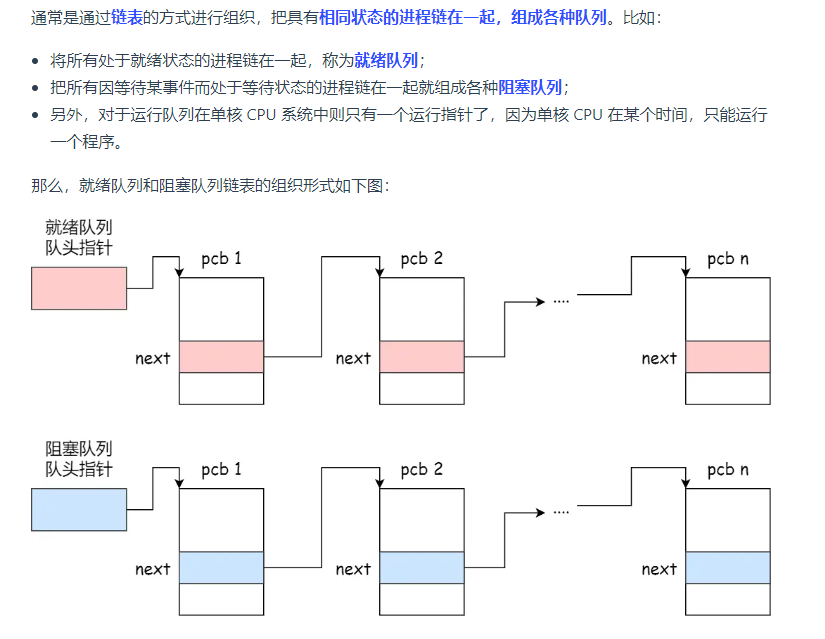

常见的寄存器种类：

- *通用寄存器*，用来存放需要进行运算的数据，比如需要进行加和运算的两个数据。

- *程序计数器*，用来存储 CPU 要执行下一条指令「所在的内存地址」，注意不是存储了下一条要执行的指令，此时指令还在内存中，程序计数器只是存储了下一条指令「的地址」。

- *指令寄存器*，用来存放当前正在执行的指令，也就是指令本身，指令被执行完成之前，指令都存储在这里

总线是用于 CPU 和内存以及其他设备之间的通信，总线可分为 3 种：
  - *地址总线*，用于指定 CPU 将要操作的内存地址；
  - *数据总线*，用于读写内存的数据；
  - *控制总线*，用于发送和接收信号，比如中断、设备复位等信号，CPU 收到信号后自然进行响应，这时也需要控制总线；

## cpu的缓存一致性：

1. 总线嗅探机制：为了保证每个缓存当中的数据一致性，当某个核心更新了Cache中的数据的时候，他会通过总线来广播告诉别的cpu进行了数据的更改

2. **MESI 协议**其实是 4 个状态单词的开头字母缩写，代表着内存块的四个状态，分别是：

   - *Modified*，已修改
   - *Exclusive*，独占
   - *Shared*，共享
   - *Invalidated*，已失效

   广播的时候告诉别的核心，将修改的共享变量状态改成已失效，才能进行修改

进程是资源分配的最小单位，而线程是cpu调度的最小单位

## 软中断 与 硬中断

硬中断，一般是由于系统相连的**硬件设备触发**的，主要是来**通知操作系统的变化**，比如网卡接收数据包

键盘输入字符，会触发电信号告诉cpu，主要是负责耗时短的工作，特点是快速执行

软中断 中断处理是越快越好,属于硬中断的后半部分，但是终端如果处理时间需要太长的话就不行，所以对那些处**理时间太长的中断**，系统会用一个**软中断内核线程来处理剩下的任务**,对应软中断，由内核触发中断，用来异步处理上半部未完成的工作

## 十进制转二进制：

小数部分的转换不同于整数部分，它采用的是**乘 2 取整法**，将十进制中的小数部分乘以 2 作为二进制的一位，然后继续取小数部分乘以 2 作为下一位，直到不存在小数为止。


但是会存在很多小数取不尽，造成**无限循环**

然而，计算机并不是这样存储的小数的，计算机存储小数的采用的是**浮点数**，名字里的「浮点」表示小数点是可以浮动的。

比如 `1000.101` 这个二进制数，可以表示成 `1.000101 x 2^3`，类似于数学上的科学记数法。


## 微内核与宏内核

**微内核**只实现最基本的功能,  内核架构的内核**只保留最基本的能力**，比如进程调度、虚拟机内存、中断等，把一些应用放到了用户空间，比如驱动程序、文件系统等。   其他功能由不同进程来实现，中央内核调用通信来处理，解耦，可扩展

微内核通信需要花费时间，效率更低

宏内核将所有功能的实现都放入了一块，完成了所有的基础功能  linux 一直坚持宏内核

## 内存

### 虚拟内存：

我们应用程序实际上是不可以操纵真实的**物理内存**的，应用所获取到的内存其实**是虚拟内存**，并且应用误以为这是一段连续的内存，实际上他可能是碎片化的

操作系统为每个进程都分配一组虚拟内存，不同进程之间互不干扰

虚拟内存地址可以通过MMU(**内存管理单元**) 转换为物理内存地址

操作系统通过**内存分段与内存分页**，来维护物理内存与虚拟内存之间的关系

### 内存分段

将物理地址分成很多的**段**，操作系统会将这些段分配给应用程序，应用程序的**虚拟地址结构**包括：**段选择因子、段内偏移量（也就是相对物理基地址的偏移量）**

段选择因子就包括了**段号**，通过段号，在**段表**中，就可以查到**段的基地址，段的界限**等信息，所以通过段的基地址加上锻内偏移量即可找到正确的物理地址

##### 缺点：

- **内存碎片**  由于段是一块连续的内存空间，所以当很容易出现内存碎片
- **内存交换效率低**  内存交换式，一块较大的连续内存

### 内存分页

分页方案，操作系统，将虚拟内存与物理内存都分成了一个一个等大的内存块，这这些等大的内存块就是**页**，页是**内存分配的最小单元**，所以有可能产生**内存浪费**的情况，但是在内存不够用的情况下，操作系统会将一个应用程序最近没有使用过的页，暂时放在**硬盘的swap区**

操作系统通过**页表**维护 **虚拟页号** 与 物理页号之间的**映射**关系

分页机制下的虚拟地址  包括 **虚拟页号** 与  **页内偏移量**， 操作系统通过页表找到物理页，通过业内偏移量即可找到真实的物理地址

##### 缺页中断：

> 进程访问的虚拟地址在页表当中找不到的时候就会发生缺页中断，此时会由内核分配内存并更新进程的页表

##### 缺点：

每个进程维护一个页表，维护页表的内存占用太过于大

##### 多级页表:

  将单页表**拆分**成**多个页表**，那么一个虚拟地址中就要包含**多个页表页号**，比如**一级页号**，**二级页号**，

层层递进最终找到物理地址，这样子一个一级页表就可以表示更多的空间，然后再去二级页表中找更细的页，由于**二级页表是懒加载的,需要的时候才会被创建**，所以是更节省空间


**但是多级页表之间的转换会耗费时间复杂度**

**TLB**

是一个缓存，虚拟地址查询物理基地址的时候，先去查询缓存，缓存没有命中再去查询

### 段页式内存管理：

就是将分段与分页组合起来，再一个操作系统中使用

内存分配就是，先将**内存中分段**，但是**段中又会分页**

那这样的话，虚拟地址，就包括   **段号、段内页号、页内偏移**

### 分配内存的过程：

先给进程分配**虚拟内存**，当cpu访问该虚拟内存的时候，在页表当中找不到的时候，发生**缺页中断**，去查找空闲的物理内存并进行分配，如果内存不够就会清理内存

先是**异步回收**，就是通过后台进程

如果异步回收更不上了，就会执行阻塞的**直接内存回收**

匿名页 与 文件页 可以进行回收

如果还是不够的话就会**触发OOM,**他会杀死一个**物理内存占用比较高的进程**

## 进程：

进程是应用程序在操作系统当中运行的一种活动

进程的状态：


虚拟内存管理的操作系统中，通常会把阻塞状态的进程的物理内存空间换出到硬盘，等需要再次运行的时候，再从硬盘换入到物理内存。


那么，就需要一个新的状态，来**描述进程没有占用实际的物理内存空间的情况，这个状态就是挂起状态**。这跟阻塞状态是不一样，阻塞状态是等待某个事件的返回

在操作系统中，是用**进程控制块**（*process control block，PCB*）数据结构来描述进程的

**PCB 是进程存在的唯一标识**，这意味着一个进程的存在，必然会有一个 PCB，如果进程消失了，那么 PCB 也会随之消失。

> PCB 具体包含什么信息呢？

**进程描述信息：**

- 进程标识符：标识各个进程，每个进程都有一个并且唯一的标识符；
- 用户标识符：进程归属的用户，用户标识符主要为共享和保护服务；

**进程控制和管理信息：**

- 进程当前状态，如 new、ready、running、waiting 或 blocked 等；
- 进程优先级：进程抢占 CPU 时的优先级；

**资源分配清单：**

- 有关内存地址空间或虚拟地址空间的信息，所打开文件的列表和所使用的 I/O 设备信息。

**CPU 相关信息：**

- CPU 中各个寄存器的值，当进程被切换时，CPU 的状态信息都会被保存在相应的 PCB 中，以便进程重新执行时，能从断点处继续执行。
- 

上面说到所谓的「任务」，主要包含进程、线程和中断。所以，可以根据任务的不同，把 CPU 上下文切换分成：**进程上下文切换、线程上下文切换和中断上下文切换**。

> 进程的上下文切换到底是切换什么呢？

进程是由内核管理和调度的，所以进程的切换只能发生在内核态。

所以，**进程的上下文切换不仅包含了虚拟内存、栈、全局变量等用户空间的资源，还包括了内核堆栈、寄存器等内核空间的资源。**

通常，会把交换的信息保存在进程的 PCB，当要运行另外一个进程的时候，我们需要从这个进程的 PCB 取出上下文，然后恢复到 CPU 中，这使得这个进程可以继续执行，如下图所示：


用户线程的**优点**：

- 每个进程都需要有它私有的线程控制块（TCB）列表，用来跟踪记录它各个线程状态信息（PC、栈指针、寄存器），TCB 由用户级线程库函数来维护，可用于不支持线程技术的操作系统；
- 用户线程的切换也是由线程库函数来完成的，无需用户态与内核态的切换，所以速度特别快；

用户线程的**缺点**：

- 由于操作系统不参与线程的调度，如果一个线程发起了系统调用而阻塞，那进程所包含的用户线程都不能执行了。
- 当一个线程开始运行后，除非它主动地交出 CPU 的使用权，否则它所在的进程当中的其他线程无法运行，因为用户态的线程没法打断当前运行中的线程，它没有这个特权，只有操作系统才有，但是用户线程不是由操作系统管理的。
- 由于时间片分配给进程，故与其他进程比，在多线程执行时，每个线程得到的时间片较少，执行会比较慢；

**内核线程是由操作系统管理的，线程对应的 TCB 自然是放在操作系统里的，这样线程的创建、终止和管理都是由操作系统负责。**

内核线程的**优点**：

- 在一个进程当中，如果某个内核线程发起系统调用而被阻塞，并不会影响其他内核线程的运行；
- 分配给线程，多线程的进程获得更多的 CPU 运行时间；

内核线程的**缺点**：

- 在支持内核线程的操作系统中，由内核来维护进程和线程的上下文信息，如 PCB 和 TCB；
- 线程的创建、终止和切换都是通过系统调用的方式来进行，因此对于系统来说，系统开销比较大；

**轻量级进程（\*Light-weight process，LWP\*）是内核支持的用户线程，一个进程可有一个或多个 LWP，每个 LWP 是跟内核线程一对一映射的，也就是 LWP 都是由一个内核线程支持，而且 LWP 是由内核管理并像普通进程一样被调度**。

调度算法:

01 先来先服务调度算法

02 最短作业优先调度算法

04 时间片轮转调度算法	

## 内存页面置换算法

发生缺页中断的时候将数据加载到内存当中，但是如果没有空闲页面的话，需要将部分页置换回磁盘，给新加载的页腾出空间

- 最佳页面置换算法（*OPT*）  **置换在「未来」最长时间不访问的页面**
- 先进先出置换算法（*FIFO*）
- 最近最久未使用的置换算法（*LRU*）
- 时钟页面置换算法（*Lock*）
- 最不常用置换算法（*LFU*）

## I/O 零拷贝


 **CPU 不再参与「将数据从磁盘控制器缓冲区搬运到内核空间」的工作，这部分工作全程由 DMA 完成**

传统的I/O:

```c++
read(file, tmp_buf, len);
write(socket, tmp_buf, len);
```


零拷贝技术：

**mmap+write**

```c
buf = mmap(file, len);
write(sockfd, buf, len);
```


**sendfile**

```c
#include <sys/socket.h>
ssize_t sendfile(int out_fd, int in_fd, off_t *offset, size_t count);
```


java当中的**transferTo**与**transferFrom**方法就用到了零拷贝


MappedBuffer:

```java
 //文件通道的可读可写要建立在文件流本身可读写的基础之上
        MappedByteBuffer mbb = fc.map(FileChannel.MapMode.READ_WRITE, 0, length);
```

```java
@Overridepublic 
long transferFrom(FileChannel fileChannel, long position, long count) throws IOException { 
    return fileChannel.transferTo(position, count, socketChannel);
}
```

## PageCache 有什么作用？

回顾前面说道文件传输过程，其中第一步都是先需要先把磁盘文件数据拷贝「内核缓冲区」里，这个「内核缓冲区」实际上是**磁盘高速缓存（\*PageCache\*）**。

由于零拷贝使用了 PageCache 技术，可以使得零拷贝进一步提升了性能，我们接下来看看 PageCache 是

于是我们可以用 **PageCache 来缓存最近被访问的数据**，当空间不足时淘汰最久未被访问的缓存

**但是，在传输大文件（GB 级别的文件）的时候，PageCache 会不起作用，那就白白浪费 DMA 多做的一次数据拷贝，造成性能的降低，即使使用了 PageCache 的零拷贝也会损失性能**

PageCache 由于长时间被大文件占据，其他「热点」的小文件可能就无法充分使用到 PageCache，于是这样磁盘读写的性能就会下降了；

## Socket

传统的Socket模型：


传统的Socket模型是同步阻塞的,如果想要多条连接同时进行处理需要使用多进程模型，也就是在accept()获取socket套接字的时候fork()创建子进程去处理一个连接请求：


同理，也可以使用**多线程模型**

## I/O多路复用

通过select() poll() epoll()实现

##  select/poll

select 实现多路复用的方式是，将已连接的 Socket 都放到一个**文件描述符集合**，然后调用 select 函数将文件描述符集合**拷贝**到内核里，让内核来检查是否有网络事件产生，检查的方式很粗暴，就是通过**遍历**文件描述符集合的方式，当检查到有事件产生后，将此 Socket 标记为可读或可写， 接着再把整个文件描述符集合**拷贝**回用户态里，然后用户态还需要再通过**遍历**的方法找到可读或可写的 Socket，然后再对其处理。

所以，对于 select 这种方式，需要进行 **2 次「遍历」文件描述符集合**，一次是在内核态里，一个次是在用户态里 ，而且还会发生 **2 次「拷贝」文件描述符集合**，先从用户空间传入内核空间，由内核修改后，再传出到用户空间中。

select 使用固定长度的 BitsMap，表示文件描述符集合，而且所支持的文件描述符的个数是有限制的，在 Linux 系统中，由内核中的 FD_SETSIZE 限制， 默认最大值为 `1024`，只能监听 0~1023 的文件描述符。

poll 不再用 BitsMap 来存储所关注的文件描述符，取而代之用动态数组，以链表形式来组织，突破了 select 的文件描述符个数限制，当然还会受到系统文件描述符限制。

但是 poll 和 select 并没有太大的本质区别，**都是使用「线性结构」存储进程关注的 Socket 集合，因此都需要遍历文件描述符集合来找到可读或可写的 Socket，时间复杂度为 O(n)，而且也需要在用户态与内核态之间拷贝文件描述符集合**，这种方式随着并发数上来，性能的损耗会呈指数级增长。

## epoll

```c
int s = socket(AF_INET, SOCK_STREAM, 0);
bind(s, ...);
listen(s, ...)

int epfd = epoll_create(...);
epoll_ctl(epfd, ...); //将所有需要监听的socket添加到epfd中

while(1) {
    int n = epoll_wait(...);
    for(接收到数据的socket){
        //处理
    }
}
```

*第一点*，epoll 在内核里使用**红黑树来跟踪进程所有待检测的文件描述字**，把需要监控的 socket 通过 `epoll_ctl()` 函数加入内核中的红黑树里

*第二点*， epoll 使用**事件驱动**的机制，内核里**维护了一个链表来记录就绪事件**，当某个 socket 有事件发生时，通过**回调函数**内核会将其加入到这个就绪事件列表中


epoll 的方式即使监听的 Socket 数量越多的时候，效率不会大幅度降低，能够同时监听的 Socket 的数目也非常的多了，上限就为系统定义的进程打开的最大文件描述符个数。因而，**epoll 被称为解决 C10K 问题的利器**。

epoll 支持两种事件触发模式，分别是**边缘触发（\*edge-triggered，ET\*）\**和\**水平触发（\*level-triggered，LT\*）**。

这两个术语还挺抽象的，其实它们的区别还是很好理解的。

- 使用边缘触发模式时，当被监控的 Socket 描述符上有可读事件发生时，**服务器端只会从 epoll_wait 中苏醒一次**，即使进程没有调用 read 函数从内核读取数据，也依然只苏醒一次，因此我们程序要保证一次性将内核缓冲区的数据读取完；
- 使用水平触发模式时，当被监控的 Socket 上有可读事件发生时，**服务器端不断地从 epoll_wait 中苏醒，直到内核缓冲区数据被 read 函数读完才结束**，目的是告诉我们有数据需要读取；

## Reactor模型

用过 I/O 多路复用接口写网络程序的同学，肯定知道是面向过程的方式写代码的，这样的开发的效率不高。

于是，大佬们基于面向对象的思想，对 I/O 多路复用作了一层封装，让使用者不用考虑底层网络 API 的细节，只需要关注应用代码的编写。

大佬们还为这种模式取了个让人第一时间难以理解的名字：**Reactor 模式**

这里的反应指的是「**对事件反应**」，也就是**来了一个事件，Reactor 就有相对应的反应/响应**。

事实上，Reactor 模式也叫 `Dispatcher` 模式，我觉得这个名字更贴合该模式的含义，即 **I/O 多路复用监听事件，收到事件后，根据事件类型分配（Dispatch）给某个进程 / 线程**。

Reactor 模式主要由 Reactor 和处理资源池这两个核心部分组成，它俩负责的事情如下：

- Reactor 负责**监听和分**发事件，事件类型包含连接事件、读写事件；
- 处理资源池负责**处理事件**，如 read -> 业务逻辑 -> send；

Reactor 模式是灵活多变的，可以应对不同的业务场景，灵活在于：

- Reactor 的数量可以只有一个，也可以有多个；
- 处理资源池可以是单个进程 / 线程，也可以是多个进程 /线程；

将上面的两个因素排列组设一下，理论上就可以有 4 种方案选择：

- 单 Reactor 单进程 / 线程；
- 单 Reactor 多进程 / 线程；
- 多 Reactor 单进程 / 线程；
- 多 Reactor 多进程 / 线程；

多Reactor当中分为主Reactor与子Reactor  主Reactor只负责建立连接，而子Reactor负责监听事件

Acceptor负责建立连接

可以看到进程里有 **Reactor、Acceptor、Handler** 这三个对象：

- Reactor 对象的作用是监听和分发事件；
- Acceptor 对象的作用是获取连接；
- Handler 对象的作用是处理业务；

**多Reactor：**

方案详细说明如下：

- 主线程中的 MainReactor 对象通过 select 监控连接建立事件，收到事件后通过 Acceptor 对象中的 accept 获取连接，将新的连接分配给某个子线程；
- 子线程中的 SubReactor 对象将 MainReactor 对象分配的连接加入 select 继续进行监听，并创建一个 Handler 用于处理连接的响应事件。
- 如果有新的事件发生时，SubReactor 对象会调用当前连接对应的 Handler 对象来进行响应。
- Handler 对象通过 read -> 业务处理 -> send 的流程来完成完整的业务流程。