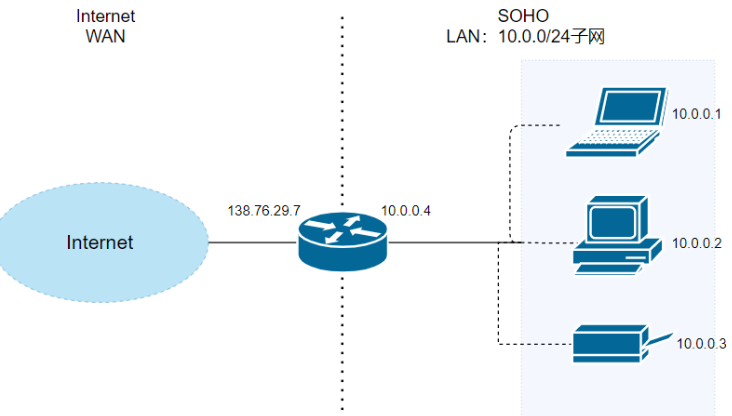
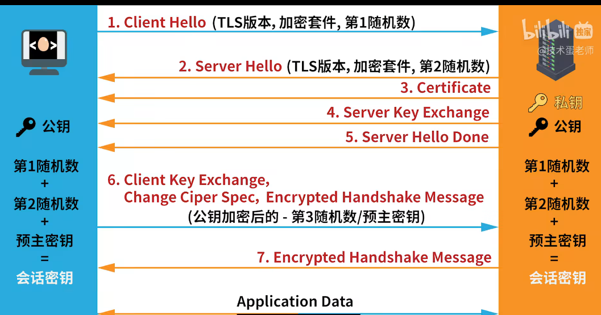
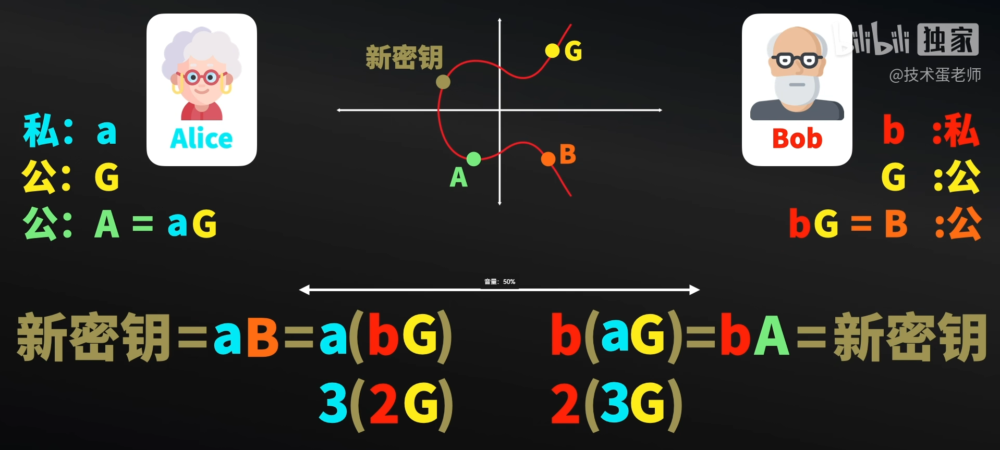
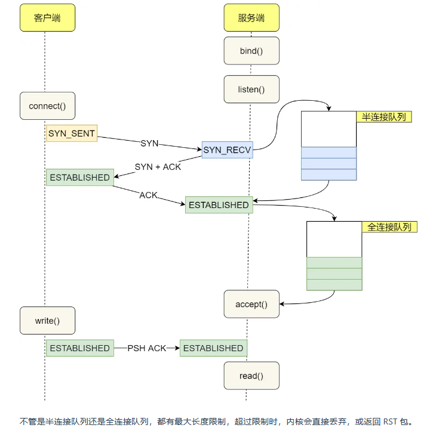
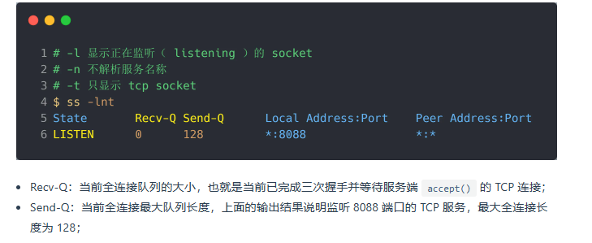
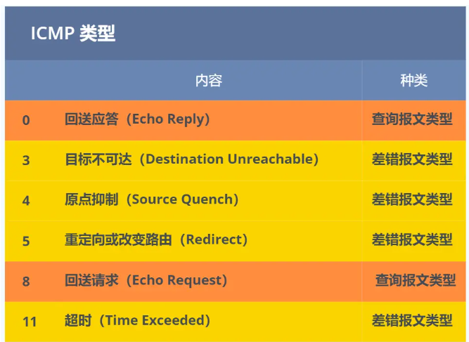

## 解析URL

解析URL，解析协议，网址域名，与资源路径

## DNS

获得域名之后需要去获得域名获得的ip地址，顶级域名
实际上域名最后还有一个点，比如 www.server.com.，这个最后的一个点代表根域名。
也就是，. 根域是在最顶层，它的下一层就是 .com 顶级域，再下面是 server.com。
DNS服务器分类：
根域名、顶级域名、权威域名
域名解析的过程，
先去查询浏览器的缓存
再去查询操作系统的缓存
再去系统的hosts文件查看

先去本地DNS服务器，如果没有问到的话，就会先去问根域名服务器，
从最高级的域名开始向下解析
根域名服务器会告诉客户端下一级域名也就是顶级域名对应的服务器在哪，顶级域名再告诉客户端对应的权威域名服务器在哪，客户端再去找对应的服务器
就这样一层一层的找，直到找到最低一级的服务器找到对应的IP地址

## TCP封装

找到ip地址之后就要去交给TCP进行TCP报文的封装
TCP里面有两个端口，一个是WEB服务器对应的端口，http默认的端口是80,Https默认的端口是443，还有一个是客户端也要确认一个端口监听响应，一般是浏览器自己随机生成
TCP通过三次握手协议建立连接
连接建立之后就需要封装报文,Http的报文就会被放在TCP的数据部分

## Tcp为什么第四次握手需要等到2*msl（报文段最长寿命）才closed

因为第四次握手发送的ack没有到达接收方的话，接收方会重新发送FIN（标志位）给发送方，如果接收方又收到了FIN，就需要重新发送ACK,并再次等待2*msl再closed

## IP协议

TCP是需要委托IP协议的,ip协议封装成网络包发送给通信对象

IP协议提供端到端的服务

不同的数据链路层网络必须分配不同网段的Ip地址并且由路由器将其连接起来。主机A通过本机的hosts表或wins系统或dns系统先主机B的计算机名转换为IP地址，然后用自己的Ip地址与[子网掩码](https://so.csdn.net/so/search?q=子网掩码&spm=1001.2101.3001.7020)计算出自己所处的**网段**，比较目的目的主机B的Ip地址，发现与自己处于不同的网段。于是主机A将知道应该将次数据包发送给自己的缺省网关，即路由器的本地接口。主机A在自己的ARP缓存中查找是否有缺省网关的MAC地址，如果能够找到就直接做数据链路层封装并通过网卡 将封装好的以太网数据帧发送到物理线路上去，如果**arp缓存表**中没有缺省网关的Mac地址，主机A将启动arp协议通过在本地网络上的arp广播来查询缺省网关的mac地址，获得缺省网关的mac地址后写入arp缓存表，进行数据链路层的封装，发送数据。数据帧到达路由器的接受接口后首先解封装，变成ip数据包，对ip 包进行处理，根据目的Ip地址查找路由表，决定转发接口后做适应转发接口数据链路层协议帧的封装，并且发送到下一跳路由器，次过程继续直至到达目的的网络与目的主机。

## MAC

包装成MAC协议

先试用ARP协议获取对方的MAC地址，在协议中填写目标Mac地址，mac是出不了“国”的，也就是只能在同一网段当中，不在同一网段的话只能靠 ip 地址来通信

### ARP协议 （网络层的协议）

在数据链路层（第二层）进行通信时，设备通常需要获取目标设备的MAC地址。这个过程涉及使用ARP（Address Resolution Protocol）协议来解析目标设备的IP地址对应的MAC地址。

ARP的工作流程如下：

1. **ARP请求：** 当一个设备想要与另一个设备通信，但只知道目标设备的IP地址而不知道其MAC地址时，它会发送一个ARP请求广播到局域网中的所有设备。这个请求包含了目标设备的IP地址。
2. **ARP响应：** 具有目标IP地址的设备收到ARP请求后，会向请求设备发送一个ARP响应，其中包含了它自己的MAC地址。其他设备收到这个响应后，就知道了目标设备的MAC地址。
3. **ARP缓存：** 一旦设备获取了目标设备的MAC地址，它会将这个映射关系存储在ARP缓存中，以便将来的通信中可以直接使用，而不需要再次发送ARP请求。

ARP 协议是一个**广播问询，单播响应**协议

### arp 协议   如果两个主机不在同一网段之下：

1. 主机 A 查询 ARP 表，期望寻找到目标路由器的本子网接口的 MAC 地址。

   目标路由器指的是，根据目的主机 B 的 IP 地址，分析出 B 所在的子网，能够把报文转发到 B 所在子网的那个路由器。

2. 主机 A 未能找到目标路由器的本子网接口的 MAC 地址，将采用 ARP 协议，问询到该 MAC 地址，由于目标接口与主机 A 在同一个子网内，该过程与同一局域网内的 MAC 寻址相同。

3. 主机 A 获取到目标接口的 MAC 地址，先构造 IP 数据报，其中源 IP 是 A 的 IP 地址，目的 IP 地址是 B 的 IP 地址，再构造链路层帧，其中源 MAC 地址是 A 的 MAC 地址，目的 MAC 地址是**本子网内与路由器连接的接口的 MAC 地址**。主机 A 将把这个链路层帧，以单播的方式，发送给目标接口。

4. 目标接口接收到了主机 A 发过来的链路层帧，解析，根据目的 IP 地址，查询转发表，将该 IP 数据报转发到与主机 B 所在子网相连的接口上。

   到此，该帧已经从主机 A 所在的子网，转移到了主机 B 所在的子网了。

5. 路由器接口查询 ARP 表，期望寻找到主机 B 的 MAC 地址。

6. 路由器接口如未能找到主机 B 的 MAC 地址，将采用 ARP 协议，广播问询，单播响应，获取到主机 B 的 MAC 地址。

7. 路由器接口将对 IP 数据报重新封装成链路层帧，目标 MAC 地址为主机 B 的 MAC 地址，单播发送，直到目的地。

**网卡：**

封装好所有的数据之后，我们需要将数字信号转换为电信号

使用网卡实现，负责执行这一操作的是**网卡**，要控制网卡还需要靠**网卡驱动程序**。

网卡驱动获取网络包之后，会将其**复制**到网卡内的缓存区中，并转换为电信号再发送出去

**抵达服务器：**

经过交换机路由器发送到目标地址，拆解数据MAC,IP,TCP,途中会产生许多的校验，一但有不规范的就会被抛弃

最后抵达对应的HTTP处理进程应用：

如果是请求的前端文件，一般对应的静态资源服务器，就会返回对应的资源

如果对应的是后端的请求就会等待对应的后端代码执行相关的代码逻辑。如增删改查，并返回对应的结果

服务器又会将对应的返回情况包装成HTTP报文以刚才的形式返回给客户端

## https

- **混合加密的方式，**

  在建立通信的时候先使用公私钥的方式，服务端从CA 数字证书颁发机构获取公钥，客户端生成一个会话秘钥，并且使用公钥加密，这个会话秘钥只有服务端持有的私钥才能破解，服务端获取到会话秘钥以后都会采用这个会话秘钥进行通信，因为使用 公钥加密私钥解密的方式效率比较低（先进行非对称加密，再进行堆成加密）

- **摘要算法+数字签名**（保证https传输的内容不被篡改）

  在传输之前会使用摘要算法（哈希算法）对内容进行加密获得一个数字签名，接收方也会使用同样的算法进行的计算，将计算的结果与传过来的数字签名进行对比，如果相同则就说明没有被篡改

  但是可能出现（内容+哈希值）都被替换的场景

  解决方案：

  在服务端使用私钥对 哈希值进行加密，由于私钥是服务器持有的，别人就不能进行篡改了

  发送到客户端的时候就用公钥对数字签名解密 再进行比对

- **CA机构（防止拿到伪造的公钥）**

  如果别人拿了一对伪造的公私钥，你用拿到的伪造的公钥对别人伪造的私钥，这样就可以获取到被篡改的信息，所以一般服务器都会将公钥注册到CA,

  CA会给这个公钥颁发数字证书，这样浏览器通过数字证书来确定这个被拿到的公钥不是被伪造的

## NAT 的示例：

### 只有路由器有公网地址，路由器将子网中的  源主机内网ip：源端口 转换为  公网ip ：路由器的某个端口,并记录映射关系

当一个设备处于私有网络中，通过路由器使用NAT访问互联网上的公有网址时，NAT会负责将内部私有地址映射为外部公有地址。让我们通过一个简单的例子来演示这个过程。

假设你的计算机在局域网中获得了私有地址 `192.168.1.2`，而你要访问的服务器的公有 IP 地址是 `203.0.113.1`。以下是一个简单的过程：

1. **计算机发起请求：** 你的计算机（私有IP地址 `192.168.1.2`）通过浏览器访问一个服务器，比如 `http://www.example.com`，这个域名会通过DNS解析为公有IP地址 `203.0.113.1`。

2. **NAT映射：** 在发送请求之前，NAT会将数据包中的源地址从私有IP地址 `192.168.1.2` 替换为路由器的公有IP地址，比如 `203.0.113.2`。此时，数据包的源地址字段被修改为 `203.0.113.2`。

   请求数据包：

   - 源IP地址：`192.168.1.2`（内部私有地址）
   - 目标IP地址：`203.0.113.1`（服务器的公有地址）

   修改后的数据包：

   - 源IP地址：`203.0.113.2`（路由器的公有地址）
   - 目标IP地址：`203.0.113.1`（服务器的公有地址）

3. **服务器响应：** 服务器接收到请求后，将响应数据包发送回给 `203.0.113.2`。

   响应数据包：

   - 源IP地址：`203.0.113.1`（服务器的公有地址）
   - 目标IP地址：`203.0.113.2`（路由器的公有地址）

4. **NAT还原：** 路由器收到响应后，会将数据包中的目标地址从公有IP地址 `203.0.113.2` 还原为内部私有IP地址 `192.168.1.2`。

   修改后的响应数据包：

   - 源IP地址：`203.0.113.1`（服务器的公有地址）
   - 目标IP地址：`192.168.1.2`（内部私有地址）

这样，通过NAT，内部的私有IP地址在互联网上是不可见的，而公有IP地址则负责在互联网上唯一标识你的网络。整个过程中，NAT起到了一个关键的作用，确保了内部设备可以与外部服务器通信，并且确保了响应数据包正确返回到请求的内部设备。

## 子网掩码：

1. **IP地址分配：** 子网掩码帮助确定一个网络中有多少个主机。在一个子网中，主机部分的位数决定了可以分配的唯一主机数。例如，在上述例子中，由于有 8 位用于主机，因此每个子网可以容纳 2^8 = 256 个唯一的主机。
2. **路由和子网划分：** 子网掩码允许网络管理员将大的IP地址空间划分成更小的子网，以更好地组织和管理网络流量。这有助于提高网络的效率和安全性。
3. **子网间的通信：** 子网掩码还有助于定义哪些主机属于同一子网，从而影响着它们之间的直接通信。如果两个主机属于同一子网，它们可以直接通信，而不需要经过路由器。如果它们属于不同的子网，则需要路由器来进行通信。

## 子网掩码与NAT:

1. **子网掩码的作用：** 主要用于内网中对IP地址的划分。通过使用子网掩码，内网管理员可以将整个IP地址空间分为多个子网，以更有效地组织和管理网络。这种划分有助于提高网络的性能、安全性，并简化路由和管理。
2. **NAT的作用：** 主要用于内网与外界的通信。内网中的设备通常使用私有IP地址，而在与互联网通信时，需要通过NAT将私有IP地址映射为公有IP地址。这有助于隐藏内部网络的结构，节约公有IP地址的使用，并提高网络的安全性。

所以，这两个概念在网络中扮演不同的角色：

- **子网掩码：** 主要用于内网中的IP地址管理和组织。
- **NAT：** 主要用于连接内网和互联网，允许内部设备使用私有IP地址与外部网络通信，同时保护内部网络的隐私。

### Sokcet

所谓套接字(Socket)，就是对网络中不同主机上的应用进程之间进行双向通信的端点的抽象。一个套接字就是网络上进程通信的一端，提供了应用层进程利用网络协议交换数据的机制。从所处的地位来讲，套接字上联应用进程，下联网络协议栈，是应用程序通过网络协议进行通信的接口，是应用程序与网络协议栈进行交互的接口

## 有连接的多路复用，与无连接的多路复用多路分用

## udp只需要二元祖来确定一个套接字

UDP是无连接的，它只需要（dst ip 和dsp port）这样一个二元组就可以确定一个socket，换句话说，一般来看，udp只有一个socket,所有的数据包（无论源ip和源port是否相同）都会发向这一个socket（只要其目的ip和目的port相同）udp不需要唯一性 

而TCP是面向连接的，对于服务端来说，每accept一个请求就会创建一个新的socket，这样的话，光凭（dst ip 和dsp port） 是无法确定具体的socket的，需要加上src ip 和src port 才可以。  

从某种程度上来看，可以认为tcp在udp上又多了一层。

## TCP为什么是可靠的：

1. 会对数据进行合适的分块，并发送

2. 会对数据排序，保证数据的有序性

3. 校验和：tcp有首部与数据的校验和，数据被接受的时候会进行校验和

4. 有重传机制： 丢包或者超时都会重传 重传机制的详细介绍，可以查看[详解 TCP 超时与重传机制open in new window](https://zhuanlan.zhihu.com/p/101702312)这篇文章。

   **超时重传**：RTO (超时时间) 是根据 RTT（往返）的平均值 与方差 算出来的,超时了就会重传

   **快速重传**： 基于接收端的反馈作出判断直接重传，比如seq 5 的包漏了，你发 6 7 8，接收方一直回复 5，发送方就知道5 漏了，需要重传,快速重传机制只解决了一个问题，就是超时时间的问题，但是它依然面临着重传的时候，是重传一个，还是重传所有的问题。就是不知道只重传seq 5 的包 还是 seq 5 之后的所有的包

   **SACK:**:这种方式需要在 TCP 头部「选项」字段里加一个 `SACK` 的东西， 接收方，将所有已经接收到的段的 返回给 接收方，这样只需要重传对应的就行

   **Duplicate Ack** 告诉发送方哪些段 重传了

5. 流量控制

   ​	两方都维护了两个窗口，接收窗口与发送窗口

   **发送窗口：**

   ​	**发送窗口缓冲区的四个部分**

   ​		已经发送并且确认的 TCP 段（已经发送并确认）；

   ​		已经发送但是没有确认的 TCP 段（已经发送未确认）；

   ​		未发送但是接收方准备接收的 TCP 段（可以发送）；

   ​		未发送并且接收方也并未准备接受的 TCP 段（不可发送）

   两个指针,一个大小

   - **SND.WND**：发送窗口的字节数。
   - **SND.UNA**：Send Unacknowledged 指针，指向发送窗口的第一个字节,也就是已发送但是未接收。
   - **SND.NXT**：Send Next 指针，指向可用窗口的第一个字节，为发送但是可以发送。

   **接收窗口:**

   ​	接收窗口缓冲区的三个部分

   1. 已经接收并且已经确认的 TCP 段（已经接收并确认）；
   2. 等待接收且允许发送方发送 TCP 段（可以接收未确认）；
   3. 不可接收且不允许发送方发送 TCP 段（不可接收）。

   **窗口的大小随处理速度动态调整**

   可能出现窗口大小调整到0，关闭窗口的现象，出现该情况，另一方会有定时探测机制

   **糊涂窗口综合证：** 只是几个字节还一如既往的发送，会造成资源浪费

   当接收可用窗口小于一定值的时候就告诉发送方剩余为0，发送方等到可发送窗口大于一定值才能发送

6. 拥塞控制

   通过拥塞窗口 cwnd 的值，来避免拥塞控制

   **慢启动**：没收到一个ack  ，cwnd +1,所以 cwnd是线性增长

   **拥塞避免**，当达到 阈值threshold的时候就将减缓,没收到一个ack,就增加 1/cwnd

   拥塞发生：   当发生超时重传的时候，则 threshold = cwnd / 2   ，cwnd  = 1,重新开始慢启动

   当发生快速重传，也就是收到三个重复的ack的时候 , cwnd = cwnd / 2  , threshold = cwnd ,并且进入快速恢复算法

   **快速恢复**：当收到新的数据的ack 的时候则 让cwnd = threshold 并且直接进入拥塞避免算法  

## https 通过 数字证书 数字签名获取服务器公钥的流程

1. 服务器将自己的公钥 在CA进行注册，CA使用自己的私钥对服务器的公钥进行数字签名（内容摘要+加密），发布成数字证书，包括 服务器公钥 、有效时间、发布者、数字签名
2. 客户端访问的服务器的时候获取到数字证书，并且客户端本地与浏览器都存有CA的公钥，用CA的公钥对数字证书中的数字签名进行解密，并且使用内容摘要算法 与解密的内容进行比对，如果一至就可以信任
3. 信任之后就确定了服务器的公钥，并且该公钥是可信的

## tls 1.2握手流程:

密码套件:「**密钥交换算法 + 签名算法 + 对称加密算法 + 摘要算法**」

前两段都是明文传输，只有最后传输最终秘钥的时候是用的公钥加密		

RSA 加密的方式就是大致如此的，并且不支持前向加密，如果私钥被破解了，之前的被截获的都会被破解

**ECDHE**

ecdhe 相较于 sra算法多在第二次握手也就是 服务端回复 hello时 多出来了一个Server Key Exchange消息，这个消息主要是  告诉 客户端  选择的 **圆锥曲线**、**公共的G点**，**以及计算出来的公钥**

由于两方都有一个私钥，并且每次都是随机生成的，所以是支持前向加密的

## http1.1  /2/  3

http1.1的首部不压缩，有长连接，会有队头阻塞问题，虽然有pipline管道，可以同时发送多个请求，但是接收响应的时候还是会产生阻塞

http2 使用了  二进制分帧，实现了多路复用，一条连接有多个Stream，每个帧都有自己的标识id,与序号，这样即使乱序发送也可以在接收端组装好返回   |  并且首部也进行了压缩、使用静态、动态常量表，对常量进行编码,维护一个字典，用哈夫曼编码进行压缩  并且有服务器主动推送，将之后可能会用到的文件也上传给对方

## http code:

100  请求能够继续处理 101 升级请求 

200  201  已经创建  204无内容

3** 资源转移  301资源重定向 永久移动  302临时移动    304可以直接使用服务器缓存不用继续请求

400  语法错误  401 无身份   403  没有权限   404 没有资源  409请求冲突(数据版本信息冲突)

500 内部错误    502 网关出错   503服务器超载

## 半连接队列与全连接队列：

半连接队列指的是，客户端第一次握手发送SYN报文时后，内核会将连接放至**半连接**

当收到第三次握手的ACK之后内核会将连接从半连接队列放至**全连接队列**

建立连接的过程中根本不需要`accept()`参与， **执行accept()只是为了从全连接队列里取出一条连接。**,所以说不需要执行**accept**也能够建立连接，不要要**listen()**也可以建立连接的情况发生于，**同时向对方发送SYN请求与自连接**

使用ss命令查看**全连接队列**

当全连接队列满了**默认会丢弃ACK**，其实还有一个设置就是返回**RST**给客户端并告诉它**废弃这个链接**，

默认丢弃有好处：

当 TCP 全连接队列满导致服务器丢掉了 ACK，与此同时，客户端的连接状态却是 ESTABLISHED，进程就在建立好的连接上发送请求。只要服务器没有为请求回复 ACK，请求就会被多次**重发**。如果服务器上的进程只是**短暂的繁忙造成 accept 队列满，那么当 TCP 全连接队列有空位时，再次接收到的请求报文由于含有 ACK，仍然会触发服务器端成功建立连接。**

**半连接队列满常常见于SYN攻击**

如果当半连接队列满的时候，一般是默认将ACK抛弃，但是如果开启了**syncookies**功能,可以不使用半连接队列就创建成功

**syncookies 是这么做的**：服务器根据当前状态计算出一个值，放在己方发出的 SYN+ACK 报文中发出，当客户端返回 ACK 报文时，取出该值验证，如果合法，就认为连接建立成功，也就是说把连接的状态放在报文当中，就不需要占用连接了

## CRLF注入攻击

http报文当中请求行 请求头 请求体 是由CRLF换行符分隔的，攻击者可以在路径中伪造CRLF换行符，来向请求头中注入恶意内容

## ICMP协议 互联网控制报文协议

`ICMP` 主要的功能包括：**确认 IP 包是否成功送达目标地址、报告发送过程中 IP 包被废弃的原因和改善网络设置等。** 分为查询报文，与差错报文：

