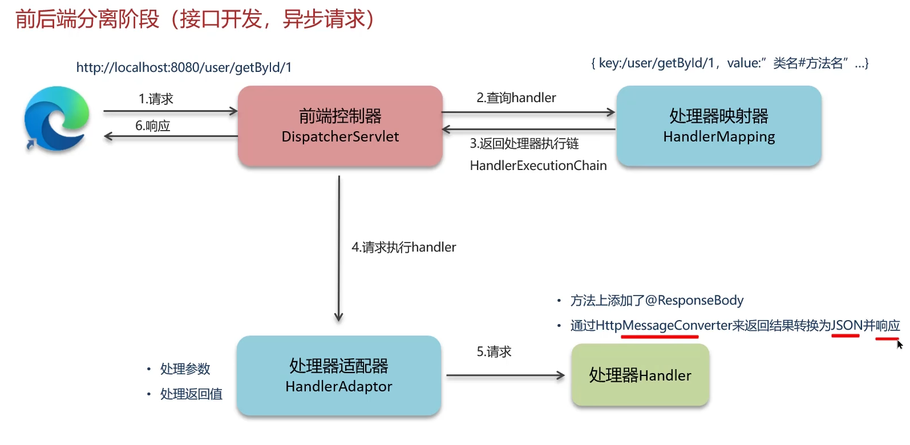

## Redis


延时队列使用zset

消息队列使用list


**缓存穿透：** 每次都会查询一个不存在的数据，导致每次请求都去查询数据库，

解决方案：

1.**缓存空数据**2.**使用布隆过滤器，**在使用缓冲之前先查询布隆数据库，拦截布隆过滤器（
可以使用位图bitmap实现）,将key进行多次hash，根据多次hash将对应的数据bit变为1，查询数据的时候就可以使用hash函数判断是否存在（可能存在误判，即某个不存在的也可被误判为存在）

**缓存击穿** 某一个key刚好过期大量的请求进来将DB压垮

两种解决方案：互斥锁（数据的一致性），与逻辑过期（可用性）


**缓存雪崩** 指集体失效，比如许多热点key在同一时间过期（可以给每个key设置随机的过期时间），**redis宕机**，可以搭建redis的集群来预防,哨兵集群模式

添加多级缓存

添加限流

**双写一致：**保证数据库与redis缓存的一致性

措施:

延时双删(不能保证数据强一致性),延时是想让主节点数据库数据扩散至从结点:


**保证强一致性的方法，**对一个数据的读或写都添加分布式锁,但是性能会下降

对于读多写少的场景，我们可以使用共享锁与排他锁结合使用，


**保证最终一致性**，可以使用消息队列,先修改数据库，使用异步通知的方式更新缓存保证最终一致性


**redis的持久化**

**RDB**:就是将数据以文件的方式存储至磁盘当中,数据快照

可以使用save(主进程)与bgsave(子进程)命令执行RDB

可以使用redisconfig来配置rdb触发机制


**AOF:**记录命令的日志

在配置文件中配置appendonly打开


几种频率:


为了防止命令的冗余，可以使用bgrewriteaof命令，执行aof文件的重写减少aof文件大小


百分比与体积两种重写的阈值

AOF与RDB对比：


**redis key的过期后的删除策略:**

1.惰性删除，在过期之后还在内存当中不去管他，当再次使用到他的时候在对他进行检测，如果过期了的话就删除,(对CPU有好，但是对内存不友好比较浪费)

2.定期删除，每隔一定的时间，就会遍历定量的key,删除里面过期的key,

定期删除的时候有两种模式：


定期删除执行时间少的原因是尽量的不占用CPU资源


**redis的淘汰策略:**

当redis内存不够用的时候需要对redis中的key进行淘汰,八种淘汰策略


redis分布式锁，使用set nx  ex命令实现,可以使用看门狗机制使用守护线程来进行锁的续期,每隔releaseTime/3的时间续期，redssion实现的分布式锁是可重入锁

为了保证主从数据的一致性，也就是怕主节点突然宕机，redission还实现了红锁,在多个节点上创建锁(实现起来特别复杂)：


红锁实现复杂成本高，如果非要保证强一致性，就要使用zookeeper（CP），redis是(AP)

**Redis集群的方案：**

**1.主从复制**

主节点一般实现写操作，从节点一般实现读操作，主节点写入数据的时候需要同步给从节点

**同步的情况**

1.主从全量同步


**哨兵机制**

监控主从结点的故障，

故障恢复，如果主节点宕机了，会推选从节点充当新的从节点，

通知，推举新的主节点，故障转移的时候会通知Redis客户端


**脑裂问题：**

因为网络故障问题，产生了两个主节点，客户端还在往原来的主节点中写入数据，等到网络恢复的时候，redis集群会将之前的主节点当做salve从节点,数据清空，导致数据丢失


解决方案：通过配置来使得被分离的老的主节点拒绝客户端的请求


**分片集群** 可以支持海量数据，每个结点master都存储不同的数据：


可以使用哈希槽的方法来实现决定一个key对应的位置应该放在哪里

**Redis是单线程的为什么这么快**

- c语言编写的,他是内存数据库，他可以直接操纵内存，当然快
- 他是单线程的，不需要进行上下文的切换,切换可竞争条件
- 它的网络IO是非阻塞IO，使用了IO多路复用模型

Redis是纯内存模型，所以说他的性能瓶颈其实是网络IO，I/O多路复用就是为了实现高效的网络请求

**传统io模型降低效率的两个点：**

-  用户空间与内核空间频繁的数据拷贝就降低了效率，
- 还有是用户缓冲区一直等待内核缓冲区的数据也会降低效率


**阻塞IO**


**非阻塞IO**


**IO多路复用**


**Linux实现IO多路复用的三种方式**

- select、poll 这两种方式只会通知用户进程有socket的资源已经准备好了，但是不会告诉用户进程是哪一个socket资源准备好了，需要用户进程去进行轮询，
- epoll ,在通知用户进程socket进程准备好的时候，会顺便告诉用户进程是哪一个用户进程准备好了,就可以直接将socket放入用户空间

**Redis的网络模型,6.0之后引入了多线程**

多线程主要是对IO部分添加了多线程的处理

IO复用+事件派发


# MYSQL

mysql定位慢查询

可以使用sql的日志


使用explain对sql执行计划进行分析

 


**索引的概念：**

​	索引(index) 是帮助MySQL高效获取数据的数据结构(有序)。在数据之外，数据库系统还维护着满足特定查找算法的数据结构(B+树)，这些数据结构以某种方式引用(指向)数据，这样就可以在这些数据结构， 上实现高级查找算法，这种数据结构就是索引。对查找的字段进行排序

**索引的底层数据结构**

使用B+树

优点

- 使用的是矮胖树，阶层更低，路径更短
- 磁盘读写的代价更低，非叶子结点只存储指针，只有叶子结点是存储的数据
- B+树的叶子结是一个双向链表，更利于扫库和查询范围

**索引的分类**

- 聚集索引，  一般是针对于主键的索引。聚集索引一张表当中一般只存在一个，该索引结构中存放数据的部分存储着整行的所有字段的数据 ,数据与索引放到一块，B+树的叶子节点保存了整行数据，有且只有一个

  一般会将给一个表的主键创建索引，如果一个表中没有主键，就会给这个表当中的唯一键创建聚集索引，如果也没有唯一键，数据库会给表中的没有每一行创建一个rowid，给这个rowid创建聚集索引

- 二级索引、非聚集索引、普通索引，该索引，一张表当中可以创建多个，但是该种索引存放数据的部分，存放的是该数据的主键，数据与索引分开存储，B+树的叶子节点保存对应的主键，可以有多个

**回表**

> 通过二级索引找到对应的主键值，到聚集索引中查找整行数据，这个过程就是回表

**覆盖索引 ** 覆盖索引是指查询使用了索引，返回的列，必须在索引中全部能够找到，不用回表的就是覆盖索引。

使用id查询，直接走聚集索引查询，一次索引扫描，直接返回数据，性能高
如果返回的列中没有创建索引，有可能会触发回表查询，尽量避免使用select*

使用覆盖索引解决超大问题：

覆盖索引子查询


**索引创建的原则：**

+ 对于数据量大的表创建索引，增加用户体验，如数据量大于十万
+ 对于经常作为where 、order by、group by 操作的字段，创建索引
+ 尽量选择区分度较高的字段创建索引，这样效率更高
+ 对于字符创类型的字段如果长度较长可以针对字段的特点创建前缀索引
+ 要尽量使用联合索引，使用联合索引的时候很多时候可以覆盖索引，可以节省空间，避免回表，提高查询的效率
+ 控制索引的数量，索引不是越多越好

**索引失效的条件**

- 违反了最左前缀法则，比如一个联合索引，查询的时候的条件的列必需从左开始，不能跳过索引
-  范围查询的右边的列是不能使用使用索引的
- 对索引的列进行运算
- 条件查询的时候，对字符串不加单引号会使得索引失效，因为会有类型转换
- 模糊查询的时候不能使用头部模糊匹配，不然会失效

**SQL语句的优化**

> SELECT语句务必指明字段名称(避免直接使用select * )
> SQL语句要避免造成索弓|失效的写法
> 尽量用union all代替union union会多- 次过滤， 效率低
> 避免在where子句中对字段进行表达式操作
> Join优化能用innerjoin就不用left join right join,如必须使用-定要以小表为驱动,
> 内连接会对两个表进行优化，优先把小表放到外边,把大表放到里边。left join或right join,不会重新调整顺序


**数据库事务**

事务是一组操作的集合，它是一个不可分割的工作单位，事务会把所有的操作作为一个整体一起向系统提交或撤销操作请求，即这些操作要么同时成功，要么同时失败。

事务特性ACID

- 原子性  事务是操作的最小单元要么成功要么失败
- 一致性  事务完成时，所有的数据应该保持一致
- 隔离性  事务执行的时候，应该保证不受到外界并发的影响
- 持久性  事务提交或回滚之后。所有的数据都将持久化存储

例子转账，要么成功要么失败a扣除1000b就要增加1000，在转账时，不能受其他的影响，转账之后数据局要存储在磁盘中

**数据库并发的三种问题**

- 脏读  一个事务读到了另外一个事务的还没有提交的数据
- 不可重复读   在同一次事务当中读取同一条数据两次，两次读取到的数据不一样
- 幻读   在同一次事务当中第一次查询数据时候，某一条数据不存在，但是第二次操纵数据库的时候却发现那一条数据又存在了

**数据库的隔离级别**

| 隔离级别                             | 脏读 | 不可重复读 | 幻读 |
| ------------------------------------ | ---- | ---------- | ---- |
| 读未提交（Read Uncommitted）         | 是   | 是         | 是   |
| 读已提交（Read Committed）           | 否   | 是         | 是   |
| 可重复读（Repeatable Read）MYSQL默认 | 否   | 否         | 是   |
| 串行化（Serializable）               | 否   | 否         | 否   |


**缓冲池(buffer pool)**:

> 主内存中的一个区域，里面可以缓存磁盘上经常操作的真实数据，在执行增删改查操作时，先操作缓冲池中的数据(若缓冲池没有数据，则从磁盘加载并缓存》，以一定频率刷新到磁盘，从而减少磁盘10，加快处理速度

**数据页(page)**

> 是lnnoDB 存储引擎磁盘管理的最小单元，每个页的大小默认为 16KB。页中存储的是行数据

**redo log**

redo log是用来实现事务的持久性。

重做日志，记录的是事务提交时数据页的物理修改,是用来实现事务的持久性。
该日志文件由两部分组成:重做日志缓冲(redo log buffer)以及重做日志文件(redo log file) ,前者是在内存中，后者在磁盘中。当事
务提交之后会把所有修改信息都存到该日志文件中，用于在刷新脏页到磁盘,发生错误时,进行数据恢复使用。


**undo log**

undo log可以实现事务的一致性和原子性

回滚日志，用于记录数据被修改前的信息，作用包含两个:提供回滚和 MVCC(多版本并发控制)。undo log和redo log记录物理日志不一样，它是逻辑日志
可以认为当delete一条记录时，undo log中会记录一条对应的insert记录，反之亦然当update一条记录时，它记录一条对应相反的update记录。当执行rolback时，就可以从undo log中的逻辑记录读取到相应的内容并进行回滚。
undo log可以实现事务的一致性和原子性

**MySql数据库隔离的控制的实现方式**

1. 锁 排它锁 共享锁
2. mvcc 多版本并发控制

**MVCC 多版本并发控制**


**主从同步的原理**

MySQL主从复制的核心就是二进制日志
二进制日志(BINLOG)记录了所有的 DDL(数据定义语言)语和 DML(数据操纵语言)语句，但不包括数据查询(SELECT、SHOW)语句.

复制分成三步
1.Master主库在事务提交时，会把数据变更记录在二进制日志文件 Binlog 中
2.从库读取主库的二进制日志文件 Binlog，写入到从库中继日志 Relay Log
3.slave重做中继日志中的事件，将改变反映它自己的数据


**SQL语句的五大类**

- DQL (Data Query Language-数据查询语言) - Select 查询语句不存在提交问题。
- DML (Data Manipulation Language-数据操作语言) - Insert、Update、Delete，实现数据的“增删改。 ”
- DDL (Data Definition Language-数据定义语言) - Create、Alter、Drop，实现表格的“增删改”。
- DTL (Transaction Control Language-事务控制语言) - Commit、Rollback事务提交、回滚语句。
- DCL (Data Control Language-数据控制语言) - Grant、Revoke 权限语句

**分库分表**

数据量达到一定量级就要分库分表 1000W或20G

策略


垂直分库


垂直分表


水平分库,解决海量数据的存储问题，讲一个库中的数据分开


水平分表：


水平分库分表产生的问题


#  spring

**bean线程安全**

spring的中的bean不是线程安全的，因为他默认是单例的，spring中的bean对象可以使用@scope注解来决定是否单例，它默认的值是单例,对于有可修改的成员变量的bean他是有线程安全问题的，需要考虑线程安全问题，需要通过多例或者加锁来解决问题

**spring aop**

spring当中的aop是面向切面编程，是将一些与业务逻辑无关的但是会对多个对象产生影响的逻辑与公共行为，抽取为公共模块，降低耦合

aop的一些使用，可以用来记录日志，记录缓存，spring自身用于实现事务也是用的aop

spring事务使用Transactional守住接来实现，本质是使用aop拦截被注解的service方法，在执行方法之前通过TransactionTemplate编程式开启事务，在方法执行完毕之后依据情况回滚或者提交事务

**Spring事务失效的几种场景**

- 方法中的异常被捕获但是没有被抛出，这样的话你自己本身知道了异常的发生，但是aop代理类并不知道你的异常的发生，这样就不会回滚
- 方法抛出了检查异常，检查异常是出自Exception类的，非检查异常是出自RunTimeException类的，解决方法，添加注解属性：@Transactional(rollbackFor=Exception.class)
- 方法为非public方法的时候注解会失效，因为Spring创建代理类需要目标的方法是public方法
- 使用方法内调用，也就是在同一个类对象当中发生了调用,对应的标注了@Transactinal注解的方法,这样子调用不会调用代理方法，所以事务也不会生效

**bean的生命周期：**

1. **获取bean的定义信息**：通过BeanDefinition获取bean的定义信息。
2. **实例化bean**：调用构造器实例化bean。
3. **依赖注入**：进行bean的依赖注入。
4. **处理Aware接口**：处理Aware接口，包括BeanNameAware、 BeanFactoryAware、 ApplicationContextAware。
5. **后置处理器前置**：进行Bean的后置处理器postProcessor前置。
6. **初始化方法**：执行初始化方法，包括InitializingBean、 init-method。
7. **后置处理器后置**：进行Bean的后置处理器postProcessor后置。
8. **销毁bean**：销毁bean。


**代码示例**

User类

```java
package com.lxl.beans;

import org.springframework.beans.BeansException;
import org.springframework.beans.factory.BeanFactory;
import org.springframework.beans.factory.BeanFactoryAware;
import org.springframework.beans.factory.BeanNameAware;
import org.springframework.beans.factory.InitializingBean;
import org.springframework.beans.factory.annotation.Value;
import org.springframework.context.ApplicationContext;
import org.springframework.context.ApplicationContextAware;
import org.springframework.stereotype.Component;

import javax.annotation.PostConstruct;

/**
 * @Author LiuXiaolong
 * @Description test-autoConfig
 * @DateTime 2023/11/18  16:00
 **/
@Component
public class User implements BeanNameAware, BeanFactoryAware, ApplicationContextAware, InitializingBean {

    private BeanFactory beanFactory;
    private String beanName;
    private ApplicationContext applicationContext;


    @Value("刘孝龙")
    private String userName;

    public String getUserName() {
        return userName;
    }

    public void setUserName(String userName) {
        this.userName = userName;
    }

    public void showSomething(){
        System.out.println("asdasdasdaasasdasda啊实打实大");
    }


    /**
     * 自定义初始化方法
     *
     */
    @PostConstruct
    public void init(){
        System.out.println("PostConstruct 初始化");
    }

    @Override
    public void setBeanFactory(BeanFactory beanFactory) throws BeansException {
        System.out.println("setBeanFactory");
            this.beanFactory = beanFactory;
    }

    @Override
    public void setBeanName(String s) {
        System.out.println("setBeanName");
        this.beanName = s;
    }

    @Override
    public void setApplicationContext(ApplicationContext applicationContext) throws BeansException {
        System.out.println("setApplicationContext");
        this.applicationContext = applicationContext;
    }

    @Override
    public void afterPropertiesSet() throws Exception {
        System.out.println("InitializingBean  afterPropertiesSet");
    }
}

```

MyBeanPostProcessor类

```java
package com.lxl.beans;

import org.springframework.beans.BeansException;
import org.springframework.beans.factory.config.BeanPostProcessor;
import org.springframework.stereotype.Component;

/**
 * @Author LiuXiaolong
 * @Description test-autoConfig
 * @DateTime 2023/11/18  16:25
 **/
@Component
public class MyBeanPostProcessor implements BeanPostProcessor {
    @Override
    public Object postProcessBeforeInitialization(Object bean, String beanName) throws BeansException {
        System.out.printf("postProcessBeforeInitialization(Object bean  %s, String beanName  %s)\n", bean.toString(), beanName);
        return BeanPostProcessor.super.postProcessBeforeInitialization(bean, beanName);
    }

    @Override
    public Object postProcessAfterInitialization(Object bean, String beanName) throws BeansException {
        System.out.printf("postProcessAfterInitialization(Object bean  %s, String beanName  %s)\n", bean.toString(), beanName);
        return BeanPostProcessor.super.postProcessAfterInitialization(bean, beanName);
    }
}

```

Configuration配置类

```java
@Configuration
@ComponentScan("com.lxl.beans")
public class MyConfiguration {

}
```

Main主函数

```java
public class Main {
    public static void main(String[] args) {
        ApplicationContext applicationContext = new AnnotationConfigApplicationContext(MyConfiguration.class);
        User bean = applicationContext.getBean(User.class);
        System.out.println(bean);
    }
}
```

**Spring循环依赖**

> 循环依赖其实就是循环引用,也就是两个或两个以上的bean互相持有对方,最终形成闭环。比如A依赖于B,B依赖于A

spring中的三级缓存

| 保存类型 | 属性名                | 描述                                                         |
| :------- | :-------------------- | :----------------------------------------------------------- |
| 一级缓存 | singletonObjects      | 单例池中，缓存已经解析了完整的bean定义信息，已经实例化并完成初始化的bean对象 |
| 一级缓存 | earlySingletonObjects | 缓存早期的bean对象（在bean属性还没完全注入）                 |
| 三级缓存 | singletonFactories    | 缓存的是ObjectFactory，表示对象实例工厂，用来创建委托个人对象的 |

spring通过三级缓存解决循环依赖问题：


**SpringMVC的执行流程**

- 视图阶段（JSP,thymleaf）


- 前后端分离开发



**springboot自动装配的原理**


Spring相关注解

| 注解                                            | 说明                                                         |
| :---------------------------------------------- | :----------------------------------------------------------- |
| @Component、@Controller、@Service、@Repository  | 使用这些上面开发我们Bean                                     |
| @Autowired                                      | 使用在字段上用于将指定类型的类装配进入该字段                 |
| @Qualifier                                      | 结合@Autowired一起使用用于将指定名称的类装配进入该字段       |
| @Scope                                          | 标注Bean的作用范围                                           |
| @Configuration                                  | 指定当前类是一个 Spring 配置类，创建容器时会从该类上获取配置信息 |
| @ComponentScan                                  | 用于扫描 Spring 容器初始化时需要扫描的包                     |
| @Bean                                           | 使用在方法上，标识该方法返回值是一个Spring容器中的Bean       |
| @Import                                         | 使用在 @Import导入外部容器Spring加载到IOC容器中              |
| @Aspect、@Before、 @After、 @Around、 @Pointcut | 用于切面编程（AOP）                                          |

springMVC

| 注解            | 说明                                                         |
| :-------------- | :----------------------------------------------------------- |
| @RequestMapping | 用于映射请求路径，可以定义在类上和方法上。用于类上，则表示类中的所有方法都可以处理此路径下的请求。用于方法上，则表示该方法用于处理对应路径下的请求 |
| @RequestBody    | 注解修饰http请求体json数据。将json转换为java对象             |
| @RequestParam   | 指定请求参数的名称和类型                                     |
| @PathVariable   | 从请求路径中获取参数(如/user/{id})，传递给方法的形式参数     |
| @ResponseBody   | 注解修饰controller方法返回值时将值转化为json对象返回客户端   |
| @RequestHeader  | 获取指定的请求头数据                                         |
| @RestController | @Controller + @ResponseBody                                  |

springboot

| 注解                     | 说明                                               |
| :----------------------- | :------------------------------------------------- |
| @SpringBootConfiguration | 注解，实现配置类上的特殊处理                       |
| @EnableAutoConfiguration | 打开自动配置功能，也可以关闭某个自动配置选项的功能 |
| @ComponentScan           | Spring组件扫描                                     |

## MYBATIS

mybatis执行流程

①读取MyBatis配置文件: mybatis-config.xml加载运行环境和映射文件
②构造会话工厂SqlSessionFactory
③会话工厂创建SqISession对象(包含了执行SQL语句的所有方法)
④操作数据库的接口，Executor执行器， 同时负责查询缓存的维护
⑤Executor接口的执行方法中有一个MappedStatement类型的参数, 封装了映射信息
⑥输入参数映射
⑦输出结果映射

mybatis支持延迟加载，如果存在一对多的关系,并且使用分步查询的时候就能使用延迟加载，开启方法在<association>标签中设置属性fetchType=lazy

延迟加载原理:


mybatis的一级和二级缓存

一级缓存：基于 PerpetualCache 的 HashMap 本地缓存，其存储作用域为 Session，当Session进行flush或close之后，该Session中的所有Cache就将清空，默认打开一级缓存

二级缓存： 是基于namespace和mapper的作用域起作用的，不是依赖于SQL session，默认也是采用 PerpetualCache
HashMap 存储

1，对于缓存数据更新机制，当某一个作用域(一级缓存 Session/二级缓存Namespaces)的进行了新增、修改、删除操作后，默认该作用域下所有 select 中的缓存将被clear
2，二级缓存需要缓存的数据实现Serializable接口
3，只有会话提交或者关闭以后，一级缓存中的数据才会转移到二级缓存中

mybatis一级缓存的范围是一个事务之内，减少数据库的无效访问范围是sqlSession级别的 在有多个会话以及分布式场景会产生脏读现象
mybatis二级缓存是命名空间级别的，也就是Mapper.xml中的nameSpace属性增删改还会被失效，在分布式场景会被失效，实际用的也不多