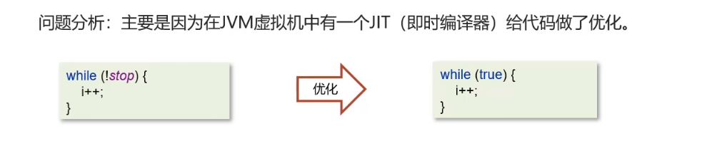
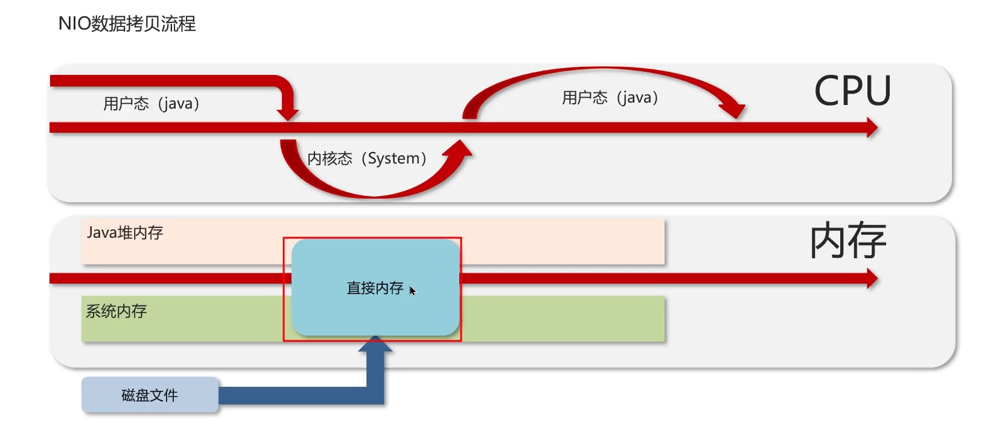
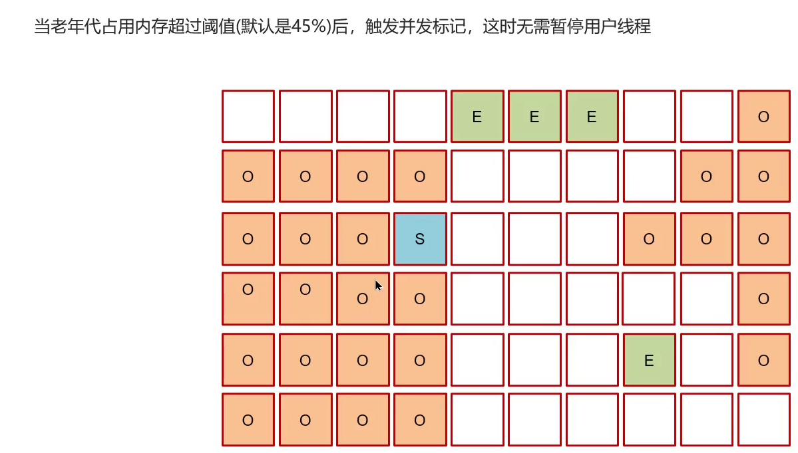

## Redis


延时队列使用zset

消息队列使用list


**缓存穿透：** 每次都会查询一个不存在的数据，导致每次请求都去查询数据库，

解决方案：

1.**缓存空数据**2.**使用布隆过滤器，**在使用缓冲之前先查询布隆数据库，拦截布隆过滤器（
可以使用位图bitmap实现）,将key进行多次hash，根据多次hash将对应的数据bit变为1，查询数据的时候就可以使用hash函数判断是否存在（可能存在误判，即某个不存在的也可被误判为存在）

**缓存击穿** 某一个key刚好过期大量的请求进来将DB压垮

两种解决方案：互斥锁（数据的一致性），与逻辑过期（可用性）


**缓存雪崩** 指集体失效，比如许多热点key在同一时间过期（可以给每个key设置随机的过期时间），**redis宕机**，可以搭建redis的集群来预防,哨兵集群模式

添加多级缓存

添加限流

**双写一致：**保证数据库与redis缓存的一致性

措施:

延时双删(不能保证数据强一致性),延时是想让主节点数据库数据扩散至从结点:


**保证强一致性的方法，**对一个数据的读或写都添加分布式锁,但是性能会下降

对于读多写少的场景，我们可以使用共享锁与排他锁结合使用，


**保证最终一致性**，可以使用消息队列,先修改数据库，使用异步通知的方式更新缓存保证最终一致性


**redis的持久化**

**RDB**:就是将数据以文件的方式存储至磁盘当中,数据快照

可以使用save(主进程)与bgsave(子进程)命令执行RDB

可以使用redisconfig来配置rdb触发机制


**AOF:**记录命令的日志

在配置文件中配置appendonly打开


几种频率:


为了防止命令的冗余，可以使用bgrewriteaof命令，执行aof文件的重写减少aof文件大小


百分比与体积两种重写的阈值

AOF与RDB对比：


**redis key的过期后的删除策略:**

1.惰性删除，在过期之后还在内存当中不去管他，当再次使用到他的时候在对他进行检测，如果过期了的话就删除,(对CPU有好，但是对内存不友好比较浪费)

2.定期删除，每隔一定的时间，就会遍历定量的key,删除里面过期的key,

定期删除的时候有两种模式：


定期删除执行时间少的原因是尽量的不占用CPU资源


**redis的淘汰策略:**

当redis内存不够用的时候需要对redis中的key进行淘汰,八种淘汰策略


redis分布式锁，使用set nx  ex命令实现,可以使用看门狗机制使用守护线程来进行锁的续期,每隔releaseTime/3的时间续期，redssion实现的分布式锁是可重入锁

为了保证主从数据的一致性，也就是怕主节点突然宕机，redission还实现了红锁,在多个节点上创建锁(实现起来特别复杂)：


红锁实现复杂成本高，如果非要保证强一致性，就要使用zookeeper（CP），redis是(AP)

**Redis集群的方案：**

**1.主从复制**

主节点一般实现写操作，从节点一般实现读操作，主节点写入数据的时候需要同步给从节点

**同步的情况**

1.主从全量同步


**哨兵机制**

监控主从结点的故障，

故障恢复，如果主节点宕机了，会推选从节点充当新的从节点，

通知，推举新的主节点，故障转移的时候会通知Redis客户端


**脑裂问题：**

因为网络故障问题，产生了两个主节点，客户端还在往原来的主节点中写入数据，等到网络恢复的时候，redis集群会将之前的主节点当做salve从节点,数据清空，导致数据丢失


解决方案：通过配置来使得被分离的老的主节点拒绝客户端的请求


**分片集群** 可以支持海量数据，每个结点master都存储不同的数据：


可以使用哈希槽的方法来实现决定一个key对应的位置应该放在哪里

**Redis是单线程的为什么这么快**

- c语言编写的,他是内存数据库，他可以直接操纵内存，当然快
- 他是单线程的，不需要进行上下文的切换,切换可竞争条件
- 它的网络IO是非阻塞IO，使用了IO多路复用模型

Redis是纯内存模型，所以说他的性能瓶颈其实是网络IO，I/O多路复用就是为了实现高效的网络请求

**传统io模型降低效率的两个点：**

-  用户空间与内核空间频繁的数据拷贝就降低了效率，
- 还有是用户缓冲区一直等待内核缓冲区的数据也会降低效率


**阻塞IO**


**非阻塞IO**


**IO多路复用**


**Linux实现IO多路复用的三种方式**

- select、poll 这两种方式只会通知用户进程有socket的资源已经准备好了，但是不会告诉用户进程是哪一个socket资源准备好了，需要用户进程去进行轮询，
- epoll ,在通知用户进程socket进程准备好的时候，会顺便告诉用户进程是哪一个用户进程准备好了,就可以直接将socket放入用户空间

**Redis的网络模型,6.0之后引入了多线程**

多线程主要是对IO部分添加了多线程的处理

IO复用+事件派发


# MYSQL

mysql定位慢查询

可以使用sql的日志


使用explain对sql执行计划进行分析

 


**索引的概念：**

​	索引(index) 是帮助MySQL高效获取数据的数据结构(有序)。在数据之外，数据库系统还维护着满足特定查找算法的数据结构(B+树)，这些数据结构以某种方式引用(指向)数据，这样就可以在这些数据结构， 上实现高级查找算法，这种数据结构就是索引。对查找的字段进行排序

**索引的底层数据结构**

使用B+树

优点

- 使用的是矮胖树，阶层更低，路径更短
- 磁盘读写的代价更低，非叶子结点只存储指针，只有叶子结点是存储的数据
- B+树的叶子结是一个双向链表，更利于扫库和查询范围

**索引的分类**

- 聚集索引，  一般是针对于主键的索引。聚集索引一张表当中一般只存在一个，该索引结构中存放数据的部分存储着整行的所有字段的数据 ,数据与索引放到一块，B+树的叶子节点保存了整行数据，有且只有一个

  一般会将给一个表的主键创建索引，如果一个表中没有主键，就会给这个表当中的唯一键创建聚集索引，如果也没有唯一键，数据库会给表中的没有每一行创建一个rowid，给这个rowid创建聚集索引

- 二级索引、非聚集索引、普通索引，该索引，一张表当中可以创建多个，但是该种索引存放数据的部分，存放的是该数据的主键，数据与索引分开存储，B+树的叶子节点保存对应的主键，可以有多个

**回表**

> 通过二级索引找到对应的主键值，到聚集索引中查找整行数据，这个过程就是回表

**覆盖索引 ** 覆盖索引是指查询使用了索引，返回的列，必须在索引中全部能够找到，不用回表的就是覆盖索引。

使用id查询，直接走聚集索引查询，一次索引扫描，直接返回数据，性能高
如果返回的列中没有创建索引，有可能会触发回表查询，尽量避免使用select*

使用覆盖索引解决超大问题：

覆盖索引子查询


**索引创建的原则：**

+ 对于数据量大的表创建索引，增加用户体验，如数据量大于十万
+ 对于经常作为where 、order by、group by 操作的字段，创建索引
+ 尽量选择区分度较高的字段创建索引，这样效率更高
+ 对于字符创类型的字段如果长度较长可以针对字段的特点创建前缀索引
+ 要尽量使用联合索引，使用联合索引的时候很多时候可以覆盖索引，可以节省空间，避免回表，提高查询的效率
+ 控制索引的数量，索引不是越多越好

**索引失效的条件**

- 违反了最左前缀法则，比如一个联合索引，查询的时候的条件的列必需从左开始，不能跳过索引
-  范围查询的右边的列是不能使用使用索引的
- 对索引的列进行运算
- 条件查询的时候，对字符串不加单引号会使得索引失效，因为会有类型转换
- 模糊查询的时候不能使用头部模糊匹配，不然会失效

**SQL语句的优化**

> SELECT语句务必指明字段名称(避免直接使用select * )
> SQL语句要避免造成索弓|失效的写法
> 尽量用union all代替union union会多- 次过滤， 效率低
> 避免在where子句中对字段进行表达式操作
> Join优化能用innerjoin就不用left join right join,如必须使用-定要以小表为驱动,
> 内连接会对两个表进行优化，优先把小表放到外边,把大表放到里边。left join或right join,不会重新调整顺序


**数据库事务**

事务是一组操作的集合，它是一个不可分割的工作单位，事务会把所有的操作作为一个整体一起向系统提交或撤销操作请求，即这些操作要么同时成功，要么同时失败。

事务特性ACID

- 原子性  事务是操作的最小单元要么成功要么失败
- 一致性  事务完成时，所有的数据应该保持一致
- 隔离性  事务执行的时候，应该保证不受到外界并发的影响
- 持久性  事务提交或回滚之后。所有的数据都将持久化存储

例子转账，要么成功要么失败a扣除1000b就要增加1000，在转账时，不能受其他的影响，转账之后数据局要存储在磁盘中

**数据库并发的三种问题**

- 脏读  一个事务读到了另外一个事务的还没有提交的数据
- 不可重复读   在同一次事务当中读取同一条数据两次，两次读取到的数据不一样
- 幻读   在同一次事务当中第一次查询数据时候，某一条数据不存在，但是第二次操纵数据库的时候却发现那一条数据又存在了

**数据库的隔离级别**

| 隔离级别                             | 脏读 | 不可重复读 | 幻读 |
| ------------------------------------ | ---- | ---------- | ---- |
| 读未提交（Read Uncommitted）         | 是   | 是         | 是   |
| 读已提交（Read Committed）           | 否   | 是         | 是   |
| 可重复读（Repeatable Read）MYSQL默认 | 否   | 否         | 是   |
| 串行化（Serializable）               | 否   | 否         | 否   |


**缓冲池(buffer pool)**:

> 主内存中的一个区域，里面可以缓存磁盘上经常操作的真实数据，在执行增删改查操作时，先操作缓冲池中的数据(若缓冲池没有数据，则从磁盘加载并缓存》，以一定频率刷新到磁盘，从而减少磁盘10，加快处理速度

**数据页(page)**

> 是lnnoDB 存储引擎磁盘管理的最小单元，每个页的大小默认为 16KB。页中存储的是行数据

**redo log**

redo log是用来实现事务的持久性。

重做日志，记录的是事务提交时数据页的物理修改,是用来实现事务的持久性。
该日志文件由两部分组成:重做日志缓冲(redo log buffer)以及重做日志文件(redo log file) ,前者是在内存中，后者在磁盘中。当事
务提交之后会把所有修改信息都存到该日志文件中，用于在刷新脏页到磁盘,发生错误时,进行数据恢复使用。


**undo log**

undo log可以实现事务的一致性和原子性

回滚日志，用于记录数据被修改前的信息，作用包含两个:提供回滚和 MVCC(多版本并发控制)。undo log和redo log记录物理日志不一样，它是逻辑日志
可以认为当delete一条记录时，undo log中会记录一条对应的insert记录，反之亦然当update一条记录时，它记录一条对应相反的update记录。当执行rolback时，就可以从undo log中的逻辑记录读取到相应的内容并进行回滚。
undo log可以实现事务的一致性和原子性

**MySql数据库隔离的控制的实现方式**

1. 锁 排它锁 共享锁
2. mvcc 多版本并发控制

**MVCC 多版本并发控制**


**主从同步的原理**

MySQL主从复制的核心就是二进制日志
二进制日志(BINLOG)记录了所有的 DDL(数据定义语言)语和 DML(数据操纵语言)语句，但不包括数据查询(SELECT、SHOW)语句.

复制分成三步
1.Master主库在事务提交时，会把数据变更记录在二进制日志文件 Binlog 中
2.从库读取主库的二进制日志文件 Binlog，写入到从库中继日志 Relay Log
3.slave重做中继日志中的事件，将改变反映它自己的数据


**SQL语句的五大类**

- DQL (Data Query Language-数据查询语言) - Select 查询语句不存在提交问题。
- DML (Data Manipulation Language-数据操作语言) - Insert、Update、Delete，实现数据的“增删改。 ”
- DDL (Data Definition Language-数据定义语言) - Create、Alter、Drop，实现表格的“增删改”。
- DTL (Transaction Control Language-事务控制语言) - Commit、Rollback事务提交、回滚语句。
- DCL (Data Control Language-数据控制语言) - Grant、Revoke 权限语句

**分库分表**

数据量达到一定量级就要分库分表 1000W或20G

策略


垂直分库


垂直分表


水平分库,解决海量数据的存储问题，讲一个库中的数据分开


水平分表：


水平分库分表产生的问题


#  spring

**bean线程安全**

spring的中的bean不是线程安全的，因为他默认是单例的，spring中的bean对象可以使用@scope注解来决定是否单例，它默认的值是单例,对于有可修改的成员变量的bean他是有线程安全问题的，需要考虑线程安全问题，需要通过多例或者加锁来解决问题

**spring aop**

spring当中的aop是面向切面编程，是将一些与业务逻辑无关的但是会对多个对象产生影响的逻辑与公共行为，抽取为公共模块，降低耦合

aop的一些使用，可以用来记录日志，记录缓存，spring自身用于实现事务也是用的aop

spring事务使用Transactional守住接来实现，本质是使用aop拦截被注解的service方法，在执行方法之前通过TransactionTemplate编程式开启事务，在方法执行完毕之后依据情况回滚或者提交事务

**Spring事务失效的几种场景**

- 方法中的异常被捕获但是没有被抛出，这样的话你自己本身知道了异常的发生，但是aop代理类并不知道你的异常的发生，这样就不会回滚
- 方法抛出了检查异常，检查异常是出自Exception类的，非检查异常是出自RunTimeException类的，解决方法，添加注解属性：@Transactional(rollbackFor=Exception.class)
- 方法为非public方法的时候注解会失效，因为Spring创建代理类需要目标的方法是public方法
- 使用方法内调用，也就是在同一个类对象当中发生了调用,对应的标注了@Transactinal注解的方法,这样子调用不会调用代理方法，所以事务也不会生效

**bean的生命周期：**

1. **获取bean的定义信息**：通过BeanDefinition获取bean的定义信息。
2. **实例化bean**：调用构造器实例化bean。
3. **依赖注入**：进行bean的依赖注入。
4. **处理Aware接口**：处理Aware接口，包括BeanNameAware、 BeanFactoryAware、 ApplicationContextAware。
5. **后置处理器前置**：进行Bean的后置处理器postProcessor前置。
6. **初始化方法**：执行初始化方法，包括InitializingBean、 init-method。
7. **后置处理器后置**：进行Bean的后置处理器postProcessor后置。
8. **销毁bean**：销毁bean。


**代码示例**

User类

```java
package com.lxl.beans;

import org.springframework.beans.BeansException;
import org.springframework.beans.factory.BeanFactory;
import org.springframework.beans.factory.BeanFactoryAware;
import org.springframework.beans.factory.BeanNameAware;
import org.springframework.beans.factory.InitializingBean;
import org.springframework.beans.factory.annotation.Value;
import org.springframework.context.ApplicationContext;
import org.springframework.context.ApplicationContextAware;
import org.springframework.stereotype.Component;

import javax.annotation.PostConstruct;

/**
 * @Author LiuXiaolong
 * @Description test-autoConfig
 * @DateTime 2023/11/18  16:00
 **/
@Component
public class User implements BeanNameAware, BeanFactoryAware, ApplicationContextAware, InitializingBean {

    private BeanFactory beanFactory;
    private String beanName;
    private ApplicationContext applicationContext;


    @Value("刘孝龙")
    private String userName;

    public String getUserName() {
        return userName;
    }

    public void setUserName(String userName) {
        this.userName = userName;
    }

    public void showSomething(){
        System.out.println("asdasdasdaasasdasda啊实打实大");
    }


    /**
     * 自定义初始化方法
     *
     */
    @PostConstruct
    public void init(){
        System.out.println("PostConstruct 初始化");
    }

    @Override
    public void setBeanFactory(BeanFactory beanFactory) throws BeansException {
        System.out.println("setBeanFactory");
            this.beanFactory = beanFactory;
    }

    @Override
    public void setBeanName(String s) {
        System.out.println("setBeanName");
        this.beanName = s;
    }

    @Override
    public void setApplicationContext(ApplicationContext applicationContext) throws BeansException {
        System.out.println("setApplicationContext");
        this.applicationContext = applicationContext;
    }

    @Override
    public void afterPropertiesSet() throws Exception {
        System.out.println("InitializingBean  afterPropertiesSet");
    }
}

```

MyBeanPostProcessor类

```java
package com.lxl.beans;

import org.springframework.beans.BeansException;
import org.springframework.beans.factory.config.BeanPostProcessor;
import org.springframework.stereotype.Component;

/**
 * @Author LiuXiaolong
 * @Description test-autoConfig
 * @DateTime 2023/11/18  16:25
 **/
@Component
public class MyBeanPostProcessor implements BeanPostProcessor {
    @Override
    public Object postProcessBeforeInitialization(Object bean, String beanName) throws BeansException {
        System.out.printf("postProcessBeforeInitialization(Object bean  %s, String beanName  %s)\n", bean.toString(), beanName);
        return BeanPostProcessor.super.postProcessBeforeInitialization(bean, beanName);
    }

    @Override
    public Object postProcessAfterInitialization(Object bean, String beanName) throws BeansException {
        System.out.printf("postProcessAfterInitialization(Object bean  %s, String beanName  %s)\n", bean.toString(), beanName);
        return BeanPostProcessor.super.postProcessAfterInitialization(bean, beanName);
    }
}

```

Configuration配置类

```java
@Configuration
@ComponentScan("com.lxl.beans")
public class MyConfiguration {

}
```

Main主函数

```java
public class Main {
    public static void main(String[] args) {
        ApplicationContext applicationContext = new AnnotationConfigApplicationContext(MyConfiguration.class);
        User bean = applicationContext.getBean(User.class);
        System.out.println(bean);
    }
}
```

**Spring循环依赖**

> 循环依赖其实就是循环引用,也就是两个或两个以上的bean互相持有对方,最终形成闭环。比如A依赖于B,B依赖于A

spring中的三级缓存

| 保存类型 | 属性名                | 描述                                                         |
| :------- | :-------------------- | :----------------------------------------------------------- |
| 一级缓存 | singletonObjects      | 单例池中，缓存已经解析了完整的bean定义信息，已经实例化并完成初始化的bean对象 |
| 一级缓存 | earlySingletonObjects | 缓存早期的bean对象（在bean属性还没完全注入）                 |
| 三级缓存 | singletonFactories    | 缓存的是ObjectFactory，表示对象实例工厂，用来创建委托个人对象的 |

spring通过三级缓存解决循环依赖问题：


**SpringMVC的执行流程**

- 视图阶段（JSP,thymleaf）


- 前后端分离开发


**springboot自动装配的原理**


Spring相关注解

| 注解                                            | 说明                                                         |
| :---------------------------------------------- | :----------------------------------------------------------- |
| @Component、@Controller、@Service、@Repository  | 使用这些上面开发我们Bean                                     |
| @Autowired                                      | 使用在字段上用于将指定类型的类装配进入该字段                 |
| @Qualifier                                      | 结合@Autowired一起使用用于将指定名称的类装配进入该字段       |
| @Scope                                          | 标注Bean的作用范围                                           |
| @Configuration                                  | 指定当前类是一个 Spring 配置类，创建容器时会从该类上获取配置信息 |
| @ComponentScan                                  | 用于扫描 Spring 容器初始化时需要扫描的包                     |
| @Bean                                           | 使用在方法上，标识该方法返回值是一个Spring容器中的Bean       |
| @Import                                         | 使用在 @Import导入外部容器Spring加载到IOC容器中              |
| @Aspect、@Before、 @After、 @Around、 @Pointcut | 用于切面编程（AOP）                                          |

springMVC

| 注解            | 说明                                                         |
| :-------------- | :----------------------------------------------------------- |
| @RequestMapping | 用于映射请求路径，可以定义在类上和方法上。用于类上，则表示类中的所有方法都可以处理此路径下的请求。用于方法上，则表示该方法用于处理对应路径下的请求 |
| @RequestBody    | 注解修饰http请求体json数据。将json转换为java对象             |
| @RequestParam   | 指定请求参数的名称和类型                                     |
| @PathVariable   | 从请求路径中获取参数(如/user/{id})，传递给方法的形式参数     |
| @ResponseBody   | 注解修饰controller方法返回值时将值转化为json对象返回客户端   |
| @RequestHeader  | 获取指定的请求头数据                                         |
| @RestController | @Controller + @ResponseBody                                  |

springboot

| 注解                     | 说明                                               |
| :----------------------- | :------------------------------------------------- |
| @SpringBootConfiguration | 注解，实现配置类上的特殊处理                       |
| @EnableAutoConfiguration | 打开自动配置功能，也可以关闭某个自动配置选项的功能 |
| @ComponentScan           | Spring组件扫描                                     |

## MYBATIS

mybatis执行流程

①读取MyBatis配置文件: mybatis-config.xml加载运行环境和映射文件
②构造会话工厂SqlSessionFactory
③会话工厂创建SqISession对象(包含了执行SQL语句的所有方法)
④操作数据库的接口，Executor执行器， 同时负责查询缓存的维护
⑤Executor接口的执行方法中有一个MappedStatement类型的参数, 封装了映射信息
⑥输入参数映射
⑦输出结果映射

mybatis支持延迟加载，如果存在一对多的关系,并且使用分步查询的时候就能使用延迟加载，开启方法在<association>标签中设置属性fetchType=lazy

延迟加载原理:


mybatis的一级和二级缓存

一级缓存：基于 PerpetualCache 的 HashMap 本地缓存，其存储作用域为 Session，当Session进行flush或close之后，该Session中的所有Cache就将清空，默认打开一级缓存

二级缓存： 是基于namespace和mapper的作用域起作用的，不是依赖于SQL session，默认也是采用 PerpetualCache
HashMap 存储

1，对于缓存数据更新机制，当某一个作用域(一级缓存 Session/二级缓存Namespaces)的进行了新增、修改、删除操作后，默认该作用域下所有 select 中的缓存将被clear
2，二级缓存需要缓存的数据实现Serializable接口
3，只有会话提交或者关闭以后，一级缓存中的数据才会转移到二级缓存中

脏数据：从目标中取出的数据已经过期、错误或者没有意义，这种数据就叫做脏数据

mybatis一级缓存的范围是一个事务之内，减少数据库的无效访问范围是sqlSession级别的 在有多个会话以及分布式场景会产生脏读现象
mybatis二级缓存是命名空间级别的，也就是Mapper.xml中的nameSpace属性增删改还会被失效，在分布式场景会被失效，实际用的也不多

# SpringCloud

组件有哪些：

注册中心 ：nacos euraka

配置中心：nacos

服务熔断降级：sentinel  hystrix

服务限流：sentinel

负载均衡：ribbon loadbalance

远程调用：openFeign

网关：gateway

**服务注册与发现是什么？**

服务注册是服务提供者与服务注册中心连接将自己的信息比如自身的服务名，ip端口等注册到服务注册中心上

服务发现   是服务提供者会定期去服务注册中心拉取指定服务的服务列表信息，获取指定服务的地址去访问该服务，如果服务存在集群则会使用负载均衡算法去选择一个合适的服务结点去访问

服务监控：  服务提供者会以固定的频率去访问注册中心，去告诉服务注册中心自己还存活者，如果服务注册中心很久没有收到一个服务的心跳，则会认为这个服务已经死了，将其移除服务列表

**nacos与Eureka的区别**

在nacos当中，可以将服务设置为，非临时实例，可以在配置中心当中配置ephemeral属性设置，默认是临时实例，

如果是临时实例的话，naocs会主动的去检测该实例的健康状况，并且该节点不存活之后，并不会在列表当中删除该节点的信息，而是会将该结点标记为不健康状态。

nacos会主动的向其他结点推送该结点变更的信息

Nacos集群默认采用AP方式，当集群中存在非临时实例时，采用CP模式，Eureka采用AP方式

Nacos还支持配置中心，Eureka却不支持

**Spring cloud 服务的雪崩**


在微服务之间进行通信服务调用由于某一个服务故障，导致级联服务故障的现象叫做雪崩效应。雪崩效应描述的是提供方不可用，导致消费方不可用并将不可用逐渐放大的过程。

比如有三个服务：用户服务调用商品服务，商品服务调用库存服务，调用关系如下图：


如果有一时刻用户服务的流量波动很大，流量经常会突然性增加，那么在这种情况下，就算用户服务能够扛着请求，但是商品服务或者库存服务也未必能够扛住这突发性的海量请求。这时候库存服务很可能因为扛不住请求，而变得不可用，那么商品服务的请求也会变得阻塞，慢慢耗尽商品服务的线程资源，这时候商品服务也会变得不可用了，同理会导致用户服务也变得不可用。

所以服务雪崩产生的根本原因是在调用链路中链路的某一个服务因为执行业务时间过长，或者大规模出现异常导致自身服务不可用，并且将这种不可用进行放大的情况。就像雪崩一样，雪崩的出现往往是因为山顶的一刻雪球的滚动，从而导致不断的放大，从而导致的雪崩的出现。

如果系统没有设计处理好，服务雪崩是微服务中很容易出现的情况，从而会导致整个系统的不可用性，造成难以估量的损失，那么如何解决微服务中如何解决服务雪崩的问题呢？

主要的解决方案有**服务熔断**和**服务降级**！

链路追踪skywalking


限流方式：

Nginx 

漏桶算法限流,控制速率


控制并发数，限制每个IP的连接数以及并发数


spring cloud gateway  网管 配置令牌桶


区别: 漏桶算法是以固定的速率去控制请求的，但是令牌桶算法可能会产生波动


CAP与BASE理论

C 数据的一致性，也就是说各个节点的数据要保持一致

A 可用性，该分布式系统一直保持能够对外提供服务的状态

P paration tolerance 分区容忍性,就是当因为网络问题的时候，一个分布式系统产生了分区，那么每一个分区还是需要像之前一样能够正常的对外提供服务

BASE 理论

BA  base available  基本可用,就是在系统出现故障的时候，允许损失部分的可用性，但是保证系统的核心功能可用

S  soft state 软状态  在一定时间内，允许出现一定的中间状态,比如可以出现临时的数据不一至等待事务协调者去协调各个服务

E   最终一致性  无法保证强一致性，但是在软状态结束之后会达到最终的一致性


解决分布式事务的思想和模型:
**最终一致思想**:各分支事务分别执行并提交，如果有不一致的情况，再想办法恢复数据(AP）

**强一致思想:**各分支事务执行完业务不要提交，等待彼此结果。而后统一提交或回滚(CP)


**seata解决分布式事务**

seata中的几个角色:

- TC   transacation  coordinator  事务协调者,维护全局的事务的状态,协调事务的回滚或提交
- TM  transaction manager  事务控制者，负责全局事务的发起,提交或者回滚全局事务
- RM  resource manager  资源管理者，负责管理分支事务，与TC交谈以注册分支事务和报告分支事务的状态,并驱动分支事务的回滚或提交

seata分布式事务的三种模式

**XA模式:**

等待各个分支事务完成之后才会实现提交或者回滚,性能相对其他两个较差是CP保证的数据的强一致性


**AT模式(最常用的)：**

各个分支事务会各自提交，并且分支事务提交的时候会使用undo_log去记录提交的信息,当其他分支的事务需要回滚的时候，已经提交的事务会更具undo_log来进行回滚,性能较好时AP


**TCC模式：**

该模式在对资源进行操作之前会对资源进行操作预检，并冻结资源,如果资源能够实现的话就提交事务，否则就释放资源，是实现了AP 但是代码耦合度较高，实现更加的复杂,性能较好


**需要实现幂等性的场景**

用户重复点击

MQ消息重复发送

超时重试机制

**考虑幂等性的场景:**

新增操作，不能重复新增，

按增量更新，如不能重复扣款等

**解决方案**

**按钮只可操作一次**

一般是提交后把按钮置灰或loding状态,消除用户因为重复点击而产生的重复记录,比如添加操作,由于点击两次而产生两条记录

**使用唯一索引防止新增脏数据**

利用数据库唯一索引机制,当数据重复时,插入数据库会抛出异常,保证不会出现脏数据。

**Token + Redis**

**以订单为例:**

第一阶段:在进入到提交订单页面之前,需要订单系统根据用户信息向后端发起一个申请Token的请求,后端将Token保存到Redis缓存中,为第二阶段操作使用。

第二阶段: 订单系统拿着申请到的token发起提交订单请求,后端会检查Redis中是否存在该Token, 如果存在, 表示第一次发起订单提交请求,开始逻辑处理,处理完逻辑后删除Redis中的Token 当有重复请求的时候,检查缓存中Token是否存在。不存在表示非法请求。

**状态机**

针对更新操作,比如业务上需要修改订单状态,例如订单状态有待支付、支付中、支付成功、支付失败、订单超时关闭等,在设计的时候最好只支持状态的单向改变(不可逆),也就是在更新的时候where条件里可以加上status = {状态},多次调用的话实际上也只会执行一次。

# java集合


ArrayList


ArrayList底层的实现原理是什么
●ArrayList底层 是用动态的数组实现的
●ArrayList初始容量为0， 当第一-次添加数据的时候才会初始化容量为10
●ArrayList在进行扩 容的时候是原来容量的1.5倍,每次扩容都需要拷贝数组
●ArrayList在添加数据的时候
	◆确保数组已使用长度(size) 加1之后足够存下下一个数据
	◆计算数组的容量，如果当前数组已使用长度+ 1后的大于当前的数组长度,则调用grow方法扩容(原来的1 .5倍)
	◆确保新增的数据有地方存储之 后，则将新元素添加到位于size的位置上。
	◆返回添加成功布尔值。

List与数组之间的转换:

```JAVA
Arrays.asList();//传入的这个数组再被修改之后会对这个方法产生的List产生影响,并且该方法返回的ArrayList并不是我们常用的那个

list.toArray();
```

ArrayList与LinkedList他们之间的区别是什么：

1. ArrayList底层是使用的动态扩容的数组实现的而LinkedList底层是使用的双向链表来实现的
2. ArrayList通过索引查找的元素是o(1)而LinkedList查找的效率是O(n),通过元素的值与删除的效率都是O(n).,但是linkedList新增删除查找的效率也是O(1),因为这个特点LinkedList也是Deque双端队列的实现类之一
3. ArrayList使用的数组是使用连续的空间存储着的，而LinkedList却是使用的链表，双向链表需要存储数据与指针更占用内存
4. 他们都不是线程安全的

二叉搜索树时间复杂度 log n 最坏情况退化成链表 o 

红黑树：


红黑树的性质：

- 结点要么红色要么黑色
- 根结点是黑色
- 叶子结点都是黑色的根节点
- 红色结点的子节点都是黑色
- 任意节点到叶子结点的所有路径都包含相同数目的黑色结点

再添加或者删除结点的时候如果违反了这些性质，就会发生旋转保证这些性质

查找新增与删除的时间复杂度都是O(log n)


jdk1.8之后


HashMap是懒惰加载，在创建对象时并没有初始化数组

在无参的构造函数中，设置了默认的加载因子是0.75

map put方法：


# HashMap源码

### 1 put方法流程

```java
public V put(K key, V value) {
    return putVal(hash(key), key, value, false, true);
}

final V putVal(int hash, K key, V value, boolean onlyIfAbsent,
                   boolean evict) {
    Node<K,V>[] tab; Node<K,V> p; int n, i;
    //判断数组是否未初始化
    if ((tab = table) == null || (n = tab.length) == 0)
        //如果未初始化，调用resize方法 进行初始化
        n = (tab = resize()).length;
    //通过 & 运算求出该数据（key）的数组下标并判断该下标位置是否有数据
    if ((p = tab[i = (n - 1) & hash]) == null)
        //如果没有，直接将数据放在该下标位置
        tab[i] = newNode(hash, key, value, null);
    //该数组下标有数据的情况
    else {
        Node<K,V> e; K k;
        //判断该位置数据的key和新来的数据是否一样
        if (p.hash == hash &&
            ((k = p.key) == key || (key != null && key.equals(k))))
            //如果一样，证明为修改操作，该节点的数据赋值给e,后边会用到
            e = p;
        //判断是不是红黑树
        else if (p instanceof TreeNode)
            //如果是红黑树的话，进行红黑树的操作
            e = ((TreeNode<K,V>)p).putTreeVal(this, tab, hash, key, value);
        //新数据和当前数组既不相同，也不是红黑树节点，证明是链表
        else {
            //遍历链表
            for (int binCount = 0; ; ++binCount) {
                //判断next节点，如果为空的话，证明遍历到链表尾部了
                if ((e = p.next) == null) {
                    //把新值放入链表尾部
                    p.next = newNode(hash, key, value, null);
                    //因为新插入了一条数据，所以判断链表长度是不是大于等于8
                    if (binCount >= TREEIFY_THRESHOLD - 1) // -1 for 1st
                        //如果是，进行转换红黑树操作
                        treeifyBin(tab, hash);
                    break;
                }
                //判断链表当中有数据相同的值，如果一样，证明为修改操作
                if (e.hash == hash &&
                    ((k = e.key) == key || (key != null && key.equals(k))))
                    break;
                //把下一个节点赋值为当前节点
                p = e;
            }
        }
        //判断e是否为空（e值为修改操作存放原数据的变量）
        if (e != null) { // existing mapping for key
            //不为空的话证明是修改操作，取出老值
            V oldValue = e.value;
            //一定会执行  onlyIfAbsent传进来的是false
            if (!onlyIfAbsent || oldValue == null)
                //将新值赋值当前节点
                e.value = value;
            afterNodeAccess(e);
            //返回老值
            return oldValue;
        }
    }
    //计数器，计算当前节点的修改次数
    ++modCount;
    //当前数组中的数据数量如果大于扩容阈值
    if (++size > threshold)
        //进行扩容操作
        resize();
    //空方法
    afterNodeInsertion(evict);
    //添加操作时 返回空值
    return null;
}
```

### 2 扩容

```java
//扩容、初始化数组
final Node<K,V>[] resize() {
        Node<K,V>[] oldTab = table;
    	//如果当前数组为null的时候，把oldCap老数组容量设置为0
        int oldCap = (oldTab == null) ? 0 : oldTab.length;
        //老的扩容阈值
    	int oldThr = threshold;
        int newCap, newThr = 0;
        //判断数组容量是否大于0，大于0说明数组已经初始化
    	if (oldCap > 0) {
            //判断当前数组长度是否大于最大数组长度
            if (oldCap >= MAXIMUM_CAPACITY) {
                //如果是，将扩容阈值直接设置为int类型的最大数值并直接返回
                threshold = Integer.MAX_VALUE;
                return oldTab;
            }
            //如果在最大长度范围内，则需要扩容  OldCap << 1等价于oldCap*2
            //运算过后判断是不是最大值并且oldCap需要大于16
            else if ((newCap = oldCap << 1) < MAXIMUM_CAPACITY &&
                     oldCap >= DEFAULT_INITIAL_CAPACITY)
                newThr = oldThr << 1; // double threshold  等价于oldThr*2
        }
    	//如果oldCap<0，但是已经初始化了，像把元素删除完之后的情况，那么它的临界值肯定还存在，       			如果是首次初始化，它的临界值则为0
        else if (oldThr > 0) // initial capacity was placed in threshold
            newCap = oldThr;
        //数组未初始化的情况，将阈值和扩容因子都设置为默认值
    	else {               // zero initial threshold signifies using defaults
            newCap = DEFAULT_INITIAL_CAPACITY;
            newThr = (int)(DEFAULT_LOAD_FACTOR * DEFAULT_INITIAL_CAPACITY);
        }
    	//初始化容量小于16的时候，扩容阈值是没有赋值的
        if (newThr == 0) {
            //创建阈值
            float ft = (float)newCap * loadFactor;
            //判断新容量和新阈值是否大于最大容量
            newThr = (newCap < MAXIMUM_CAPACITY && ft < (float)MAXIMUM_CAPACITY ?
                      (int)ft : Integer.MAX_VALUE);
        }
    	//计算出来的阈值赋值
        threshold = newThr;
        @SuppressWarnings({"rawtypes","unchecked"})
        //根据上边计算得出的容量 创建新的数组       
    	Node<K,V>[] newTab = (Node<K,V>[])new Node[newCap];
    	//赋值
    	table = newTab;
    	//扩容操作，判断不为空证明不是初始化数组
        if (oldTab != null) {
            //遍历数组
            for (int j = 0; j < oldCap; ++j) {
                Node<K,V> e;
                //判断当前下标为j的数组如果不为空的话赋值个e，进行下一步操作
                if ((e = oldTab[j]) != null) {
                    //将数组位置置空
                    oldTab[j] = null;
                    //判断是否有下个节点
                    if (e.next == null)
                        //如果没有，就重新计算在新数组中的下标并放进去
                        newTab[e.hash & (newCap - 1)] = e;
                   	//有下个节点的情况，并且判断是否已经树化
                    else if (e instanceof TreeNode)
                        //进行红黑树的操作
                        ((TreeNode<K,V>)e).split(this, newTab, j, oldCap);
                    //有下个节点的情况，并且没有树化（链表形式）
                    else {
                        //比如老数组容量是16，那下标就为0-15
                        //扩容操作*2，容量就变为32，下标为0-31
                        //低位：0-15，高位16-31
                        //定义了四个变量
                        //        低位头          低位尾
                        Node<K,V> loHead = null, loTail = null;
                        //        高位头		   高位尾
                        Node<K,V> hiHead = null, hiTail = null;
                        //下个节点
                        Node<K,V> next;
                        //循环遍历
                        do {
                            //取出next节点
                            next = e.next;
                            //通过 与操作 计算得出结果为0
                            if ((e.hash & oldCap) == 0) {
                                //如果低位尾为null，证明当前数组位置为空，没有任何数据
                                if (loTail == null)
                                    //将e值放入低位头
                                    loHead = e;
                                //低位尾不为null，证明已经有数据了
                                else
                                    //将数据放入next节点
                                    loTail.next = e;
                                //记录低位尾数据
                                loTail = e;
                            }
                            //通过 与操作 计算得出结果不为0
                            else {
                                 //如果高位尾为null，证明当前数组位置为空，没有任何数据
                                if (hiTail == null)
                                    //将e值放入高位头
                                    hiHead = e;
                                //高位尾不为null，证明已经有数据了
                                else
                                    //将数据放入next节点
                                    hiTail.next = e;
                               //记录高位尾数据
                               	hiTail = e;
                            }
                            
                        } 
                        //如果e不为空，证明没有到链表尾部，继续执行循环
                        while ((e = next) != null);
                        //低位尾如果记录的有数据，是链表
                        if (loTail != null) {
                            //将下一个元素置空
                            loTail.next = null;
                            //将低位头放入新数组的原下标位置
                            newTab[j] = loHead;
                        }
                        //高位尾如果记录的有数据，是链表
                        if (hiTail != null) {
                            //将下一个元素置空
                            hiTail.next = null;
                            //将高位头放入新数组的(原下标+原数组容量)位置
                            newTab[j + oldCap] = hiHead;
                        }
                    }
                }
            }
        }
    	//返回新的数组对象
        return newTab;
    }
```


### 3 get方法

```java
public V get(Object key) {
    Node<K,V> e;
    //hash(key)，获取key的hash值
    //调用getNode方法，见下面方法
    return (e = getNode(hash(key), key)) == null ? null : e.value;
}


final Node<K,V> getNode(int hash, Object key) {
    Node<K,V>[] tab; Node<K,V> first, e; int n; K k;
    //找到key对应的桶下标，赋值给first节点
    if ((tab = table) != null && (n = tab.length) > 0 &&
        (first = tab[(n - 1) & hash]) != null) {
        //判断hash值和key是否相等，如果是，则直接返回，桶中只有一个数据（大部分的情况）
        if (first.hash == hash && // always check first node
            ((k = first.key) == key || (key != null && key.equals(k))))
            return first;
        
        if ((e = first.next) != null) {
            //该节点是红黑树，则需要通过红黑树查找数据
            if (first instanceof TreeNode)
                return ((TreeNode<K,V>)first).getTreeNode(hash, key);
            
            //链表的情况，则需要遍历链表查找数据
            do {
                if (e.hash == hash &&
                    ((k = e.key) == key || (key != null && key.equals(k))))
                    return e;
            } while ((e = e.next) != null);
        }
    }
    return null;
}
```

put的流程

1.判断键值对数组table是否为空或为null,否则执行resize()进行扩 容(初始化)
2.根据键值key计算hash值得到数组索引|
3.判断table[i]==null,条件成立,直接新建节点添加
4.如果table[i]= =null ,不成立
	4.1判断table[i]的首个元素是否和key-样,如果相同直接覆盖value
	4.2判断table[i]是否为treeNode,即table[i] 是否是红黑树，如果是红黑树，则直接在树中插入键值对
	4.3遍历table[i],链表的尾部插入数据，然后判断链表长度是否大于8,大于8的话把链表转换为红黑树，在红黑树中执行插入
	操作,遍历过程中若发现key已经存在直接覆盖value
5.插入成功后，判断实际存在的键值对数量size是否超多了最大容量threshold (数组长度*0.75) ，如果超过,进行扩容。


**hashMap的hash()方法：**

```
  static final int hash(Object key) {
        int h;
        return (key == null) ? 0 : (h = key.hashCode()) ^ (h >>> 16);
    }
```

高区的16位很有可能会被数组槽位数的二进制码锁屏蔽，如果我们不做刚才移位异或运算，那么在计算槽位时将丢失高区特征

也许你可能会说，即使丢失了高区特征不同hashcode也可以计算出不同的槽位来，但是细想当两个哈希码很接近时，那么这高区的一点点差异就可能导致一次哈希碰撞，所以这也是将性能做到极致的一种体现
异或运算能更好的保留各部分的特征，如果采用&运算计算出来的值会向0靠拢，采用|运算计算出来的值会向1靠拢

**计算数组下标**

使用位运算效率更高   

在计算散列位置时 `k = j - 1 & i` ，理论上是将hash值对散列表长度 `j` （默认长度 16）取模  k = i  %  j，实际则转换成了与运算,但是要满足条件，自定义 HashMap 容量应为 2 的幂次方

(n-1)&hash:得到数组中的索引，代替取模，性能更好数组长度必须是2的n次幂


hashMap在jdk1.7中链表是头插法，在高并发情况下可能会有死循环问题

# JUC

**线程与进程的区别**

1. 进程是正在运行的程序实例，而一个进程当中可以包括很多的线程
2. 进程与进程之间的内存不是共享的，但是一个进程中的所有线程共享该进程的数据
3. 线程更加的轻量，相较于进程，它的上下文切换成本更高

并发是交替做某几件事情

并行是同一时间同时的做几件事情

Thread的几个状态：

```java
public enum State {
    	//新建
        NEW,
    	//就绪，运行
        RUNNABLE,
    	//阻塞  没有拿到锁
        BLOCKED,
    	//  wait()
        WAITING,
    	// sleep()
        TIMED_WAITING,
    	// 运行完成
        TERMINATED;
    }
```


三个线程如何按顺序进行，可以使用 join()方法，他可以等待某一个方法执行结束以后在执行，也可以使用completableFurtrue类

notify()只会随机唤醒一个被wait的线程，但是notifyAll会唤醒所有

中断线程的方法：

```java
thread.interrupt()//该方法会修改线程的中断信号，并不会让该线程停止,如果执行该方法的时候该线程在sleep、wait、join,即线程阻塞的状态就会抛出InterruptException,并且取消阻塞
thread.isInterrupt//判断是否被中断
    			//中断线程应该让线程自己决定判断
```

对象的内存结构：

[Java对象在内存的结构](https://www.jianshu.com/p/0a63a4d22765)


MarkWord的结构


重量级锁的实现原理：

一个monitor有三个区域： owner  waitSet(wait)  entrySet(未抢到锁),并且一个被锁的对象对应一个monitor，如果使用synchornized给对象上锁之后会将该对象的对象头中的Mark Word替换为指向Mpnitor对象的指针

每个等待锁的线程都会被封装成ObjectWaiter对象，进入到如下机制：


ObjectWaiter首先会进入 Entry Set等着，当线程获取到对象的`monitor`后进入 The Owner 区域并把`monitor`中的`owner`变量设置为当前线程，同时`monitor`中的计数器`count`加1，若线程调用`wait()`方法，将释放当前持有的`monitor`，`owner`变量恢复为`null`，`count`自减1，同时该线程进入 WaitSet集合中等待被唤醒。若当前线程执行完毕也将释放`monitor`并复位变量的值，以便其他线程进入获取对象的`monitor`。

**自旋锁**

为了解决重量级锁上下文切换消耗资源

虽然这样的设计思路非常合理，但是在大多数应用上，每一个线程占用同步代码块的时间并不是很长，我们完全没有必要将竞争中的线程挂起然后又唤醒，并且现代CPU基本都是多核心运行的，我们可以采用一种新的思路来实现锁。

在JDK1.4.2时，引入了自旋锁（JDK6之后默认开启），它不会将处于等待状态的线程挂起，而是通过无限循环的方式，不断检测是否能够获取锁，由于单个线程占用锁的时间非常短，所以说循环次数不会太多，可能很快就能够拿到锁并运行，这就是自旋锁。当然，仅仅是在等待时间非常短的情况下，自旋锁的表现会很好，但是如果等待时间太长，由于循环是需要处理器继续运算的，所以这样只会浪费处理器资源，因此自旋锁的等待时间是有限制的，默认情况下为10次，如果失败，那么会进而采用重量级锁机制。


在JDK6之后，自旋锁得到了一次优化，自旋的次数限制不再是固定的，而是自适应变化的，比如在同一个锁对象上，自旋等待刚刚成功获得过锁，并且持有锁的线程正在运行，那么这次自旋也是有可能成功的，所以会允许自旋更多次。当然，如果某个锁经常都自旋失败，那么有可能会不再采用自旋策略，而是直接使用重量级锁。

### 轻量级锁

> 从JDK 1.6开始，为了减少获得锁和释放锁带来的性能消耗，就引入了轻量级锁。

轻量级锁的目标是，在无竞争情况下，减少重量级锁产生的性能消耗（并不是为了代替重量级锁，实际上就是赌一手同一时间只有一个线程在占用资源），包括系统调用引起的内核态与用户态切换、线程阻塞造成的线程切换等。它不像是重量级锁那样，需要向操作系统申请互斥量。它的运作机制如下：

在即将开始执行同步代码块中的内容时，会首先检查对象的Mark Word，查看锁对象是否被其他线程占用，如果没有任何线程占用，那么会在当前线程中所处的栈帧中建立一个名为锁记录（Lock Record）的空间，用于复制并存储对象目前的Mark Word信息（官方称为Displaced Mark Word）。

接着，虚拟机将使用CAS操作将对象的Mark Word更新为轻量级锁状态（数据结构变为指向Lock Record的指针，指向的是当前的栈帧）

> CAS（Compare And Swap）是一种无锁算法，它并不会为对象加锁，而是在执行的时候，看看当前数据的值是不是我们预期的那样，如果是，那就正常进行替换，如果不是，那么就替换失败。比如有两个线程都需要修改变量`i`的值，默认为10，现在一个线程要将其修改为20，另一个要修改为30，如果他们都使用CAS算法，那么并不会加锁访问`i`，而是直接尝试修改`i`的值，但是在修改时，需要确认`i`是不是10，如果是，表示其他线程还没对其进行修改，如果不是，那么说明其他线程已经将其修改，此时不能完成修改任务，修改失败。
>
> 在CPU中，CAS操作使用的是`cmpxchg`指令，能够从最底层硬件层面得到效率的提升。

如果CAS操作失败了的话，那么说明可能这时有线程已经进入这个同步代码块了，这时虚拟机会再次检查对象的Mark Word，是否指向当前线程的栈帧，如果是，说明不是其他线程，而是当前线程已经有了这个对象的锁，直接放心大胆进同步代码块即可。如果不S是，那确实是被其他线程占用了。Fre

这时，轻量级锁一开始的想法就是错的（这时有对象在竞争资源，已经赌输了），所以说只能将锁膨胀为重量级锁，按照重量级锁的操作执行（注意锁的膨胀是不可逆的）


所以，轻量级锁 -> 失败 -> 自适应自旋锁 -> 失败 -> 重量级锁

解锁过程同样采用CAS算法，如果对象的MarkWord仍然指向线程的锁记录，那么就用CAS操作把对象的MarkWord和复制到栈帧中的Displaced Mark Word进行交换。如果替换失败，说明其他线程尝试过获取该锁，在释放锁的同时，需要唤醒被挂起的线程。

### 偏向锁

偏向锁相比轻量级锁更纯粹，干脆就把整个同步都消除掉，不需要再进行CAS操作了。它的出现主要是得益于人们发现某些情况下某个锁频繁地被同一个线程获取，这种情况下，我们可以对轻量级锁进一步优化。

偏向锁实际上就是专门为单个线程而生的，当某个线程第一次获得锁时，如果接下来都没有其他线程获取此锁，那么持有锁的线程将不再需要进行同步操作。

可以从之前的MarkWord结构中看到，偏向锁也会通过CAS操作记录线程的ID，如果一直都是同一个线程获取此锁，那么完全没有必要在进行额外的CAS操作。当然，如果有其他线程来抢了，那么偏向锁会根据当前状态，决定是否要恢复到未锁定或是膨胀为轻量级锁。

如果我们需要使用偏向锁，可以添加`-XX:+UseBiased`参数来开启。

所以，最终的锁等级为：未锁定 < 偏向锁 < 轻量级锁 < 重量级锁

值得注意的是，如果对象通过调用`hashCode()`方法计算过对象的一致性哈希值，那么它是不支持偏向锁的，会直接进入到轻量级锁状态，因为Hash是需要被保存的，而偏向锁的Mark Word数据结构，无法保存Hash值；如果对象已经是偏向锁状态，再去调用`hashCode()`方法，那么会直接将锁升级为重量级锁，并将哈希值存放在`monitor`（有预留位置保存）中。


### 锁消除和锁粗化

锁消除和锁粗化都是在运行时的一些优化方案，比如我们某段代码虽然加了锁，但是在运行时根本不可能出现各个线程之间资源争夺的情况，这种情况下，完全不需要任何加锁机制，所以锁会被消除。锁粗化则是我们代码中频繁地出现互斥同步操作，比如在一个循环内部加锁，这样明显是非常消耗性能的，所以虚拟机一旦检测到这种操作，会将整个同步范围进行扩展。

## JMM内存模型

注意这里提到的内存模型和我们在JVM中介绍的内存模型不在同一个层次，JVM中的内存模型是虚拟机规范对整个内存区域的规划，而Java内存模型，是在JVM内存模型之上的抽象模型，具体实现依然是基于JVM内存模型实现的，我们会在后面介绍。

### Java内存模型

我们在`计算机组成原理`中学习过，在我们的CPU中，一般都会有高速缓存，而它的出现，是为了解决内存的速度跟不上处理器的处理速度的问题，所以CPU内部会添加一级或多级高速缓存来提高处理器的数据获取效率，但是这样也会导致一个很明显的问题，因为现在基本都是多核心处理器，每个处理器都有一个自己的高速缓存，那么又该怎么去保证每个处理器的高速缓存内容一致呢？


为了解决缓存一致性的问题，需要各个处理器访问缓存时都遵循一些协议，在读写时要根据协议来进行操作，这类协议有MSI、MESI（Illinois Protocol）、MOSI、Synapse、Firefly及Dragon Protocol等。

**JMM内存模型定义了共享内存中多线程场景下的的读写操作的行为规范**

**线程与线程之间是相互隔离的。线程与线程之间共享变量之间的交互需要通过主内存**


JMM（Java Memory Model）内存模型规定如下：

* 所有的变量全部存储在主内存（注意这里包括下面提到的变量，指的都是会出现竞争的变量，包括成员变量、静态变量等，而局部变量这种属于线程私有，不包括在内）
* 每条线程有着自己的工作内存（可以类比CPU的高速缓存）线程对变量的所有操作，必须在工作内存中进行，不能直接操作主内存中的数据。
* 不同线程之间的工作内存相互隔离，如果需要在线程之间传递内容，只能通过主内存完成，无法直接访问对方的工作内存。

也就是说，每一条线程如果要操作主内存中的数据，那么得先拷贝到自己的工作内存中，并对工作内存中数据的副本进行操作，操作完成之后，也需要从工作副本中将结果拷贝回主内存中，具体的操作就是`Save`（保存）和`Load`（加载）操作。

那么各位肯定会好奇，这个内存模型，结合之前JVM所讲的内容，具体是怎么实现的呢？

* 主内存：对应堆中存放对象的实例的部分。
* 工作内存：对应线程的虚拟机栈的部分区域，虚拟机可能会对这部分内存进行优化，将其放在CPU的寄存器或是高速缓存中。比如在访问数组时，由于数组是一段连续的内存空间，所以可以将一部分连续空间放入到CPU高速缓存中，那么之后如果我们顺序读取这个数组，那么大概率会直接缓存命中。

**CAS**

compare and swap 它体现的是乐观锁的思想。在无锁的状态保证线程操作数据的原子性，它是使用Unsafe的compareAndSwap由native方法实现的在CPU中，CAS操作使用的是`cmpxchg`指令，能够从最底层硬件层面得到效率的提升。在操作变量的时候使用自旋锁+CAS效率更高。

**乐观锁和悲观锁的区别**

- CAS 是基于乐观锁的思想:最乐观的估计，不怕别的线程来修改共享变量，就算
  改了也没关系,我吃亏点再重试呗。
- synchronized 是基于悲观锁的思想:最悲观的估计，得防着其它线程来修改共
  享变量，我上了锁你们都别想改,我改完了解开锁,你们才有机会。

**volatile的作用**

- 保证被修饰对象的可见性，防止其被指令优化,并且让一个线程对共享变量的修改对另外一个线程可见



- 为被修饰的对象添加读写屏障，防止指令的重排序

**AQS (AbstractQueuedSychronizer)抽象队列同步器**

他是使用java实现的一种悲观锁,在锁竞争激烈的时候提供了多种解决方案,ReentrantLock 可重入锁,Semphore信号量,ConutDownLatch他们中都有着抽象队列同步器的实现

基本工作机制

它的内部有一个private voliate int state变量表示这个锁是否被强占，如果有多个线程去争抢该锁的话，就会使用CAS去试图更改state值,竞争成功的线程拥有这把锁，同时该类中还维护着一个双向链表，用于存放那些没有抢到锁的线程，没有抢到锁的线程就会被放到队列尾部

**AQS的公平机制：**

当新进来的线程与等待队列中的线程一起争抢锁的时候，那么就是非公平锁，

当新进来的线程也进入等待队列，并且只让队列中的head来占用锁，那就是公平锁

**ReentrantLock**

相对于synchornized的特点

可中断，可设置枪锁的超时时间，有非公平锁与公平锁两种方式，可重入


**sychornized与Lock的区别**

**语法层面：**synchronized是关键字，源码在jvm中，底层由c++语言实现，退出同步代码块会自动释放锁                  

 lock是接口，源码由jdk提供，是java语言实现的，通过调用方法实现加锁解锁 

**功能层面：**

二者均是悲观锁，具备基本的互斥、重入、同步等功能                   

 lock接口提供了许多synchronized不具备的功能：设置公平锁和非公平锁、超时机制、可打断、多条件变量 

**性能层面：**

没有竞争时，synchronized通过偏向锁、轻量级锁等优化，性能更好                    

竞争激烈时，synchronized会锁升级，lock的性能会更好

什么是死锁：

当两个或多个线程同时持有自己的锁，并且等待对方释放锁，就会形成死锁。简单来说，死锁就是两个或多个线程无限期地阻塞等待对方持有的锁。


预防死锁：


避免死锁最简单的方法是破坏死锁的4个必要条件之一。死锁的产生必须同时满足以下四个必要条件：

1. 互斥条件（Mutual exclusion）：至少有一个资源被持有，且在任意时刻只有一个进程能够使用该资源。
2. 请求与保持条件（Hold and wait）：进程已经持有至少一个资源，并且在等待获取其他进程持有的资源。
3. 不剥夺条件（Non-preemption）：进程已经获得的资源在未使用完之前不能被剥夺，只能自愿释放。
4. 循环等待条件（Circular wait）：进程之间形成一种头尾相接的循环等待资源关系。


聊一下ConcurrentHashMap
1.底层数据结构:
●JDK1.7底层采用分段的数组 +链表实现
●JDK1.8 采用的数据结构跟HashMap1.8的结构一样，数组+链表/红黑二叉树
2.加锁的方式
●JDK1.7采用Segment分段锁， 底层使用的是ReentrantLock
●JDK1 .8采用CAS添加新节点，采用synchronized锁定链表或红黑二叉树的首节
点,相对Segment分段锁粒度更细，性能更好

**线程池的参数：**

```java
       new ThreadPoolExecutor(
               2,//核心线程数
               2,//最大线程数 = 核心线程数 + 临时线程数
               0,//临时线程数空闲的允许存活的时间
               TimeUnit.SECONDS,//单位
               new ArrayBlockingQueue<>(2),//阻塞队列
               new ThreadFactory() {//线程池的线程工厂，决定如何创建线程
                   @Override
                   public Thread newThread(Runnable r) {
                       return new Thread(r);
                   }
               },
               new ThreadPoolExecutor.AbortPolicy()//线程满了的拒绝策略，jdk提供了四种
       );
//new ThreadPoolExecutor.AbortPolicy() 直接抛出异常
//new ThreadPoolExecutor.CallerRunsPolicy() 让调用者也就是主线程执行
//new ThreadPoolExecutor.DiscardOldestPolicy()  放弃队列中最老的线程执行改线程
//new ThreadPoolExecutor.DiscardPolicy() 直接将这个线程抛弃
```

线程池的执行流程


**常见的阻塞队列**

```java
     BlockingQueue<Runnable> queue;
    queue = new ArrayBlockingQueue<>(5);//必须指定范围
    queue = new LinkedBlockingQueue<>();//效率更高使用率也更多
    queue = new LinkedBlockingQueue<>(5);//可指定边界也可以不指定=，如果不指定那么边界就是Integer.MAX_VALUE
    queue = new SynchronousQueue<>();//不存储元素的阻塞队列,意思是该队列永远都为空，并且offer方法永远不成功
    queue = new PriorityBlockingQueue<>();//优先队列可以保证以优先级弹出
```

ArrayBlockingQueue与BlockingQueue区别


线程池核心线程数的确定：


常见的线程池种类：

```java
/**
* 固定大小的线程池并且没有临时线程,适合已知任务大小并且比较耗时，
*/
public static ExecutorService newFixedThreadPool(int nThreads) {
        return new ThreadPoolExecutor(nThreads, nThreads,
                                      0L, TimeUnit.MILLISECONDS,
                                      new LinkedBlockingQueue<Runnable>());
    }
/**
* 只有一个核心线程，并且没有临时线程，适合线程顺序执行的情况
*/
public static ExecutorService newSingleThreadExecutor() {
        return new FinalizableDelegatedExecutorService
            (new ThreadPoolExecutor(1, 1,
                                    0L, TimeUnit.MILLISECONDS,
                                    new LinkedBlockingQueue<Runnable>()));
    }
/**
* 没有核心线程，并且只有临时线程，等待队列为空 适合任务数比较密集，但每个任务执行时间较短的情况5
*/
public static ExecutorService newCachedThreadPool() {
        return new ThreadPoolExecutor(0, Integer.MAX_VALUE,
                                      60L, TimeUnit.SECONDS,
                                      new SynchronousQueue<Runnable>());
    }
/**
* 可调度的线程池 定时延迟
*/
ScheduledExecutorService scheduledExecutorService = Executors.newScheduledThreadPool(1);
        scheduledExecutorService.schedule(()-> System.out.println(1),5,TimeUnit.SECONDS);
```

为什么不使用Executors


**ThreadLocal:**

他是解决线程安全的一类资源操作类，他可以让每个线程都拥有各自的资源，保证资源的线程隔离性，避免引发线程安全的问题。

**实现**

每个线程的线程实例对象中都有一个ThreadLocalMap对象，这是一个维护着threadLocal实例对象与资源对象的哈希表

a)当调用threadLocal类的set方法的时候，先会获取这个对象的threadLocalMap,然后以ThreadLocal自己为key,资源对象为value,放入当前线程的threadLocalMap集合当中

b)调用get方法，就是以ThreadLocal自己作为key,到当前线程中查找关联的资源值
c)调用remove方法，就是以ThreadLocal自己作为key,移除当前线程关联的资源值

**ThreadLocal的内存泄漏问题：**

ThreadLocal的实现原理，每一个Thread维护一个ThreadLocalMap，key为使用**弱引用**的ThreadLocal实例，value为线程变量的副本。这些对象之间的引用关系如下,

Entry继承自弱引用的ThreadLocal类,也就是说key是弱引用

```java
     static class Entry extends WeakReference<ThreadLocal<?>> {
            /** The value associated with this ThreadLocal. */
            Object value;

            Entry(ThreadLocal<?> k, Object v) {
                super(k);
                value = v;
            }
        }
```

所以当内存不足时,Gc的时候会被清楚,但是value是强引用，所以内存软引用被释放的时候并不会完全释放，所以建议主动调用remove方法进行内存资源的释放

## ThreadLocal为什么会内存泄漏

`ThreadLocalMap`使用`ThreadLocal`的弱引用作为`key`，如果一个`ThreadLocal`没有外部强引用来引用它，那么系统 GC 的时候，这个`ThreadLocal`势必会被回收，这样一来，`ThreadLocalMap`中就会出现`key`为`null`的`Entry`，就没有办法访问这些`key`为`null`的`Entry`的`value`，如果当前线程再迟迟不结束的话，这些`key`为`null`的`Entry`的`value`就会一直存在一条强引用链：`Thread Ref -> Thread -> ThreaLocalMap -> Entry -> value`永远无法回收，造成内存泄漏。

其实，`ThreadLocalMap`的设计中已经考虑到这种情况，也加上了一些防护措施：在`ThreadLocal`的`get()`,`set()`,`remove()`的时候都会清除线程`ThreadLocalMap`里所有`key`为`null`的`value`。

## JVM

**运行时数据区：**


**程序计数器：**

程序私有的，记录当前线程运行的字节码行号

java对：

线程共享的，保存对象实例与数组，满的时候抛出oom

组成:年轻代+老年代
年轻代被划分 为三部分，Eden区和两个大小严格相同的Survivor区
老年代主要保存生命周期长的对象，-般是一-些老的对象


元空间：保存类信息，静态变量、常量、编译后的代码，在本地内存当中

java8之前放在堆中的永久代当中


虚拟机栈

线程私有的，一个线程一个栈，每一个栈帧都是对应着一次方法的调用，栈帧中存放着参数、局部变量、返回值等信息，每一个线程只能有一个活动栈帧，对应当前正在执行的方法

栈内存分配越大越好吗?
未必，默认的栈内存通常为1024k
栈帧过大会导致线程数变少,例如，机器总内存为512m,目前能活动的线程数则为512个，如果把栈内存改为
2048k,那么能活动的栈帧就会减半

3.方法内的局部变量是否线程安全?主要是看局部变量的作用范围
如果方法内局部变量没有逃离方法的作用范围，它是线程安全的
如果是局部变量引|用了对象,并逃离方法的作用范围，需要考虑
线程安全

栈内存溢出的情况

栈帧过大（基本不会出现）

栈帧过多

6.堆栈的区别是什么?
●栈内存一般会用来存储局部变 量和方法调用,但堆内存是用来存储Java对象和
数组的的。堆会GC垃圾回收，而栈不会。
●栈内存是线程私有的， 而堆内存是线程共有的。
●两者异常错误不同， 但如果栈内存或者堆内存不足都会抛出异常。
栈空间不足: java.lang.StackOverFlowError.
堆空间不足: java.lang.OutOfMemoryError.

**元空间、方法区**

**方法区**用于存放类的信息,加载的类型信息,结构信息,常量、静态变量等运行时常量池

2.介绍一下运行时常量池
●常量池:可以看作是一-张表， 虚拟机指令根据这张常量表找到要执行的类名、
方法名、参数类型、字面量、符号引用等信息，他在class文件当中
●当类被加载， 它的常量池信息就会放入运行时常量池，并把里面的符号地址变
为真实地址

方法区是JVM的规范，而元空间是HotSpot虚拟机的落地的实现

方法区抛出OOM

**直接内存：**

不是JVM中的内存结构。不由JVM进行管理，是JVM虚拟机的系统内存

NIO操作直接内存

IO与NIO他们运行的区别:




 **类加载器:**

java源码编译为class文件由类加载子系统来将其装入运行时数据区,使得java程序能够运行

**四种类加载器**

- 启动类加载器   由c++实现  /jre/lib下的库
- 扩展类加载器  加载扩展类  /jre/lib/ext  目录中的类
- 应用类加载器  加载开发者所编写的代码   用于加载classpath下的类
- 自定义类加载器  实现自定义的类加载的规则


**双亲委派机制**

就是如果有父级的类加载器就先让父级加载，父级如果不能加载，就自己加载，如果自己能够加载就加载，不能加载就给子记载器加载


**作用：**

- 避免一个类不可重复加载，当父记载器加载之后就无需加载，保证类的唯一性
- 为了安全，优先父加载器加载，保障核心类库被加载，防止类库的API被篡改

**类加载的过程:**


**加载：**

获取class的二进制流

将类的数据放入方法区

创建java.lang.Class对象实例，表示该类型，作为方法区的这个类的访问的入口


**验证:**
(1)文件格式验证
(2)元数据验证
格式检查，如:文件格式是否错误、语法是否错误、字节码是否合规范
(3)字节码验证
(4)符号引用验证
Class文件在其常量池会通过字符串记录自己将要使用的其他类或者方法，检查它们是否存在

**准备：**

为类分配内存，并分配类常量变量的初始值

static final 的基本类型 以及字符串常量的赋值，其他的会在初始化阶段完成

**连接：**

将类中的的符号引用转换为直接应用,(常量池中的符号引用)

**初始化：**

执行静态代码块，对静态变量执行初始化

对于有父类的类，会优先触发加载父类

连接包括：验证、准备、解析

**垃圾回收：**

一个对象不存活的时候，不可能再被使用的时候就可以被回收

**引用计数法，**计算每个对象的被引用的数量，如果为0则回收，但是当两个对象循环引用的时候则会出现问题

**找到可以被回收的对象的算法**

**可达性算法**

扫描堆中得到对象，从GcRoot对象为起点的引用链开始看能否找到该对像，能被找到则表示可以回收

**可以作为GCRoot的对象：**

- 虚拟机栈，方法栈中的本地变量表中的对象
- 类静态属性引用的对象
- 静态常量对象
- 本地方法栈中JNI引用的对象，native方法

**垃圾回收算法**

- **标记清楚法**： 标记所有能够存活的对象，将没有被标记的对象都进行清除，缺点会导致内存不连续，会导致内存碎片
- 标记整理法： 在标记清除法完成之后，会对内存空间进行整理
- **复制法**：将内存分为两个部分，每次都使用一块内存，被标记的对象将会被复制到另外一块空闲的内存区域，之前的内存区域将会被清理


缺点是需要使用两块内存空间，内存的使用率比较低

**JVM中的分代回收：**


新创建的对象会放在伊甸园区，

GC的时候,会将伊甸园区、from区的对象放入to当中,然后将from与to进行互换,下次GC又会进行对象的复制回收

如果新生代中的某个对象过大，或者存活次数久就会被挪到老年代


几种GC的类型：

- MinorGc  新生代的gc,暂停时间(STW)短
- MixedGC 新生代与老年代部分区域的回收  ，G1垃圾回收器的特有
- FullGC  新生代+老年代完整的垃圾回收 暂停时间长，应当尽力的避免

STW (Stop-The-World) :暂停所有应用程序线程，等待垃圾回收的完成

**垃圾回收器的几种类型**

- 串行

Serial  新生代  复制算法

SerialOld  老年代 标记整理算法

会产生STW ,只有一个线程在工作


-  并行垃圾回收 （java8 默认）

Parellel New 新生代  复制算法

SerialOld  老年代 标记整理算法

会产生STW ,有多个线程在工作


- CMS 并发垃圾回收器

CMS全称Concurrent Mark Sweep,是一款并发的、使用**标记清除**算法的垃圾回收器，该回收器是针对**老年代垃圾**回收的，是-款以获取最短回收停顿时间为目标的收集器，停顿时间短，用户体验就好。其最大特点是在进行垃圾回收时，应用仍然能正常运行。

初始标记与重新标记是阻塞的

初始标记只标记与GCroot直接关联的对象

并发标记是进一步延伸

重新标记是判断引用是否改变


- G1垃圾回收器 JDK9极其以后使用

将堆内存划分为了多个小的区域，每个对象都可以充当eden 、survivor、old、humongous（存放大对象）

采用复制算法

响应时间与吞吐量兼顾

如果回收速度赶不上创建对象的速度，会产生FullGC

分为三个周期：新生代回收、并发标记、混合回收

新生代回收是将所有新生代与幸存去的中存活的对象复制到一个新的幸存区，部分对象会被复制到老年代,复制算法暂停用户线程


并发标记,老年代内存超过阈值，并且并发标记没有STW



混合回收

包括之前新生代的内容，并且将老年代中存活下来的数据复制到新的老年代当中


如果一个对象太大，会使用几个连续的内存块组成一个humongous块


 

将整个堆空间划分为多个大小相等的区域。每个区域都有一个用途，例如伊甸园区、幸存者区、老年代等。

G1中并没有明确的新生代和老年代的概念，而是通过动态调整区域的用途来实现新生代和老年代的功能。

而传统的垃圾回收器是初始时候就已将空间分配成了老年代、新生代(伊甸园，from、to)

在Java虚拟机（JVM）中，堆空间的结构划分主要由垃圾回收器决定。

**四种引用**

**强引用**，最常使用的引用，只要被GCroot找到就不会回收

**软引用**

如果一个对象只具有软引用，则内存空间足够，垃圾回收器就不会回收它，如果内存空间不足了，就会回收这些对象的内存

软引用通常用在对内存敏感的程序中，比如高速缓存就有用到软引用，内存够用的时候就保留，不够用就回收。

**弱引用**

弱引用的特点是不管内存是否足够，只要发生 GC，都会被回收。

**虚引用**

虚引用”顾名思义，就是形同虚设，与其他几种引用都不同，虚引用并不会决定对象的生命周期。如果一个对象仅持有虚引用，那么它就和没有任何引用一样，在任何时候都可能被垃圾回收器回收。

虚引用需要java.lang.ref.PhantomReference 来实现：

```ini
ini复制代码A a = new A();
ReferenceQueue<A> rq = new ReferenceQueue<A>();
PhantomReference<A> prA = new PhantomReference<A>(a, rq);
```

虚引用主要用来跟踪对象被垃圾回收器回收的活动。

必须配合引用队列使用，被引用对象回收时，会将虚引用入队,由Reference Handler线程调用虚弓|用相关方法释放直接内存


引用队列

**当某个被引用的对象（referent）被回收的时候，JVM 会将指向它的引用（reference）加入到引用队列的队列末尾，这相当于是一种通知机制**。这个操作其实是由 **`ReferenceHandler` 守护线程**来做的，这个守护线程是在 `Reference` 静态代码块中建立并且运行的线程，所以只要 `Reference` 这个父类被初始化，该线程就会创建和运行，它的运行方法中依赖了比较多的本地 (native) 方法

JVM参数：

堆空间大小


栈空间大小：


年轻代中伊甸园与survivior


年轻代晋升老年代


设置垃圾回收器：


**CPU飙高排查方案与思路?**
1.使用top命令查看占用cpu的情况
2.通过top命令查看后，可以查看是哪一个进程占用cpu较高
3.使用ps命令查看进程中的线程信息
4.使用jstack命令查看进程中哪些线程出现了问题，最终定位问题

1.简单工厂
●所有的产品都共有一个工厂，如果新增产品，则需要修改代码,违反开闭原则
●是一种编程习惯，可以借鉴这种编程思路
2.工厂方法模式
●给每个产品都提供了一个工厂，让工厂专负责对应的产品的生产遵循开闭原则
●项目中用的最多
3.抽象工厂方法模式
●如果有多个纬度的产品需要配合生产时，优先建议采用抽象工厂(工厂 的工厂)
●一 般的企业开发中的较少

**1.什么是策略模式**
策略模式定义了-系列算法。并将每个算法封装起来，使它们可以
相互替换，且算法的变化不会影响使用算法的客户
-个系统需要动态地在几种算法中选择一种时， 可将每个算法封装
到策略类中

JWT单点登录


权限认证：RBAC的五张模型

